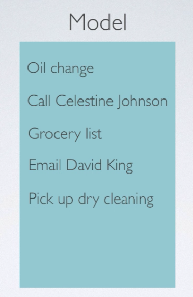
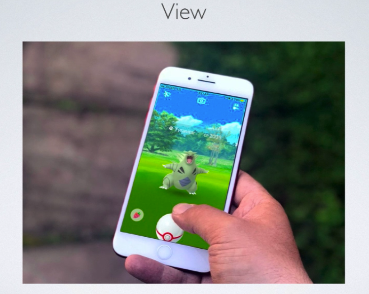
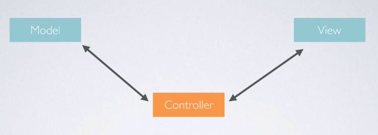
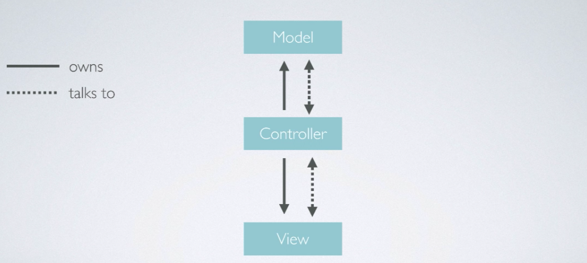

# MVP Design Pattern

### Model

- 앱 동작에 필요한 데이터를 가지고 있는 부분

### View

- 사용자와 입력을 주고 받을수 있는 화면 등을 의미
- 웹 페이지, 애플워치 패이스, 아이폰 화면 등이 예이다.

### Controller

- Model과 View사이에서 데이터를 전달하고, 조절하는 역활

## MVC 패턴의 단점

1. Controller에 많은 코드가 집중된다.
   - 
2. 코드가 많아짐에 따라서 테스트하기가 힘들어진다.