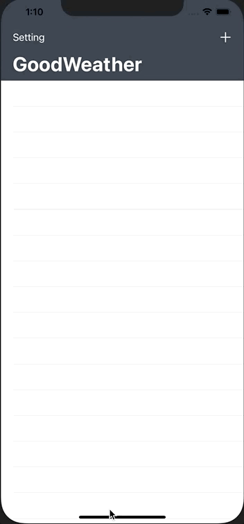
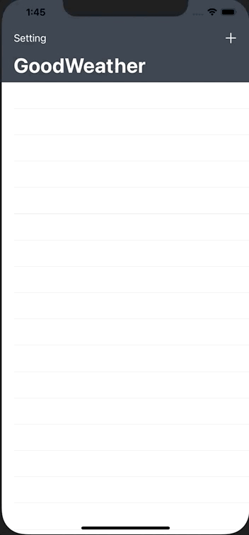

# GoodWeather App - Observble Pattern

### 앱 구현 화면

- `+` 버튼을 통해서 특정 도시의 날씨를 main 화면에 저장
- `Setting` 메뉴를 통해서 온도 표시를 변경 ( 섭시 -> 화씨, 화씨 -> 섭시)
- 등록된 도시 선택시 해당 도시의 최저, 최고 온도 같이 표시



### 상세 구현 방법

#### 개요 

- MVVM 디자인 패턴을 이용한 앱 구현
- 화면 구성은 StroyBoard 이용
- 화면간 데이터 전달은 Segue와 Delegate Pattern 이용

#### 주요 소스코드

##### Observable 페턴을 통한 VM과 UI (label) bind 코드

1. **Observavle 패턴 코드**

- ```swift
  class Dynamic<T>: Decodable where T: Decodable {
  
  typealias Listener = (T) -> ()
  var listener: Listener?
  
  var value: T {
    didSet {
      listener?(value)
    }
  }
  
  func bind(listener: @escaping Listener) {
    self.listener = listener
    self.listener?(self.value)
  }
  
  init(_ value: T) {
    self.value = value
  }
  
  private enum CodingKeys: CodingKey {
    case value
  }
  }
  ```
  
- `value` 값에 VM의 각 데이터를 저장

- `bind`  함수를 통해서  저장된 데이터를 _Escaping Closure_를 통해 가져옴

2. **ViewModel 과 tableView 바인딩**

- tableView 코드

  - ```swift
    override func tableView(_ tableView: UITableView, numberOfRowsInSection section: Int) -> Int {		
      return weatherListVM.numberOfRows(section)		
    }		
    
    override func tableView(_ tableView: UITableView, cellForRowAt indexPath: IndexPath) -> UITableViewCell {		
    
      let cell = tableView.dequeueReusableCell(withIdentifier: "WeatherCell", for: indexPath) as! WeatherCell		
    
      let weatherVM = self.weatherListVM.modelAt(indexPath.row)		
    	// bind를 이용한 UI 바인딩
      weatherVM.name.bind(listener: { cell.cityNameLabel.text = $0 })
      weatherVM.currentTemperature.temperature.bind(listener: { cell.temparatureLabel.text = $0.formatAsDegree })
    
      return cell		
    
    }
    ```

- WeatherViewModel 데이터 구조

  - ```swift
    // MARK: - WeatherViewModel
    struct WeatherViewModel: Decodable {
      
      let name : Dynamic<String>
      var currentTemperature: TemperatureViewModel
    	
      // 일반 데이터 -> Dynamic 데이터로 변경
      init(from decoder: Decoder) throws {
        let container = try decoder.container(keyedBy: CodingKeys.self)
        name = Dynamic(try container.decode(String.self, forKey: .name))
        currentTemperature = try container.decode(TemperatureViewModel.self, forKey: .currentTemperature)
      }
      
      enum CodingKeys: String, CodingKey {
        case name
        case currentTemperature = "main"
      }
    }
    
    struct TemperatureViewModel: Decodable {
      
      var temperature: Dynamic<Double>
      let temperatureMin: Dynamic<Double>
      let temperatureMax: Dynamic<Double>
      // 일반 데이터 -> Dynamic 데이터로 변경
      init(from decoder: Decoder) throws {
        let container = try decoder.container(keyedBy: CordingKeys.self)
        
        temperature = Dynamic(try container.decode(Double.self, forKey: .temperature))
        temperatureMin = Dynamic(try container.decode(Double.self, forKey: .temperatureMin))
        temperatureMax = Dynamic(try container.decode(Double.self, forKey: .temperatureMax))
        
      }
      
      enum CordingKeys: String, CodingKey {
        case temperature = "temp"
        case temperatureMin = "temp_min"
        case temperatureMax = "temp_max"
      }
    }
    ```

  - API를 통해서 받은 데이터를 Dynamic 타입으로 저장하기 위해서 Decodable의 init을 작성

3. **Value 값에 따라 UI 가 정상적으로 변경되는지 검증**

- tableView Code 수정

  - ```swift
    override func tableView(_ tableView: UITableView, cellForRowAt indexPath: IndexPath) -> UITableViewCell {		
    
      let cell = tableView.dequeueReusableCell(withIdentifier: "WeatherCell", for: indexPath) as! WeatherCell		
    
      let weatherVM = self.weatherListVM.modelAt(indexPath.row)		
    	// bind를 이용한 UI 바인딩
      weatherVM.name.bind(listener: { cell.cityNameLabel.text = $0 })
      weatherVM.currentTemperature.temperature.bind(listener: { cell.temparatureLabel.text = $0.formatAsDegree })
      // 2 초 후에 도시이름이 변경되도록 설정
      DispatchQueue.main.asyncAfter(deadline: .now()+2, execute: {
            vm.name.value = "서울"
      })
    
      return cell		
    
    }
    ```

- 확인 영상


