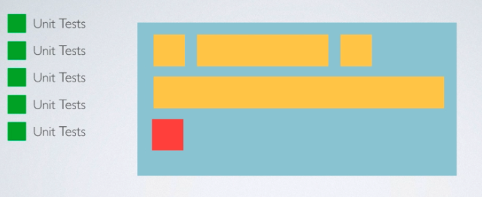

# Unit Test Basic


### 기초 이론

**유닛 테스트**(unit test)는 컴퓨터 프로그래밍에서 소스 코드의 특정 모듈이 의도된 대로 정확히 작동하는지 검증하는 절차다.

즉, 모든 함수와 메소드에 대한 테스트 케이스(Test case)를 작성하는 절차를 말한다.  이를 통해서 언제라도 코드 변경으로 인해 문제가 발생할 경우, 단시간 내에 이를 파악하고 바로 잡을 수 있도록 해준다.

이상적으로, 각 테스트 케이스는 서로 분리되어야 한다. 이를 위해 `가짜 객체(Mock object)`를 생성하는 것도 좋은 방법이다.

유닛 테스트는 (일반적인 테스트와 달리) 개발자(developer) 뿐만 아니라 보다 더 심도있는 테스트를 위해 테스터(tester)에 의해 수행되기도 한다.

### But

- 유닛 테스트를 잘 작성한다고 소프트웨어가 버그 없이 잘 돌아간다는 뜻은 아니다.
- 각각의 메서드가 유닛 테스트를 통과해도 전체적인 비지니스 로직에 따라서 버그가 있을 수 있다. 이런 경우에는 통합 테스트, 시스템 테스트 등을 통해 검증해야 한다.



화면상의 새로운 기능이 추가될 때마다 각각의 기능에 맞는 Unit Test가 작성 되어야 한다.

### Unit Test 수동으로 추가하기

1. Editor` → `Add Target
   - 
2. Unit Testing Bundle 추가
   - 
3. 프로젝트 파일 밑으로 Tests 폴더가 신규로 생성됨
   - 

https://www.notion.so/Unit-Test-Basic-2c093fb2d7d448ba9b2a61547cea97b4#d6b9deade3a74964884aa179678f10d7z

### Unit Test 기초 테스트

두 가지 함수를 가지고 있는 Calculator 클래스를 테스트해보자

Calculator 함수는 아래와 같이 `add`, `subtract` 함수를 가지고 있고, 두개의 Int 를 받아서 각각 더한 값과 뺀 값을 리턴 해준다.

```swift
class Calculator {
  
  func add(_ a: Int, _ b: Int) -> Int {
    
    return a+b
    
  }
  
  func subtract(_ a: Int, _ b: Int) -> Int {
    
    return a-b
    
  }
  
}
```

`Calculato` 를 테스트하기 위한 `CalculatorAppTests` 이다.

### 테스트 방식

```swift
XCTAssertEqual(변수,비교값)

// 변수와 비교값이 값으면 Sucess 
// 변수와 비교값이 다르면 Fail
```


#### **Test Success**


```swift
import XCTest
@testable import CalculatorApp

class CalculatorAppTests: XCTestCase {

  func test_SubtractTwoNumbers() {
    let calculator = Calculator()
    let result = calculator.subtract(5,2)
    
    XCTAssertEqual(result, 3) 
  }

  func test_AddTwoNumbers() {
    
    let calculator = Calculator()
    let result = calculator.add(2,3)
    
    XCTAssertEqual(result, 5)
    
  }
}
```


#### **Test Fail**

```swift
import XCTest
@testable import CalculatorApp

class CalculatorAppTests: XCTestCase {
  
  func test_SubtractTwoNumbers() {
    
    let calculator = Calculator()
    let result = calculator.subtract(5,2)
    
    XCTAssertEqual(result, 5)
    
  }

  func test_AddTwoNumbers() {
    
    let calculator = Calculator()
    let result = calculator.add(2,3)
    
    XCTAssertEqual(result, 6)
    
  }
}
```


### Unit Test Refactoring

- setup() : 테스트가 실행되기 전에 사전 준비가 필요한 자원들을 추가하는 곳
- tearDown() : test가 종료될때 실행되는 함수부분, test 과정에서 DB, file등의 변경된 부분을 원상복귀 시킬 수 있다.

```swift
import XCTest
@testable import CalculatorApp

class CalculatorAppTests: XCTestCase {
  
  private var calculator = Calculator()
  
  override class func setUp() {
    super.setUp()
		// 테스트가 실행되기 전에 사전 준비가 필요한 자원들을 추가하는 곳

  }
  
  func test_SubtractTwoNumbers() {
    
    let result = self.calculator.subtract(5,2)
    
    XCTAssertEqual(result, 3)
    
  }

  func test_AddTwoNumbers() {
    
    let result = self.calculator.add(2,3)
    
    XCTAssertEqual(result, 5)
    
  }
  
  override class func tearDown() {
    super.tearDown()
		// test가 종료될때 실행되는 함수부분
		// test 과정에서 DB, file등의 변경된 부분을 원상복귀 시킬 수 있다.
    
  }
}
```

소스코드 :point_right: [링크](../sourceCode/CalculatorApp)

### Reference

- [iOS 단위 테스트와 UI 테스트 튜토리얼 (iOS Unit Testing and UI Testing Tutorial)](https://kka7.tistory.com/68)
- [Udemy Lecture](https://www.udemy.com/course/mastering-mvvm-for-ios/learn/lecture/12957056#overview)

