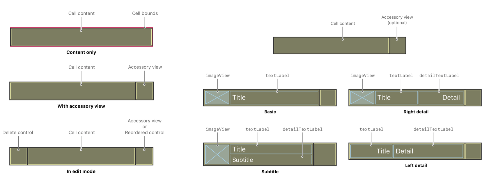
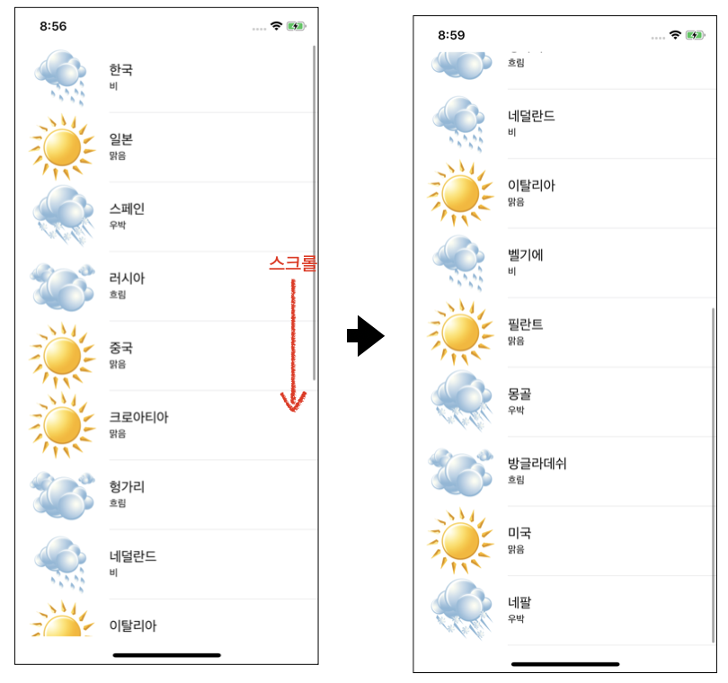
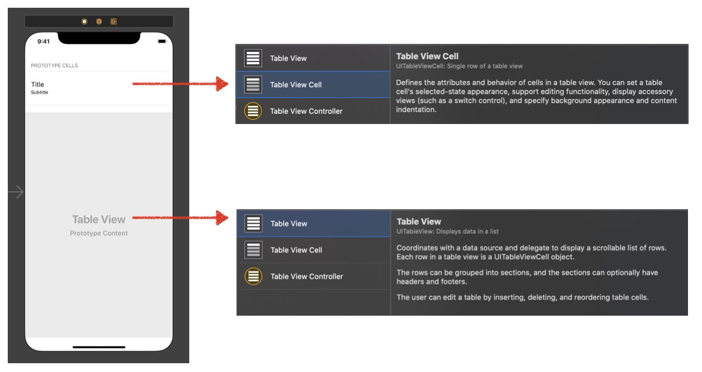

# Weather Table with UITableView


## About UITableView 

### UITableView

1. 정의 
   - 데이터를 하나의 칼럼에 넣어 한줄씩 나타내는 형태의 뷰
   - 컨텐츠들을 수직형태의 스크롤이 가능한 하며 데이터들을 section을 통해서 그룹핑 할 수 있음
   - UITableView는 기본적인 테이블의 표현을 관리하지만, 실제 데이터를 나타내기 위해서는 Cells(UITableViewCell object)를 제공해야 한다.

```swift
class UITableView : UIScrollView
```

2.  Table View 사용 방법
    1. Table View Controller를 추가한다.
    2. xcode는 table view와 view controller가 같이 포함된 새로운 화면을 생성한다

>  데이블 뷰에 데이터가 보인다면 일반적으로 사용자가 제공한 데이터를 data source object가 처리하여 보여준다.
>
> Data source 오브젝트는 앱의 데이터를 관리하고 테이블의 Cell에 데이터를 설정하고 표시해준다.

### UITableViewCell

- 테이블 뷰에서 하나의 열의 형태

```swift
class UITableViewCell : UIView
```



- 왼쪽 그림 
  - UITableViewCell은 테이블과 관련된 사항들을 커스텀 할수 있도록 몇가지를 제공한다
    - Applying a selection or highlight color to the cell.
    - Adding standard accessory views, such as a detail or disclosure control.
    - Putting the cell into an editable state.
    - Indenting the cell's content to create a visual hierarchy in your table.
- 오른쪽 그림
  - 테이블은 기본값인 cell Type을 가지지만 테이블 Prototype Cells 속성을 변경하여 여러가지 변화를 줄 수 있다.
    - Identifier : Use this identifier (also known as a reuse identifier) to create the cell. 
    - Style : Choose one of the standard types or define a custom cell.
    - Class : Specify a `UITableViewCell` subclass with your custom behavior.
  - 기본적으로 textLabel, detailTextLabel, imageView 프로퍼티를 가지고 있음

Cell Custumize : [Configuring the Cells for Your Table](https://developer.apple.com/documentation/uikit/views_and_controls/table_views/configuring_the_cells_for_your_table)


## 구현 화면

- UITableView를 이용하여 각 나라별 국가이름, 날씨 상태, 상태에 맞는 그림 추가




## 소스코드 

###  StoryBoard  사용

- Table View 및 Table View Cell 추가



- Table View Cell의 attribute inspector에서 identifier `Cell` 로 변경 후 Style은 `Subtitle`로 지정
- Table Veiw -> dataSource, Table Veiw -> delegate 연결


- **ViewController.swift**

```swift
import UIKit
class ViewController: UIViewController, UITableViewDataSource{
	// 데이터를 담을 딕셔너리 생성
  var datalist = [[String:String]]()

  override func viewDidLoad() {
    super.viewDidLoad()
    // 날씨 데이터 
    let dic1 = ["지역" : "한국", "날씨" : "비"]
    let dic2 = ["지역" : "일본", "날씨" : "맑음"]
    let dic3 = ["지역" : "스페인", "날씨" : "우박"]
    let dic4 = ["지역" : "러시아", "날씨" : "흐림"]
    let dic5 =  ["지역" : "중국", "날씨" : "맑음"]
    let dic7 =  ["지역" : "네덜란드", "날씨" : "비"]
    let dic6 =  ["지역" : "크로아티아", "날씨" : "맑음"]
    let dic15 =  ["지역" : "네팔", "날씨" : "우박"]
    let dic8 =  ["지역" : "헝가리", "날씨" : "흐림"]
    let dic9 =  ["지역" :  "이탈리아", "날씨" : "맑음"]
    let dic10 =  ["지역" : "벨기에", "날씨" : "비"]
    let dic11 =  ["지역" : "필란트", "날씨" : "맑음"]
    let dic12 =  ["지역" : "몽골", "날씨" : "우박"]
    let dic13 = ["지역" : "방글라데쉬", "날씨" : "흐림"]
    let dic14 = ["지역" : "미국", "날씨" : "맑음"]
		// 딕셔너리 배열에 딕셔너리 값들 추가
    datalist = [dic1,dic2,dic3,dic4,dic5,dic6,dic8,dic7,dic9,dic10,dic11,dic12,dic13,dic14,dic15]

  }

  func tableView(_ tableView: UITableView, numberOfRowsInSection section: Int) -> Int {
		// 테이블 row의 갯수를 결정하는 함수
    return datalist.count
  }

  func tableView(_ tableView: UITableView, cellForRowAt indexPath: IndexPath) -> UITableViewCell {
    // 데이터를 추가하려는 cell 연결
    // cell을 재사용하기 위한 큐에 저장, 메모리 누수 방지
    // 모든 데이터를 불러오지 않고, 화면에 표시되는 cell만 나타낸다
    let cell = tableView.dequeueReusableCell(withIdentifier: "Cell", for: indexPath)

    let dicTemp = datalist[indexPath.row]
		//기존에 정의되어 있는 프로터티들을 사용하여 데이터저장
    // textLabel, detailTextLabel, imageView
    cell.textLabel!.text = dicTemp["지역"]
    cell.detailTextLabel!.text = dicTemp["날씨"]
    if dicTemp["날씨"] == "맑음" {
      cell.imageView?.image = UIImage(named: "sunny.png")
    } else if dicTemp["날씨"] == "흐림" {
      cell.imageView?.image = UIImage(named: "cloudy.png")
    } else if dicTemp["날씨"] == "우박" {
      cell.imageView?.image = UIImage(named: "blizzard.png")
    } else if dicTemp["날씨"] == "비" {
      cell.imageView?.image = UIImage(named: "rainy.png")
    }
    return cell
  }
}
```


### Using Code

#### 소스코드

- ViewController.swift

```swift
import UIKit
import Foundation

class ViewController: UIViewController, UITableViewDelegate, UITableViewDataSource {
  
  let textCellIdentifier = "TextCell"
  var datalist = [[String:String]]()

  override func viewDidLoad() {
    super.viewDidLoad()

    // 날씨 데이터
    let dic1 = ["지역" : "한국", "날씨" : "비"]
    let dic2 = ["지역" : "일본", "날씨" : "맑음"]
    let dic3 = ["지역" : "스페인", "날씨" : "우박"]
    let dic4 = ["지역" : "러시아", "날씨" : "흐림"]
    let dic5 =  ["지역" : "중국", "날씨" : "맑음"]
    let dic7 =  ["지역" : "네덜란드", "날씨" : "비"]
    let dic6 =  ["지역" : "크로아티아", "날씨" : "맑음"]
    let dic15 =  ["지역" : "네팔", "날씨" : "우박"]
    let dic8 =  ["지역" : "헝가리", "날씨" : "흐림"]
    let dic9 =  ["지역" :  "이탈리아", "날씨" : "맑음"]
    let dic10 =  ["지역" : "벨기에", "날씨" : "비"]
    let dic11 =  ["지역" : "필란트", "날씨" : "맑음"]
    let dic12 =  ["지역" : "몽골", "날씨" : "우박"]
    let dic13 = ["지역" : "방글라데쉬", "날씨" : "흐림"]
    let dic14 = ["지역" : "미국", "날씨" : "맑음"]
    // 딕셔너리 배열에 딕셔너리 값들 추가
    datalist = [dic1,dic2,dic3,dic4,dic5,dic6,dic8,dic7,dic9,dic10,dic11,dic12,dic13,dic14,dic15]
		// 테이블 뷰 객체 생성
    let tableview = UITableView(frame: CGRect(x: 0, y: 0, width: view.frame.width, height: view.frame.height))
		//
    tableview.delegate = self
    tableview.dataSource = self
    // 테이블과 셀 연결
    // Cell을 기본 스타일로 설정 하는 방법
    // tableview.register(UITableViewCell.self, forCellReuseIdentifier: textCellIdentifier)
    // 테이블 뷰의 높이를 변경하기 위한 코드
	    //tableview.rowHeight = CGFloat(127.0)
    // Cell을 Subtitle로 설정 하는 방법
    tableview.register(SubtitleTableViewCell.self, forCellReuseIdentifier: textCellIdentifier)
    view.addSubview(tableview)
  }
	// subtitle 옵션 설정을 위해 Cell 초기화 함수 override
  class SubtitleTableViewCell: UITableViewCell {
    override init(style: UITableViewCell.CellStyle, reuseIdentifier: String?) {
      // subtitle 스타일 적용
      super.init(style: .subtitle, reuseIdentifier: reuseIdentifier)
    }
		// 오류 발생시 처리 구문
    required init?(coder aDecoder: NSCoder) {
      fatalError("init(coder:) has not been implemented")
    }
  }

  func numberOfSections(in tableView: UITableView) -> Int {
    return 1
  }

  func tableView(_ tableView: UITableView, numberOfRowsInSection section: Int) -> Int {
    //테이블로 출력하고자 하는 셀의 겟수
    return datalist.count
  }

  func tableView(_ tableView: UITableView, cellForRowAt indexPath: IndexPath) -> UITableViewCell {
		// cell 정의 
    let cell = tableView.dequeueReusableCell(withIdentifier: textCellIdentifier, for: indexPath)
		// subtitle 옵션의 cell에는 기본값 포함됨
    // textLabel, detailTextLabel, imageView
    let dicTemp = datalist[indexPath.row]
    cell.textLabel!.text = dicTemp["지역"]
    cell.detailTextLabel!.text = dicTemp["날씨"]
    if dicTemp["날씨"] == "맑음" {
      cell.imageView?.image = UIImage(named: "sunny.png")
    } else if dicTemp["날씨"] == "흐림" {
      cell.imageView?.image = UIImage(named: "cloudy.png")
    } else if dicTemp["날씨"] == "우박" {
      cell.imageView?.image = UIImage(named: "blizzard.png")
    } else if dicTemp["날씨"] == "비" {
      cell.imageView?.image = UIImage(named: "rainy.png")
    }

    return cell
  }
}


```

#### 기타 함수 

```swift
// row별 높이를 변경하기 위한 함수 ---------------------------------
func tableView(_ tableView: UITableView,
               heightForRowAt indexPath: IndexPath) -> CGFloat {
  // Make the first row larger to accommodate a custom cell.
  if indexPath.row == 0 {
    return 80
  }

  // Use the default size for all other rows.
  return UITableView.automaticDimension
}


```


## Reference

- Apple Doc
  - [UITableView](https://developer.apple.com/documentation/uikit/uitableview)
  - [UITableViewController](https://developer.apple.com/documentation/uikit/uitableviewcontroller)
  - [UITableViewCell](https://developer.apple.com/documentation/uikit/uitableviewcell)
  - [Filling a Table with Data](https://developer.apple.com/documentation/uikit/views_and_controls/table_views/filling_a_table_with_data)
  - [Configuring the Cells for Your Table](https://developer.apple.com/documentation/uikit/views_and_controls/table_views/configuring_the_cells_for_your_table)
- StackOverFlow
  - [How to Set UITableViewCellSytleSubTitle and dequereReusableCell In swift](https://stackoverflow.com/questions/24062285/how-to-set-uitableviewcellstylesubtitle-and-dequeuereusablecell-in-swift)
  
    

