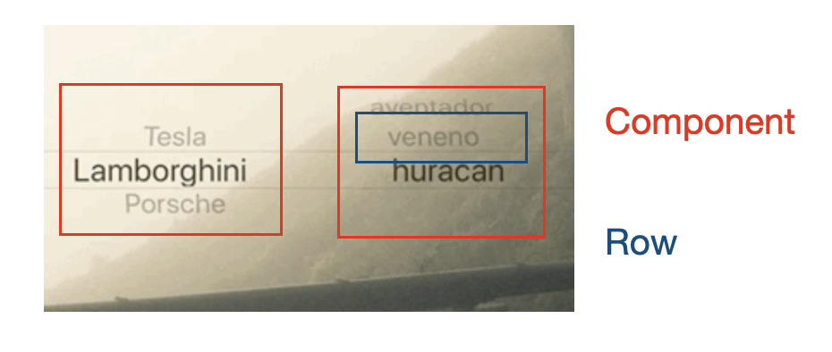
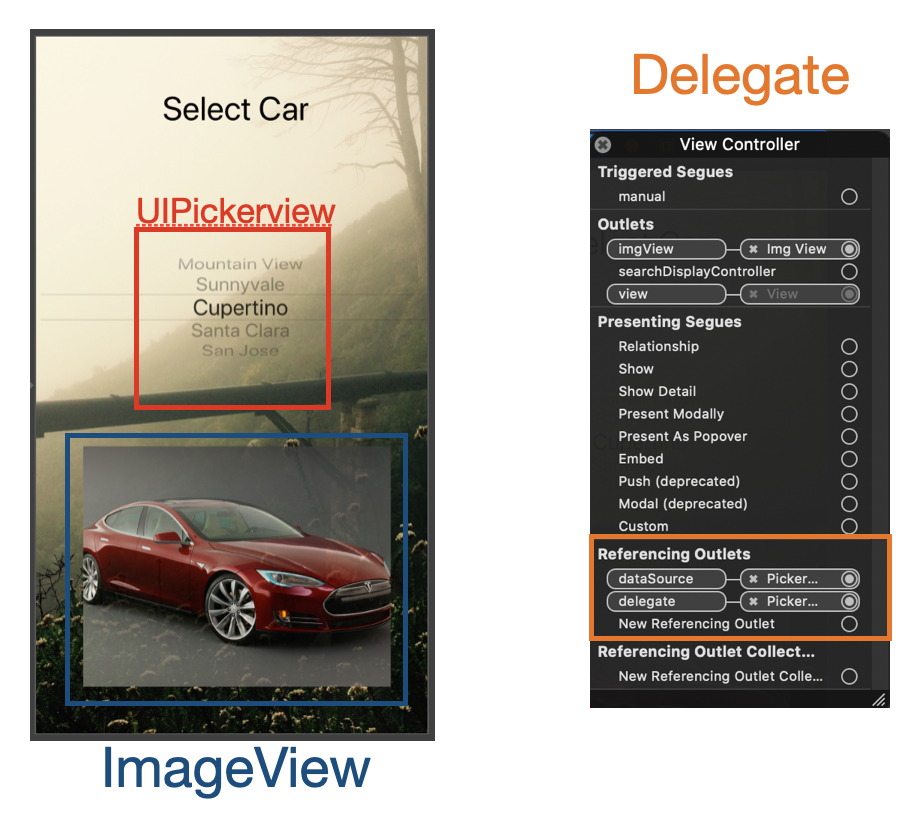

# Select Car With UIPickerview

## 구현 화면

- Picker View를 통해 사용자가 선택한 자동차 이미지를 보여줌


## 기초 이론

### UIPickerView

- 회전하는 휠과 슬롯 머신처럼 생긴 뷰를 이용하여 하나 이상의 데이터의 set을 보여줌
- component화 row 사용




### UIPickerViewDataSource

- 오브젝트와 PickerView 사이를 중제하는 역할
- Data Source는 picker view에 component들의 숫자를 제공하고, 이 숫자는 각 component의 row에 데이터를 표현하기 위해 사용된다

### UIPickerViewDelegate

- picker view를 사용하기 위해서는 아래 두가지중 하나를 사용해야 한다. compnent의 데이터를 제공하는 용도

  - [`pickerView(_:titleForRow:forComponent:)`](https://developer.apple.com/documentation/uikit/uipickerviewdelegate/1614384-pickerview)

    - ```swift
      optional func pickerView(_ pickerView: UIPickerView, 
                   titleForRow row: Int, 
                  forComponent component: Int) -> String?
      ```

    - 리턴값이 String 

  - [`pickerView(_:viewForRow:forComponent:reusing:)`](https://developer.apple.com/documentation/uikit/uipickerviewdelegate/1614389-pickerview)

    - ```swift
      optional func pickerView(_ pickerView: UIPickerView, 
                    viewForRow row: Int, 
                  forComponent component: Int, 
                       reusing view: UIView?) -> UIView
      ```

    - 리턴값이 UIView,  

  

## 구현 내용

### StoryBoard 사용

- delegate 및 화면 구현 내용



#### 소스코드 :point_right: [링크](../sourceCode/SelectCar)

### SorceCode 사용


#### 소스코드 :point_right: [링크](../sourceCode/SelectCar_Code)

## important Thing

- 주요 함수

  - 컴포넌트 갯수 설정 함수

    - ```swift
      func numberOfComponents(in pickerView: UIPickerView) -> Int 
      ```

  - 컴포넌트 내 row값 설정 함수

    - ```swift
      func pickerView(_ pickerView: UIPickerView, numberOfRowsInComponent component: Int) -> Int
      ```

  - 컴포넌트 내 row별 title 지정을 위한 함수

    - ```swift
      func pickerView(_ pickerView: UIPickerView, titleForRow row: Int, forComponent component: Int) -> String?
      ```

  - 사용자가 선택한 컴포넌트의  row index를 리턴해주는 함수

    - ```swift
      func selectedRow(inComponent component: Int) -> Int
      ```

## Reference

- Apple Doc
  - [UIPickerView](https://developer.apple.com/documentation/uikit/uipickerview)
  - [UIPickerViewDataSource](https://developer.apple.com/documentation/uikit/uipickerviewdatasource)
  - [UIPickerViewDelegate](https://developer.apple.com/documentation/uikit/uipickerviewdelegate)
