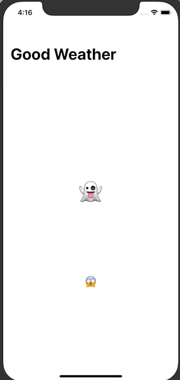
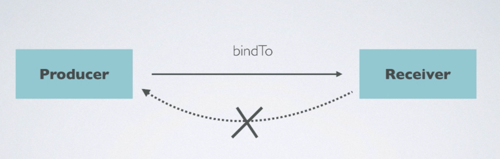

# Good Weather App

## 구현 화면

- 날씨 API를 통해 특정 도시의 날씨의 온도와 습도를 받아오는  App
- RxSwift 및 RxCocoa를 사용하여 구현



## 소스코드

### 구현 과정

1. RxSwift를 통한데이터 받아오기
   - 


## 기초 이론 

### bindTo

- observable의 binding은 단방향으로 만 가능하다.



- 

### Control Property 


- 

- 소스코드 예시

  - ```swift
    self.cityNameTextField.rx.value.subscribe(onNext: { city in
    	// city를 사용해 처리할 사항
    	}).disposed(by: disposeBag)
    ```

  - 

### Control Event


- 

- 소스코드 예시

  - ```swift
    // cityNameTextField에서 특정 이벤트가 발생하면 방출되도록 설정한 옵션
    // - .editingDidEndOnExitq 부분에 특정 Property에 이벤트의 종류를 정의해줌
    self.cityNameTextField.rx.controlEvent(.editingDidEndOnExit)
     // 이벤트가 발생했을때 처리할 사항
     }).disposed(by: disposeBag)
    ```

  - 


### Driver


- 특징
  1. 에러를 방출하지 않음
  2. 메인 스케줄러에서 실행됨
- 