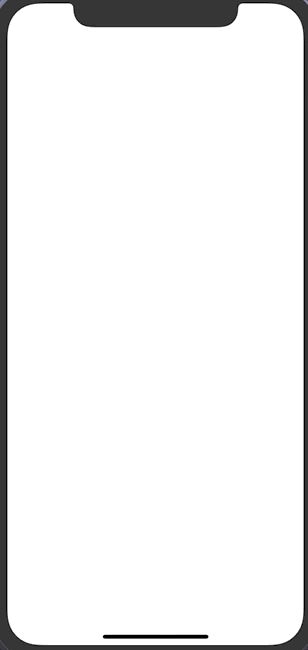

# Good News App With MVVM

## 구현 화면

- new API를 통해 뉴스 정보를 가져오는 화면 구현
- RxSwift 및 MVVM 디자인 패턴을 통한 구현



## 소스코드

### ViewModel

- 뉴스기사에 대한 데이터를 가지고 있고, View에 보여줄 데이터를 제공하는 함수들을 가지고 있다

- ```swift
  struct ArticleListViewModel {
    let articlesVM: [ArticleViewModel]  
  
    init(_ articles: [Article]) {
      self.articlesVM = articles.compactMap(ArticleViewModel.init)
    } 
  
    func articleAt(_ index: Int) -> ArticleViewModel {
      return self.articlesVM[index]
    }
  }
  
  struct ArticleViewModel {
    
    let article: Article
    
    init(_ article: Article) {
      self.article = article
    }
  
    var title: Observable<String> {
      return Observable<String>.just(article.title)
    }
    var description: Observable<String> {
      return Observable<String>.just(article.description ?? "")
    }
    
  }
  
  ```

### ViewController

1. Article 데이터 불러오는 부분

   - ```swift
     //fetch Article Datas
     private func populateNews() {
         
       let resouce = Resource<ArticleResponse>(url: URL(string: "https://newsapi.org/v2/top-headlines?country=us&apiKey=aab00f244cdd43558a60ae6c73002474")!)
         
       URLRequest.load(resource: resouce)
         .subscribe(onNext: { articleResponse in
             
     		let articles = articleResponse.articles
     		self.articleListVM = ArticleListViewModel(articles)  
     		
     		DispatchQueue.main.async {
     			self.tableView.reloadData()
     		}
     	}).disposed(by: disposeBag)    
     }
     ```

2. TableView 생성 관련 부분

   - ```swift
     // TableView DataSource
     override func numberOfSections(in tableView: UITableView) -> Int {
         return 1
       }
       
     override func tableView(_ tableView: UITableView, numberOfRowsInSection section: Int) -> Int {
         return self.articleListVM == nil ? 0 : self.articleListVM.articlesVM.count
       }
       
     override func tableView(_ tableView: UITableView, cellForRowAt indexPath: IndexPath) -> UITableViewCell {
         
       guard let cell = tableView.dequeueReusableCell(withIdentifier: "ArticleTableViewCell", for: indexPath) as? ArticleTableViewCell else { fatalError("Can't found ArticleTableViewCell")}
         
       let articleVM = self.articleListVM.articleAt(indexPath.row)
       // Observable 값에서 asDriver를 통한 UI데이터 직접 변경
       articleVM.title.asDriver(onErrorJustReturn: "")
       .drive( cell.titleLabel.rx.text )
       .disposed(by: disposeBag)
     
       articleVM.description.asDriver(onErrorJustReturn: "")
       .drive( cell.descriptionLabel.rx.text )
       .disposed(by: disposeBag)
         
     	return cell
     }
     
     
     ```

### Extenstion

- URLRequest

  - ```swift
    struct Resource<T: Decodable> {
      let url: URL
    }
    
    extension URLRequest {
      static func load<T>(resource: Resource<T>) -> Observable<T> {
        
        return Observable.just(resource.url)
          .flatMap { url -> Observable<Data> in
            let request = URLRequest(url: url)
            return URLSession.shared.rx.data(request: request)
          }.map { data -> T in
            return try JSONDecoder().decode(T.self, from: data)
          }
      }
    }
    ```