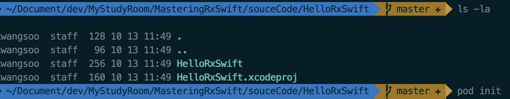
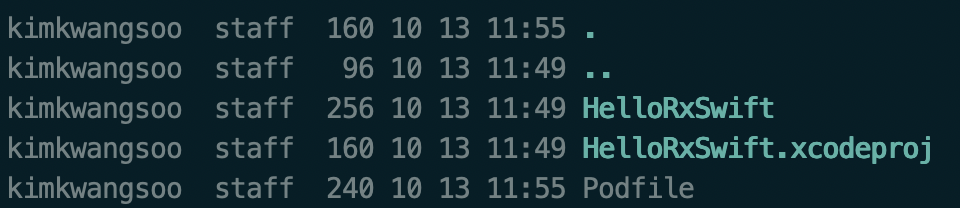
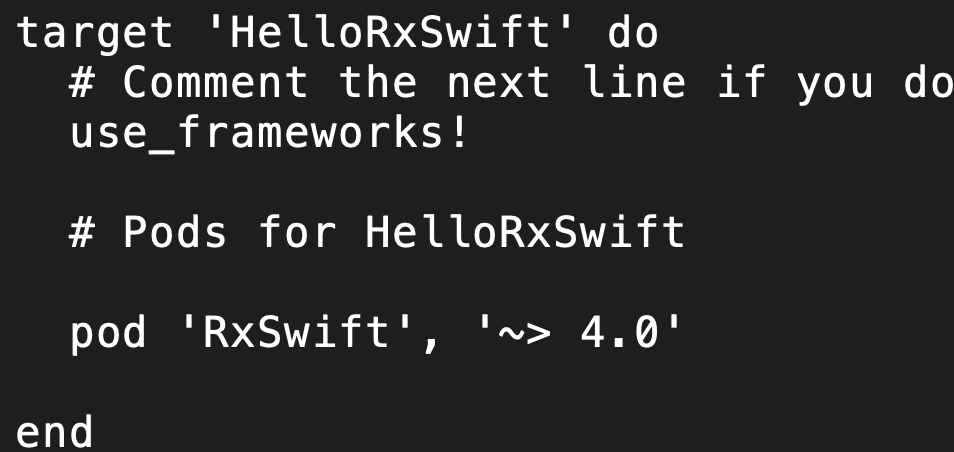
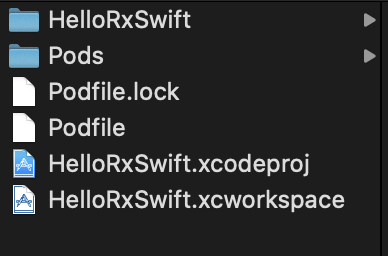

# RxSwift install with Cocoapod


## RxSwift 설치하기 

### cocoapot 설치 및 RxSwift 설치

1. cocoapot 설치하기
   - ```sudo gem install cocoapods```
2. 생성된 프로젝트 폴더로 이동 후 `pod init`실행
   - 
3. 생성된 `podfile 오픈
   - 
4. podfile 내용 추가
   - `pod 'RxSwift', '~> 4.0'` 
   - 
5. pod을 통한 RxSwift 설치 진행
   - `pod install` 입력
6. 설치 완료 확인
   - 
7. `HelloRxSwitft.xcworkspace` 실행


### Reference

-  [CocoaPods.org](https://cocoapods.org/)