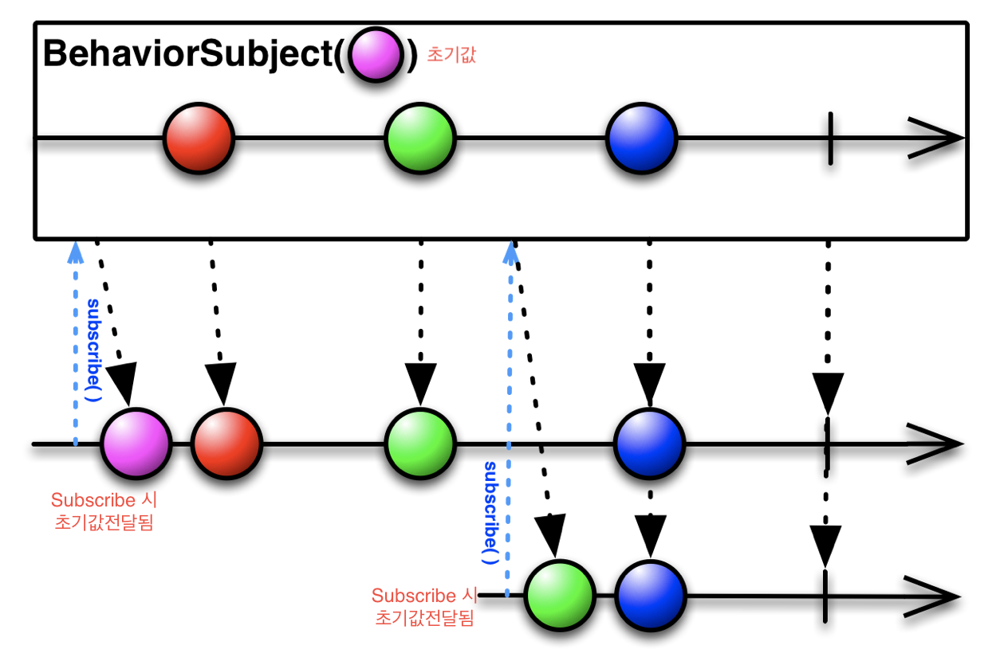

# Subject

## subject 종류


### **Publish** Subject

- 코드 예제 1

  - subscribe가 되지 않은 subject는 값을 전달하지 못한다.

  - ```swift
    let disposeBag = DisposeBag()
    
    let subject = PublishSubject<String>()
    
    subject.onNext("Issue 1") // subscribe가 되지 않은 상태에서는 값이 전달되지 않음
    
    subject.subscribe { event in
       print(event)
    }
    
    subject.onNext("Issue 2")
    subject.onNext("Issue 3")
    
    /* 출력 결과
    next(Issue 2)
    next(Issue 3)
    */
    ```

  - 

    - `subject.onNext("Issue 1")` 의 경우가 위의 그림에서 빨간색 동그라미 부분에 해당한다.

- 코드 예제 2

  - subject의 경우에 onCompleted() 되거나, dispose()된 경우 값을 전달하지 못한다.

  - ```swift
    let disposeBag = DisposeBag()
    let subject = PublishSubject<String>()
    
    subject.subscribe { event in
       print(event)
    }
    
    subject.onNext("Issue 2")
    	
    subject.dispose()
    //subject.onCompleted()
    // subject가 dispose() 되거나 onCompleted()된 경우 다음 onNext는 값이 전달되지 않는다.
    
    subject.onNext("Issue 4")
    ```


### Behavior Subject



- Publish subject와는 다르게 기본값을 가지고 있다.

- 코드 예제 1 ( 일반적인 BehaviorSubject 사용법 )

  - ```swift
    let subjectBe = BehaviorSubject(value: "Initial Value")
    
    subjectBe.subscribe { event in
      print(event)
    }
    
    subjectBe.onNext("Issue 1")
    /*
    next(Initial Value)  // 초기값 출력 됨
    next(Issue 1)
    */
    ```

- 코드 예제 2 ( PublishSubject와 다른점 )

  - ```swift
    let subjectBe = BehaviorSubject(value: "Initial Value")
    
    subjectBe.onNext("Last Issue") // PublishSubject와 다르게 값이 출력됨
    
    subjectBe.subscribe { event in
      print(event)
    }
    
    /*
    next(Last Issue)
    */
    ```


### ReplaySubject


- 몇개를 전달할지는 생성시 결정 `ReplaySubject<String>.create(bufferSize: <#Int#>)`

- 코드 예제

  - ```swift
    let replaySubject = ReplaySubject<String>.create(bufferSize: 2)
    
    replaySubject.onNext("Issue 1")
    replaySubject.onNext("Issue 2")
    replaySubject.onNext("Issue 3")
    
    print("[Subscribe1]")
    replaySubject.subscribe {   // 저장되어 있던 Issue 2,3 번 전달
      print($0)
    }
    
    print("[onNext]")
    replaySubject.onNext("Issue 4")
    replaySubject.onNext("Issue 5")
    replaySubject.onNext("Issue 6")
    
    print("[Subscribe2]")
    replaySubject.subscribe {		// 저장되어 있던 Issue 5,6 번 전달
      print($0)
    }
    
    /*
    [Subscribe1]
    next(Issue 2)
    next(Issue 3)
    
    [onNext]
    next(Issue 4)
    next(Issue 5)
    next(Issue 6)
    
    [Subscribe2]
    next(Issue 5)
    next(Issue 6)
    */
    ```


### Variable

- BehaviorSubject와 비슷하게 기본 값을 가지고 있고, observable처럼 동작 할 수 있다.

- 또한 Value 메소드를 통해서 variable이 가지고 있는 값에 접근 할 수 있다

  - 이를 통해서 사용자가 Observable이 가지고 있는 값(혹은 배열)에 대한 값을 수정가능하게 됨 - > 예제 2번

- 코드 예제 1

  - ```swift
    let variable = Variable("Initial Value")
    variable.value = "Hello world" // 초기값 변경
    variable.asObservable()
      .subscribe {
        print($0)
      }
    
    /*
    next(Hello world)
    */
    ```

- 코드 예제 2

  - ```swift
    let variable2 = Variable([String]())
    variable2.value.append("Item 1") // 초기값 적용
    variable2.asObservable()
      .subscribe {
        print($0)
      }
    variable2.value.append("Item 2")
    /*
    next(["Item 1"])
    next(["Item 1", "Item 2"])
    */
    ```

- BehaviorRelay로 사용하도록 권고하고 있다.

```swift
ℹ️ [DEPRECATED] `Variable` is planned for future deprecation. Please consider `BehaviorRelay` as a replacement. Read more at: https://git.io/vNqvx
```


### BehaviorRelay

#### 이론

- Property를 구독하기 위해 사용
- RxCocoa에 포함 되어 있음으로 `CocoaPod`을 통해서 `RxCocoa`를 설치 한 후 진행 가능

#### 소스코드 예제

- relay.value에 직접 데이터 추가 불가

  - ```swift
    let relay = BehaviorRelay(value: ["Item 1"])
    
    relay.value.append("Item 1")  // Error append 사용 불가
    relay.asObservable()
      .subscribe {
        print($0)
      }
    /*
    error: 3_Subject.playground:83:13: error: cannot use mutating member on immutable value: 'value' is a get-only property
    relay.value.append("Item 1")
    ~~~~~~~~~~~ ^
    */
    ```

- accept 를 통한 기존 값 교체 및 값 추가 방법

  - ```swift
    let relay = BehaviorRelay(value: ["Item 1"])
    
    relay.accept(["item 2"])		// 값을 입력 (기존값 삭제)
    relay.accept(relay.value + ["Item 2"]) // 값 추가 (기존값 + 추가)
    
    relay.asObservable()
      .subscribe {
        print($0)
      }
    /*
    값 교제 시 : next(["item 2"])
    값 추가 시 : next(["Item 1", "Item 2"])
    */
    ```

- ㅁㅇㄴㄹ

  - ```swift
    let relay = BehaviorRelay(value: ["Item 1"])
    
    var value = relay.value
    value.append("Item 2")
    value.append("Item 3")
    value.append("Item 4")
    
    relay.accept(value)
    
    relay.asObservable()
      .subscribe {
        print($0)
      }
    /*
    next(["Item 1", "Item 2", "Item 3", "Item 4"])
    */
    ```

  - 


```
~Subject와 ~Relay의 차이점
~Subject는 .completed, .error의 이벤트가 발생하면 subscribe가 종료되는 반면,
~Relay는 .completed, .error를 발생하지 않고 Dispose되기 전까지 계속 작동하기 때문에 UI Event에서 사용하기 적절합니다.
```

 From  [[RxSwift] Subject와 Relay - (3) - jinShine](https://jinshine.github.io/2019/01/05/RxSwift/3.Subject%EB%9E%80/) 


### Reference

-  [ReactiveX - Subject](http://reactivex.io/documentation/subject.html) 
-  [RxSwift property observe (BehaviorRelay, Variable)](https://myseong.tistory.com/11) 
-  [[RxSwift] Subject와 Relay - (3) - jinShine](https://jinshine.github.io/2019/01/05/RxSwift/3.Subject%EB%9E%80/) 