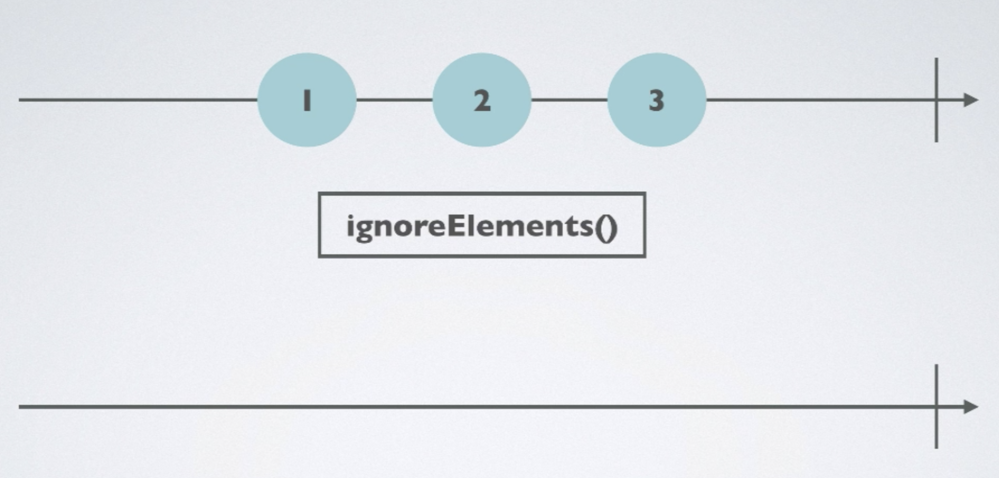
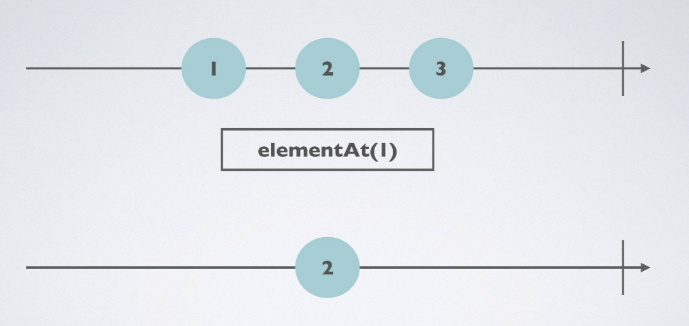
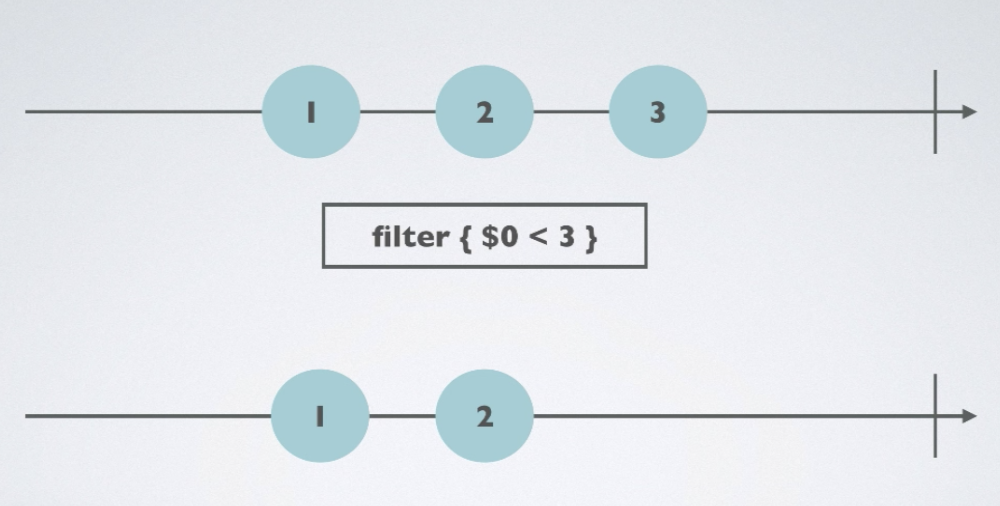
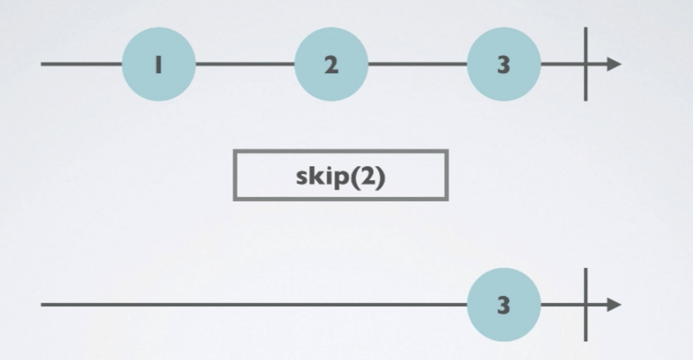
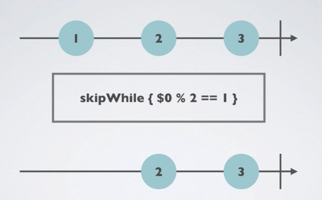
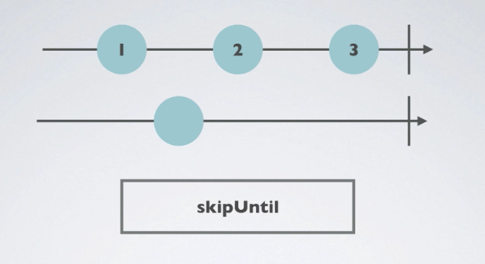
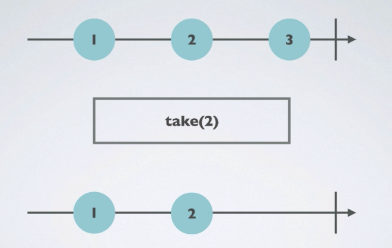
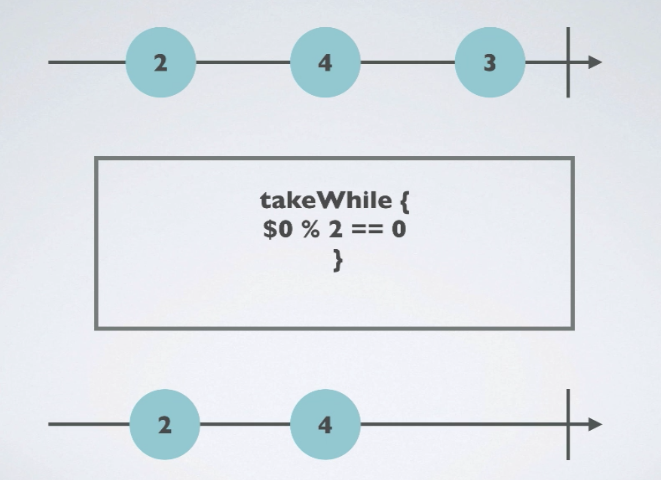
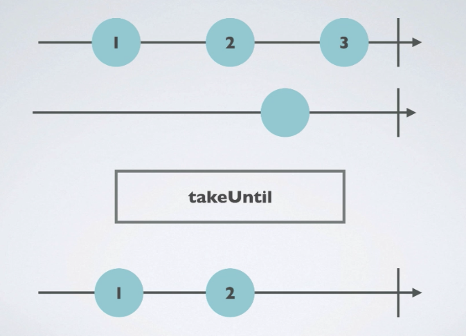

# Operator

- 거의 모든 연산자는 Observable상에서 동작하고 Observable을 리턴한다.
- 연산자 체인을 통해서 이전 연산자가 리턴한 Observable을 기반으로 동작하며 동작에 따라서 Observable을 변경한다.

### Ignore



- ignoreElements를 적용한 후에 모든 element을 무시함

- 소스코드

  - ```swift
    let strikes = PublishSubject<String>()
    let disposeBag = DisposeBag()
    
    strikes
      .ignoreElements()
      .subscribe { _ in
        print("[Subscription is called]")
      }.disposed(by: disposeBag)
    
    strikes.onNext("A") // ignore element
    strikes.onNext("B") // ignore element
    strikes.onNext("C") // ignore element
    
    strikes.onCompleted()
    /*
    [Subscription is called]
    */
    ```


### Element At



- elementAt( index ) 에 지정한 `index` 값에 따라서 실행되는 시점이 달라짐

- 소스코드

  - ```swift
    let strikesElementAt = PublishSubject<String>()
    
    strikesElementAt
      .elementAt(2)
      .subscribe(onNext: { _ in
        print("You are out!!!")
      }).disposed(by: disposeBag)
    
    strikesElementAt.onNext("D") // 0
    strikesElementAt.onNext("A") // 1
    strikesElementAt.onNext("B") // 2 <-- 실행 시점
    strikesElementAt.onNext("C") // ignore
    
    /*
    You are out!!!
    */
    ```


### Filter



- filter 연산자 뒤에 지정한 조건에 맞는 element만 전달됨

- 소스코드

  - ```swift
    Observable.of(1,2,3,4,5,6,7)
      .filter { $0 % 2 == 0 }
      .subscribe(onNext: { value in
        print(value)
      }).disposed(by: disposeBag)
    
    /* filter 뒤의 짝수만 출력하도록 지정한 조건에 맞는 value를 가진 element만 출력
    2
    4
    6
    */
    ```


### Skip



- 설정한 index 만큼 element을 건너띔

- 소스코드

  - ```swift
                  |-------skip-------|-print-|    
    Observable.of("A", "B", "C", "D", "E", "F")
      .skip(4)
      .subscribe(onNext: {
        print($0)
      }).disposed(by: disposeBag)
    /* 출력 화면
    E
    F
    */
    ```

  - 

### Skip While



- 특정 조건을 만족하지 않을때 까지 계속 적용 후 특정조건이 만족하게 되면 더이상 적용하지 않음

  - 아래 예제에서는 element의 value가 3일때 `skipwhile` 내의 조건에 만족하지 않게되고, 그 후로 들어오는 value 4의 경우에는 해당 조건이 적용되지 않음

- 소스코드

  - ```swift
    Observable.of(2,2,3,4,4)
      .skipWhile { $0 % 2 == 0 }
      .subscribe ( onNext: {
        print($0)
      }).disposed(by: disposeBag)
    /*
    3
    4
    4
    */
    ```

### Skip Until



- 

- 소스코드

  - ```swift
    let subject = PublishSubject<String>()
    let trigger = PublishSubject<String>()
    
    subject.skipUntil(trigger)  // trigger에 값이 들어올때 까지 skip
      .subscribe(onNext: {
        print($0)
      }).disposed(by: disposeBag)
    
    subject.onNext("A")
    subject.onNext("B")
     
    trigger.onNext("X")
    
    subject.onNext("C")
    ```

### Take



- 입력된 index의 맞는 element 만 받고 나머지는 무시함

- 소스코드

  - ```swift
    Observable.of(1,2,3,4,5,6)
      .take(3)
      .subscribe(onNext: {
        print($0)
      }).disposed(by: disposeBag)
    /* 출력 결과
    1
    2
    3
    */
    ```

### Take while



- 특정 조건이 될때까지 element를 받고, 해당 조건이 false가 되면 그 후로오는 값들은 무시하는 Operator

- 소스코드

  - ```swift
    Observable.of(2,4,6,7,8,10)
      .takeWhile {
        return $0 % 2 == 0
      }.subscribe(onNext: {
        print($0)
      }).disposed(by: disposeBag)
    
    /* 출력 화면
    2
    4
    6
    */
    ```


### Take Until

 

- 특정 옵져버블이 실행될때까지 element를 받아옴

- 소스코드

  - ```swift
    let subject2 = PublishSubject<String>()
    let trigger2 = PublishSubject<String>()
    
    subject2.takeUntil(trigger2)
      .subscribe(onNext:{
        print($0)
      }).disposed(by: disposeBag)
    
    subject2.onNext("1")
    subject2.onNext("2")
    
    trigger2.onNext("X") // trigger2의 값이 들어왔을때 나머지 무시
    
    subject2.onNext("3")
    /*
    1
    2
    */
    ```

### Reference

-  [ReactiveX - Operators](http://reactivex.io/documentation/operators.html) 
- 