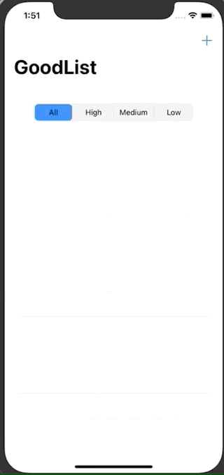

# Todo List App

## 구동 화면

- 사용자가 할일을 추가하면 메인 화면에 각각의 Priority별로 저장됨
- RxSwift를 이용하여 구현



## 소스 코드

### Task 데이터 부분

- Struct 를 통한 데이터 구조 구현

- Priority를 구별하기 위한 Enum 생성

- 소스코드

  - ```swift
    enum Priority: Int {
      case high
      case medium
      case low
    }
    
    struct Task {
      
      var title: String?
      var priority: Priority?
      
      init(title:String, priority: Priority) {
        self.title = title
        self.priority = priority
      }
    }
    ```

### MainViewController 부분

- 사용자가 추가한 Task의 정보를 가지고 있음

- segmentControl을 통해서 사용자가 지정한 Priority값에 따라서 TableView의 리스트를 변경해줌

- 소스코드

  - Properties

    - ```swift
      let disposeBag = DisposeBag()
      private var filteredTasks = [Task]()
      private var tasks = BehaviorRelay<[Task]>(value: [])
      ```

  - prepare

    - ```swift
      override func prepare(for segue: UIStoryboardSegue, sender: Any?) {
        guard let navC = segue.destination as? UINavigationController,
        let taskAddVC = navC.viewControllers.first as? AddNewTaskViewController else { fatalError("Can't find taskAddVC") }
      
        taskAddVC.taskSubjectObservavle
        .subscribe(onNext: {
      
          // SegmentedControl의 값이 4개 이고, 1번째는 All 이기 때문에 index 에서 1을 빼줌
          let priority = Priority(rawValue: self.segmentedControl.selectedSegmentIndex-1)
      
          var existingTasks = self.tasks.value // BehaviorRelay에 직접 추가 불가
          existingTasks.append($0)
      
          self.tasks.accept(existingTasks) 	// 사용자가 추가한 Task가 추가된 리스트 넣기
          self.filterTasks(by: priority)		// 추가된 전체 리스트에서 사용자가 선택한 Priority Task만 보여줌
      
        }).disposed(by: disposeBag)
      }
      ```

  - filteredTask : 사용자가 선택한 Priority만 선택적으로 보여주는 filter 기능

    - ```swift
      private func filterTasks(by priority: Priority?) {
          if priority == nil {	// All 인 경우 nil
            self.filteredTasks = self.tasks.value
            updateTableView()
          } else { // high, medium, low
            self.tasks.map { tasks in  // priority 로 필터링된 Array가 리턴됨
              return tasks.filter { $0.priority == priority! }
            }.subscribe(onNext: { [weak self] tasks in
              self?.filteredTasks = tasks // 필터링된 Array 적용
              self?.updateTableView()			// tableView Reload
            }).disposed(by: disposeBag)
          }
        }
        
        private func updateTableView() {
          DispatchQueue.main.async {
            self.tableView.reloadData()
          }
        }
      ```

### AddNewTaskViewController 부분

- 사용자가 Task를 저장하는 화면

- Task 타이틀과, SegmentedControl을 이용하여 Priority 지정

- 소스코드

  - ```swift
      var taskSubject = PublishSubject<Task>()
      var taskSubjectObservavle: Observable<Task> {
        return taskSubject.asObservable()
      }
      
      @IBAction func tapSaveButton() {
        
        guard let priority = Priority(rawValue: self.prioritySegmentedContoller.selectedSegmentIndex),
              let taskTitle = taskTitleTextField.text else { return }
        
        let task = Task(title: taskTitle, priority: priority)
        
        taskSubject.onNext(task) // task 전달
        
        dismiss(animated: true, completion: nil)
      }
    ```