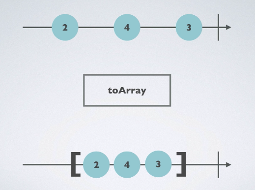
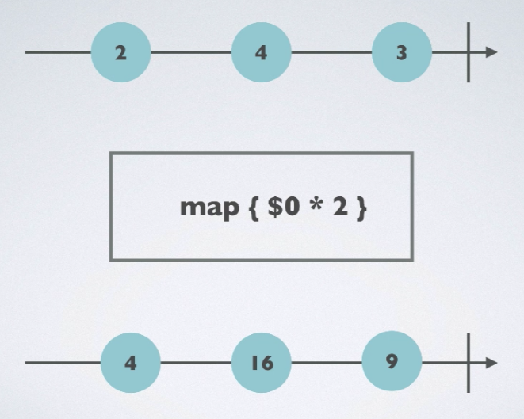
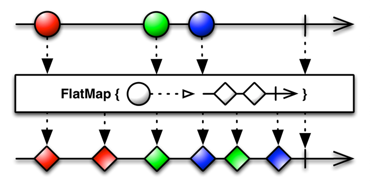

# Transforming Operators

### ToArray



- 연속된 값을 배열로 만들어주는 Operator

  - 연속된 값이 같은 형태가 아닐 경우 Observable에 타입을 지정해주어야 함
  - `Observable<Any>`

- 소스코드

  - ```swift
    Observable.of(1,2,3,4,5)
      .toArray()
      .subscribe(onNext: {
        print($0)
      }).disposed(by: disposeBag)
    /* 출력 결과
    [1, 2, 3, 4, 5]
    */
    ```

### MAP



- map은 들어오는 각각의 element의 value 값에 조건을 적용해준다

- 소스코드

  - ```swift
    Observable.of(1,2,3,4,5)
      .map {
        $0 * 2
      }
      .subscribe(onNext: {
        print($0)
      }).disposed(by: disposeBag)
    /* 출력 결과
    2
    4
    6
    8
    10
    */
    ```

### FlapMap



-  [ReactiveX - FlatMap operator](http://reactivex.io/documentation/operators/flatmap.html) 

- 방출하는 이벤트의 하위 요소들은 각각 개별 Observable로 변환도 가능하다.

- 원본 Observable의 이벤트를 받아 새로운 Observable로 변형한다.

  - ```swift
    func flatMap<O>(_ selector: @escaping (Student) throws -> O) -> Observable<O.E> where O : ObservableConvertibleType
    ```

- 소스코드

  - ```swift
    struct Student {
      var score: BehaviorRelay<Int>
    }
    
    let john = Student(score: BehaviorRelay(value: 75))
    let mary = Student(score: BehaviorRelay(value: 95))
    
    let student = PublishSubject<Student>()
    
    student.asObservable()
      .flatMap { $0.score.asObservable() }
      .subscribe(onNext: {
        print($0)
      }).disposed(by: disposeBag)
    
    student.onNext(john)
    john.score.accept(100)
    
    student.onNext(mary)
    mary.score.accept(90)
    /*
    75		- john's original Value
    100		- john's Changed Value
    95		- mary's original Value
    90		- mary's Changed Value
    */
    ```

  - 

### Flat Map Lastest 

- Flat Map과 비슷한 기능을 하지만 가장 마지막으로 변경한 Observable만 적용되고 이전에 변환된 Observble은 무시됨

- 소스코드

  - ```swift
    student.asObservable()
      .flatMapLatest { $0.score.asObservable() }
      .subscribe( onNext: {
        print($0)
      }).disposed(by: disposeBag)
    
    student.onNext(john)
    john.score.accept(100)
    
    student.onNext(mary)
    john.score.accept(45) // ignore - Can't change john's value(Score)
    /*
    75		- john's original Value
    100		- john's changed value
    95		- mary's original Value
    */
    ```


### Reference

-  [RxSwift, Observable 의 변형](https://brunch.co.kr/@tilltue/9) 