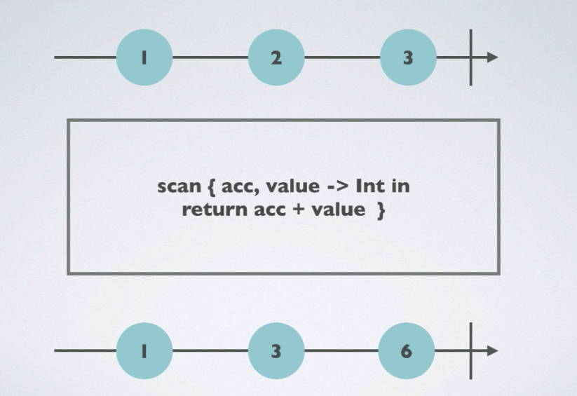

# Combining Operators

### Starts With


- startWith() 에 지정된 Sequnece부터 시작하는 Operator

- 소스코드

  - ```swift
    let numbers = Observable.of(2,3,4)
    
    let observable = numbers.startWith(1)
    observable.subscribe(onNext: {
      print($0)
    }).disposed(by: disposeBag)
    /*
    1  <- startWith Sequence
    2
    3
    4
    */
    ```

### Concat


- 서로 다른 Sequnce를 순차적으로 실행해준다.

- 소스코드

  - ```swift
    let firstSeq = Observable.of(1,2,3)
    let secondSeq = Observable.of(4,5,6)
    
    let concatedObservable = Observable.concat([firstSeq, secondSeq])
    concatedObservable
      .subscribe(onNext:{
        print($0)
      }).disposed(by: disposeBag)
    /*
    1 -- firstSeq Start
    2
    3 -- firstSeq End
    4 -- secondSeq Start
    5
    6 -- secondSeq End
    */
    ```

### Merge


- 서로 다른 Sequnce에서 먼저 들어오는 순서대로 처리해주는 Operator

- 소스코드

  - ```swift
    let left = PublishSubject<Int>()
    let right = PublishSubject<Int>()
    
    let source = Observable.of(left.asObserver(), right.asObserver())
    
    let mergeObservable = source.merge()
    mergeObservable.subscribe(onNext: {
      print($0)
    }).disposed(by: disposeBag)
    
    left.onNext(5)
    left.onNext(2)
    right.onNext(2)
    right.onNext(1)
    left.onNext(99)
    /*  먼저 들어오는 순서대로 출력 됨
    5
    2
    2
    1
    99
    */
    ```

### Combine Latest


-  서로 다른 Sequnce에서 `left` 의 Sequnce에서 들어온 마지막 값과 `right` 에서 들어온 마지막 값을 묶어서 보여줌

- 소스코드

  - ```swift
    let left = PublishSubject<Int>()
    let right = PublishSubject<Int>()
    
    let combineLatestObservable = Observable.combineLatest(left, right, resultSelector: {
      lastLeft, lastRight in
      "\(lastLeft) \(lastRight)"
    })
    
    let dispoable = combineLatestObservable.subscribe(onNext: { value in
      print(value)
    })
    
    left.onNext(46)
    right.onNext(1)
    left.onNext(30)
    right.onNext(99)
    right.onNext(2)
    
    /*
    46 1 		(left 마지막, right 마지막)
    30 1  	[left 추가] -> (left 변경!, right 마지막) 
    30 99 	[right 추가] -> (left 미지막, right 변경!)
    30 2  	[right 추가] -> (left 마지막 , right 변경!)
    */
    ```


### With Latest From


- button과 같은 특정 이벤트를 발생시키는 Observable과 일반적인 Observable을 WithLatestForm으로 지정

- 다른 Seqence에서 들어온 값들 중에서 button Action(Tap) 이 발생하기 직전 마지막 값만 가지고 있다가 보여줌

- 소스코드

  - ```swift
    let button = PublishSubject<Void>() // 버튼은 리턴하는 타입이 없다
    let textField = PublishSubject<String>()
    
    let observableButton = button.withLatestFrom(textField)
    
    let disposable = observableButton.subscribe(onNext: {
      print($0)
    })
    
    textField.onNext("Sw")				// ignore
    textField.onNext("Swif")			// ignore
    textField.onNext("Swift")			// print!
    
    button.onNext(())
    button.onNext(())
    /*
    Swift
    Swift
    */
    ```

### Reduce


- 각각의 element내의 value들을 지정한 Accumulator 연산자를 통해 계산한 값을 리턴 해줌

- 소스코드

  - ```swift
    let source = Observable.of(1,2,3)
    
    source.reduce(0, accumulator: +)
      .subscribe(onNext:{
        print($0)
      }).disposed(by: disposeBag)
    
    
    
    source.reduce(0, accumulator: {
      summary, newValue in
      return summary + newValue
    }).subscribe(onNext: {
      print($0)
    }).disposed(by: disposeBag)
    
    /*
    6
    6
    */
    ```

### Scan



- `reduce `  연산자와 동일하며 한가지가 다르다, 사용자가 지정한 연산자를 통해 element내 value의 연산되는 과정을 보여줌 

- 소스코드

  - ```swift
    let source = Observable.of(1,2,3)
    
    source.scan(0, accumulator: +)
      .subscribe(onNext:{
        print($0)
      }).disposed(by: disposeBag)
    
    /*
    1
    3
    6
    */
    ```