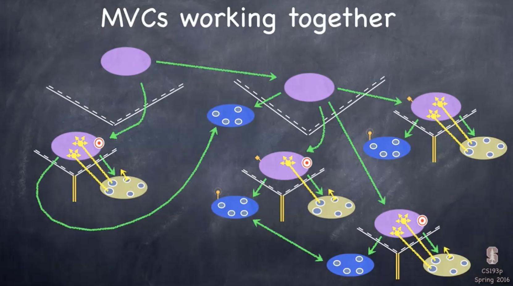

# MVC Model


## MVC 란?

### 정의

- 소프트웨어를 디자인 할때 Model, View, Controller로 나누어 디자인하는 방법

### 구성 방법

- Nomal MVC


- Apple MVC


---

## MVC 기초 


- View와 Model 사이는 넘어갈 수 없음
- view와 controller 사이에는 delegate, data Source를 통해 처리하도록

### View

- Your Controller's minion
- 화면에 대한 Zoom, Scrolling, Should, Did, Will
- 데이터를 소유할 수 없다 
  - 데이터를 얻기위해서 Controller에게 요청해야 함

### Controller

- How your model is presented to the user (UI Logic)

### Model

-  What your application is (but not how it is displayed)
- 앱이 실제로 실행되는 사항
- 데이터베이스, 알고리즘 등

## MVC 여러개를 연결하여 큰 앱을 만들려면?

### 애플에서 제공하는 다양한 뷰를 다룰 수 있는 방법



- 하나의 앱은 다양한 MVC모델들이 결합되어 존재 
- M,V,C를 하나로 묶어서 사용하고, 다른 뷰와 모델이 섞이게 되면 나중에 유지보수 차원에서 관리하기가 힘들다

#### 1. TabBarController

##### 설명

- 표현하는 데이터가 다른 View들을 표현할때 좋다

##### 구현 화면


-  하단 tabBar

#### 2. UINavigationController

##### 설명

- 루트 뷰 컨트롤러가 하나 존재
- 메뉴별로 이동할때마다 자식뷰를 생성
- 화면을 이전으로 다시 돌아가게 되면 메모리가 자동으로 해제되고 제거됨

##### 구현화면


#### 3. UISplitViewController

##### 설명

- 아이패드 같은 기기에서 화면을 분할하여 앱을 사용하는 경우 사용
- 왼쪽은 Master, 오른쪽은 Detail

##### 구현 화면


#### MVC를 더 잘 사용하려면

1. Sub MVC들을 viewControllers Property를 통해서 접근할 수 있다.
   - 예시
     - var viewControllers: [UIViewController]? { get set }
   - tabBar 는 왼쪽에서 오른쪽으로 순서대로 Array에 저장됨
   - split view는 [0] 이 마스터, [1]이 detail
   - navigation Controller는 Storyboard나 Segue 등을 통해서 접근함

2. 내가 포함된 SVC, TBC, NC 자신을 얻어오는 방법

   - 모든 UIViewController내에는 세가지 프로퍼티들이 있고, 옵셔널 값으로 해당 뷰컨트롤러에 속해있다면 값을 리턴 해줌
   - 예시 

   ```swift
   if let detailVC: UIViewController? = splitViewController?.viewControllers[1] {...}
   //Properties
   var tabBarController: UITabBarController? { get }
   var splitViewController: UISplitViewController? { get }
   var navigationController: UINavigationController? {get}
   ```

## Reference

- [iOS 아키텍처 패턴(MVC,MVVM,Viper)](http://labs.brandi.co.kr/2018/02/21/kimjh.html)
- [Inflearn 스텐포드 강의 - MVC 여러개를 연결해 좀 더 큰 앱을 만들어보자](https://www.inflearn.com/course/stanford-ios-한글자막-강의/lecture/4252)
- [Inflearn 스텐포드 강의 - MVC 디자인 패턴은 뭘까 ](https://www.inflearn.com/course/stanford-ios-한글자막-강의/lecture/4224)
- [Inflearn 스텐포드 강의 - MVC를 더 잘 사용하려면 ](https://www.inflearn.com/course/stanford-ios-한글자막-강의/lecture/4253)

