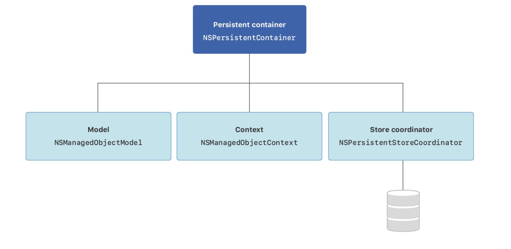
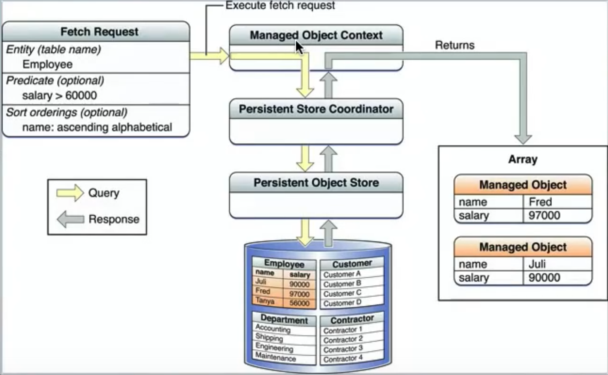

# CoreData

- 정의
  - Persist or cache data and support undo on a single device.
  - 코어 데이터를 사용하여 오프라인 사용, 임시적인 케쉬등을 위한 영구적인 데이터를 저장할 수 있다. 
  - 
  - 

1. [Core Data](https://developer.apple.com/documentation/coredata)
   - 정의
     - 한 디바이스에서 영구 또는 임시적인 데이터나 undo를 지원하기 위한 데이터
     - 오프라인 사용, 임시적인 케쉬 등을 위한 영구적인 데이터를 저장할 수 있음

2. [Creating a Core Data Model](https://developer.apple.com/documentation/coredata/creating_a_core_data_model)
   - Create a data model file to contain your app’s object structure.
3. [Setting Up da Core Data Stack](https://developer.apple.com/documentation/coredata/setting_up_a_core_data_stack)
   - Set up the classes that manage and persist your app’s objects.



- An instance of [`NSManagedObjectModel`](https://developer.apple.com/documentation/coredata/nsmanagedobjectmodel) represents your app’s model file describing your app’s types, properties, and relationships.
- An instance of [`NSManagedObjectContext`](https://developer.apple.com/documentation/coredata/nsmanagedobjectcontext) tracks changes to instances of your app’s types.
- An instance of [`NSPersistentStoreCoordinator`](https://developer.apple.com/documentation/coredata/nspersistentstorecoordinator) saves and fetches instances of your app’s types from stores.
- An instance of [`NSPersistentContainer`](https://developer.apple.com/documentation/coredata/nspersistentcontainer) sets up the model, context, and store coordinator all at once.

4. Fetch flow of data




## Create


## Read

- 전체 데이터 추출

  - ```swift
    func getUsers(ascending: Bool = false) -> [TodoList] {
      var models: [TodoList] = [TodoList]()
    
      if let context = context {
        let idSort: NSSortDescriptor = NSSortDescriptor(key: "index", ascending: ascending)
        let fetchRequest: NSFetchRequest<NSManagedObject>
        = NSFetchRequest<NSManagedObject>(entityName: modelName)
        fetchRequest.sortDescriptors = [idSort]
    
        do {
          if let fetchResult: [TodoList] = try context.fetch(fetchRequest) as? [TodoList] {
            models = fetchResult
          }
        } catch let error as NSError {
          print("Could not fetch🥺: \(error), \(error.userInfo)")
        }
      }
      return models
    }
    ```

    

- 특정 컬럼의 값만 추출 하는 방법

  - ```swift
    func fetchKindsTodoList(kinds: String) -> [TodoList] {
      var todoList = [TodoList]()
    
      if let context = context {
        let index: NSSortDescriptor = NSSortDescriptor(key: "index", ascending: true)
    
        let fetchRequest: NSFetchRequest<NSFetchRequestResult>
        = NSFetchRequest<NSFetchRequestResult>(entityName: modelName)
    
        fetchRequest.predicate = NSPredicate(format: " kinds = %@", NSString(string: kinds))
    
        fetchRequest.sortDescriptors = [index]
    
        do {
          if let fetchResult: [TodoList] = try context.fetch(fetchRequest) as? [TodoList] {
            todoList = fetchResult
          }
        } catch let error as NSError {
          print("Could not fetch🥺: \(error), \(error.userInfo)")
        }
      }
    
      return todoList
    }
    ```

  - 

## Update


## Delete


## Reference 

- Apple

  1. [Core Data](https://developer.apple.com/documentation/coredata)

  2. [Creating a Core Data Model](https://developer.apple.com/documentation/coredata/creating_a_core_data_model)
  3. [Setting Up da Core Data Stack](https://developer.apple.com/documentation/coredata/setting_up_a_core_data_stack)

  - [GeneratingCode](https://developer.apple.com/documentation/coredata/modeling_data/generating_code)

- Youtube

  - [Brian Advent - iOS Swift Tutorial: Get started with Core Data and Swift 3 - A Present App](https://www.youtube.com/watch?v=bnxQQgHL1hM)
  - 

