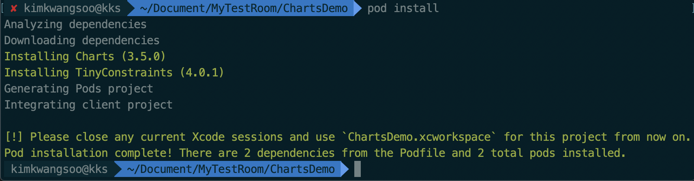
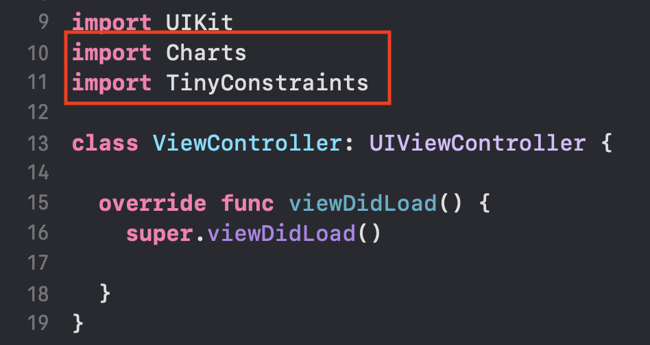
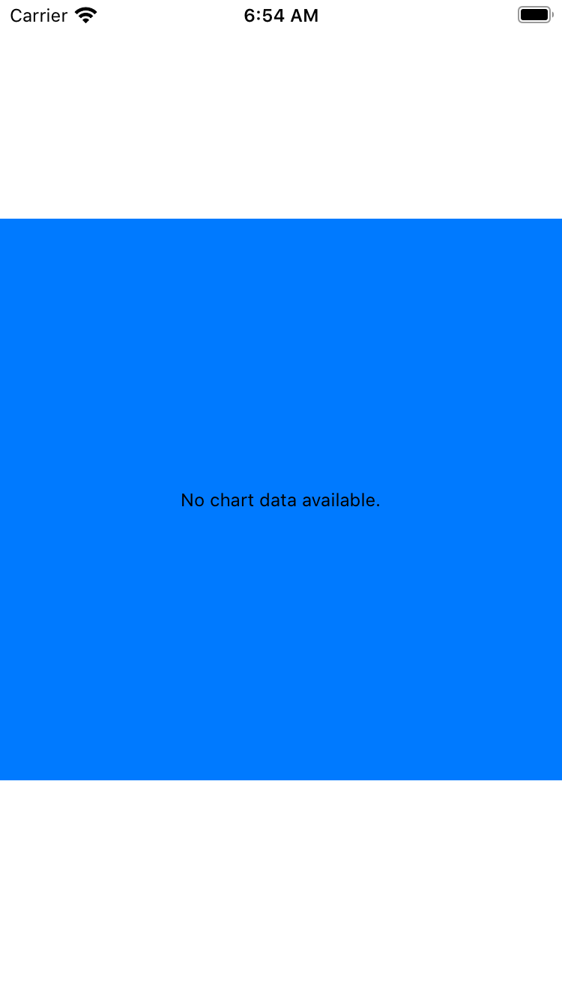

# Charts 라이브러리 사용하기

iOS에서 차트를 사용하기위한 라이브러리

### Pod을 통한 Charts 설치

1. 터미널을 통해 해당 프로젝트의 위치로 이동 후 `pod init`

```bash
pod init
```

2. 동일 위치에 `Profile` 파일이 생성되고 해당 파일을 `vi`로 열어 아래와 같이 수정

```bash
# Uncomment the next line to define a global platform for your project
platform :ios, '13.5' # 추가

target 'TodoList' do
  # Comment the next line if you don't want to use dynamic frameworks
  use_frameworks!

  # Pods for TodoList
  pod 'Charts' 						# 추가
  pod 'TinyConstraints'		# 추가

end
```

3. `pod install` 을 통한 설치 진행



4. 새로 생성된 `ChartsDemo.xcworkspace` 파일 오픈 후 `Charts`,`TinyConstratints` 모듈 정상 임포트 확인
   - TinyConstraints 는 필수 아님



5. 에러 유무 확인


### 예제 소스코드 작성

1. ViewController.swift

```swift
import UIKit
import Charts
import TinyConstraints

class ViewController: UIViewController {
  
  lazy var lineChartView: LineChartView = { // liveChartView 객체 생성
    let charView = LineChartView()
    charView.backgroundColor = .systemBlue
    return charView
  }()
  
  override func viewDidLoad() {
    super.viewDidLoad()
    
    view.addSubview(lineChartView)
    lineChartView.centerInSuperview()     // TinyConstraints
    lineChartView.width(to: view)         // TinyConstraints
    lineChartView.heightToWidth(of: view) // TinyConstraints
    
  }
}
```

2. 실행 결과




### 임시 데이터 생성하여 차트 그리기

#### 구현 화면 예시

- 사용자가 완료한 TodoList의 완료 갯수를 %로 환산하여 일별, 월별, 년별 보여주는 화면
- 주간 일일 완료 갯수를 보여주는 화면만 구현 완료


#### 소스코드

- statistic.swift

```swift
import UIKit
import Charts

class StatisticVC: UIViewController, ChartViewDelegate, IAxisValueFormatter {
  
  // MARK: - init

  override func viewDidLoad() {
    super.viewDidLoad()
  
    view.backgroundColor = .white
    navigationItem.title = "Statistic"
    
    // 초기 셋팅
    dayArary = calculateDayString()
    
    numbers = UserDefaults.standard.array(forKey: "dayStatic") as! [Int]
    segCon.selectedSegmentIndex = 0
    setupCharView(selectedSegmentIndex: segCon.selectedSegmentIndex)
    
  }
  // 오늘부터 역으로 일주일의 "요일" String값 얻는 함수
  func calculateDayString() -> [String] {
    let dayStringArray: [String] = ["일요일","월요일","화요일","수요일","목요일","금요일","토요일"]
    var resultArray:[String] = []
    let cal = Calendar(identifier: .gregorian)
    let now = Date()
    let comps = cal.dateComponents([.weekday], from: now)
    
    for index in 0..<7 {
      resultArray.append(dayStringArray[(comps.weekday! + index - 1 )%7])
    }

    return resultArray.reversed()
  }
  
  // x축의 표시될 label String값을 전달
  func stringForValue(_ value: Double, axis: AxisBase?) -> String {
    return dayArary[Int(value)]
  }
  
  @objc func segconChanged(_ segcon:UISegmentedControl) {
    configureStaticView(selectedSegmentIndex: segcon.selectedSegmentIndex)
  }
  
  func configureStaticView(selectedSegmentIndex number:Int) {
    // top : displayDurationLabel Setting
    setDisplayDurationLabel(selectedSegmentIndex: number)
    
    // mid : deafaultCharView Setting
    setupCharView(selectedSegmentIndex: number)
    
  }
  
 	// 실제 차트 관련 내용
  func setupCharView(selectedSegmentIndex number:Int) {
  
    let chartView = BarChartView()   					// 인스턴스 생성
    var barChartEntry = [BarChartDataEntry]() //BarChart 데이터 인스턴스 생성
    var count: Int = 0 												// x 축 라벨 갯수 강제 지정
    let staticArray = UserDefaults.standard.array(forKey: "dayStatic") as! [Int]
    
    chartView.delegate = self
    
    // [임시] 데이터 저장
    if number == 0 {
      count = 7 
      for i in 0..<count {
        let value = BarChartDataEntry(x: Double(i), y: Double(staticArray[i]))
        barChartEntry.append(value)
      }
    } else if number == 1 {	 // 월간 데이터 출력 데이터 생성 : 미구현 임시 데이터 생성
      count = 30
      for i in 0..<count {
           let value = BarChartDataEntry(x: Double(i), y: Double((1...100).randomElement()!))
              barChartEntry.append(value)
         }
    } else {		// 년간 데이터 출력 데이터 생성 : 미구현 임시 데이터 생성
      count = 365
      for i in 0..<count {
           let value = BarChartDataEntry(x: Double(i), y: Double((1...100).randomElement()!))
              barChartEntry.append(value)
         }
    }
    
    // ChartView 기본 설정
    chartView.backgroundColor = .white
    chartView.chartDescription?.enabled = false
    chartView.dragEnabled = true
    chartView.setScaleEnabled(true)
    chartView.pinchZoomEnabled = false
    chartView.maxVisibleCount = 60
    
    // x 축 설정
    let xAxis = chartView.xAxis
    xAxis.labelPosition = .bottom								// x축 라벨 위치
    xAxis.labelFont = .systemFont(ofSize: 10)		// 라벨 폰트
    xAxis.labelCount = count 										// x축 라벨 수
    xAxis.valueFormatter = IndexAxisValueFormatter(values: dayArary)
    xAxis.granularity = 1
    
    // 왼쪽 Y축
    let leftAxisFormatter = NumberFormatter()
    leftAxisFormatter.minimumFractionDigits = 0
    leftAxisFormatter.maximumFractionDigits = 0
    //    leftAxisFormatter.negativeSuffix = " 회"
    leftAxisFormatter.positiveSuffix = " %"
    
    let leftAxis = chartView.leftAxis
    leftAxis.labelFont = .systemFont(ofSize: 10)
    leftAxis.labelCount = 10
    leftAxis.valueFormatter = DefaultAxisValueFormatter(formatter: leftAxisFormatter)
    leftAxis.labelPosition = .outsideChart   //.insideChart
    leftAxis.spaceTop = 0.15
    leftAxis.axisMinimum = 0 // FIXME: HUH?? this replaces startAtZero = YES
    leftAxis.axisMaximum = 100
    
    // 오른쪽 Y축
    let rightAxis = chartView.rightAxis
    rightAxis.enabled = false
    
    // 데이터 저장
    let bar1 = BarChartDataSet(entries: barChartEntry, label: "완료 수")
    bar1.colors = [NSUIColor.init(cgColor: #colorLiteral(red: 0.9345774055, green: 0.7326899171, blue: 0.3023572266, alpha: 1))]
    
    let data = BarChartData()
    data.addDataSet(bar1)
    
    chartView.data = data	// 데이터 셋팅
    
    defaultCharView.addSubview(chartView)  // 미리 오토 레이아웃으로 잡아둔 view에 추가
    chartView.translatesAutoresizingMaskIntoConstraints = false
    NSLayoutConstraint.activate([
      chartView.topAnchor.constraint(equalTo: defaultCharView.topAnchor),
      chartView.leadingAnchor.constraint(equalTo: defaultCharView.leadingAnchor),
      chartView.trailingAnchor.constraint(equalTo: defaultCharView.trailingAnchor),
      chartView.bottomAnchor.constraint(equalTo: defaultCharView.bottomAnchor)
    ])
  }
  
}


```


## Reference

- Github
  - [Charts](https://github.com/danielgindi/Charts)
- youtube
  - [Chart in Swift - Setting Up a Basic Line Chart Using iOS Charts](https://www.youtube.com/watch?v=mWhwe_tLNE8&list=PL_csAAO9PQ8bjzg-wxEff1Fr0Y5W1hrum&index=5)

