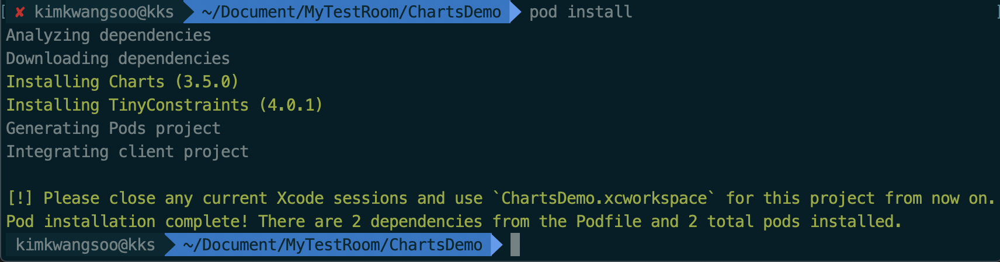
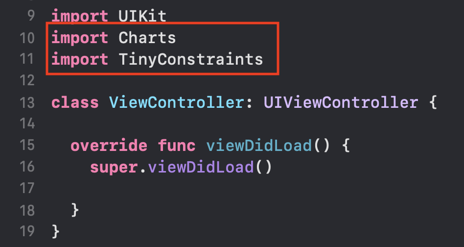

# Charts 라이브러리 사용하기

iOS에서 차트를 사용하기위한 라이브러리

### Pod을 통한 Charts 설치

1. 터미널을 통해 해당 프로젝트의 위치로 이동 후 `pod init`

```bash
pod init
```

2. 동일 위치에 `Profile` 파일이 생성되고 해당 파일을 `vi`로 열어 아래와 같이 수정

```bash
# Uncomment the next line to define a global platform for your project
platform :ios, '13.5' # 추가

target 'TodoList' do
  # Comment the next line if you don't want to use dynamic frameworks
  use_frameworks!

  # Pods for TodoList
  pod 'Charts' 						# 추가

end
```

3. `pod install` 을 통한 설치 진행



4. 새로 생성된 `ChartsDemo.xcworkspace` 파일 오픈 후 `Charts`,`TinyConstratints` 모듈 정상 임포트 확인
   - TinyConstraints 는 필수 아님



5. 에러 유무 확인


### 예제 소스코드 작성

1. ViewController.swift

```swift
import UIKit
import Charts
import TinyConstraints

class ViewController: UIViewController {
  
  lazy var lineChartView: LineChartView = { // liveChartView 객체 생성
    let charView = LineChartView()
    charView.backgroundColor = .systemBlue
    return charView
  }()
  
  override func viewDidLoad() {
    super.viewDidLoad()
    
    view.addSubview(lineChartView)
    lineChartView.centerInSuperview()     // TinyConstraints
    lineChartView.width(to: view)         // TinyConstraints
    lineChartView.heightToWidth(of: view) // TinyConstraints
    
  }
}
```

2. 실행 결과


### 임시 데이터 생성하여 차트 그리기

#### 구현 화면 예시

- 사용자가 완료한 TodoList의 완료 갯수를 %로 환산하여 일별, 월별, 년별 보여주는 화면
- 주간 일일 완료 갯수를 보여주는 화면만 구현 완료


#### 소스코드

- statistic.swift

```swift
import UIKit
import Charts
import TinyConstraints

class StatisticVC: UIViewController, ChartViewDelegate {
  
  // MARK: - Properties
  
  var numbers: [Int] = []
  var axisXStringArray: [String] = []
  var monthArray: [Double] = []
  
  let segCon: UISegmentedControl = {
    let sc = UISegmentedControl(items: ["Day","Month","Year"])
    sc.backgroundColor = UIColor.white
    sc.tintColor = UIColor.white
    sc.addTarget(self, action: #selector(segconChanged(_:)), for: .valueChanged)
    return sc
  }()
  
  let displayDurationLabel:UILabel = {
    let label = UILabel()
    label.font = .systemFont(ofSize: 20)
    label.backgroundColor = .white
    label.textAlignment = .center
    return label
  }()
  
  let defaultCharView:UIView = {
    let view = UIView()
    view.backgroundColor = .systemGray4
    return view
  }()
  
  let cal = Calendar(identifier: .gregorian)
  let now = Date()
  
  //cal.veryShortMonthSymbols
  
  var displayToggleOption: Int? {
    didSet {
      var text:String = ""
      
      let year = cal.component(.year, from: now)
      let month = cal.dateComponents([.month], from: now)
      let weekOfMonth = cal.dateComponents([.weekOfMonth], from: now)
      
      switch displayToggleOption {
      case 0: text = "\(year)년" + " \(month.month!)월" + " \(weekOfMonth.weekOfMonth!)주차"
      case 1: text = "\(year)년" + " \(month.month!)월"
      case 2: text = "\(year-3)년 ~ \(year)년"
      default: text = ""
      }
      
      displayDurationLabel.text = text
    }
  }
  
  //MARK: - BuildUI
  private func configureMainUI() {
    
    view.backgroundColor = .white
    
    navigationItem.title = "Statistic"
    
    let guide = view.safeAreaLayoutGuide
    [segCon,displayDurationLabel,defaultCharView].forEach {
      view.addSubview($0)
      $0.translatesAutoresizingMaskIntoConstraints = false
      $0.leadingAnchor.constraint(equalTo: guide.leadingAnchor).isActive = true
      $0.trailingAnchor.constraint(equalTo: guide.trailingAnchor).isActive = true
      
    }
    
    NSLayoutConstraint.activate([
      segCon.topAnchor.constraint(equalTo: guide.topAnchor ),
      segCon.heightAnchor.constraint(equalToConstant: 35),
      
      displayDurationLabel.topAnchor.constraint(equalTo: segCon.bottomAnchor),
      displayDurationLabel.heightAnchor.constraint(equalToConstant: 60),
      
      defaultCharView.topAnchor.constraint(equalTo: displayDurationLabel.bottomAnchor),
      defaultCharView.heightAnchor.constraint(equalToConstant: view.frame.size.width)
      
    ])
  }
  
  //MARK: - init
  
  override func viewDidLoad() {
    super.viewDidLoad()
    
    // 오토 레이아웃
    configureMainUI()
    
    // segment "Day" 설정
    segCon.selectedSegmentIndex = 0
    
    // 날짜 데이터 생성
    axisXStringArray = calculateDayString(segmentIndex: segCon.selectedSegmentIndex)
    
    // 상단 일,월,년 텍스트 디스플레이
    displayToggleOption = segCon.selectedSegmentIndex
    
    // 차트 셋팅
    setupCharView(selectedSegmentIndex: segCon.selectedSegmentIndex)
    
  }
  
  // segment togle action
  @objc func segconChanged(_ segcon:UISegmentedControl) {
    
    // Month label
    displayToggleOption = segCon.selectedSegmentIndex
    
    // chart Setting
    setupCharView(selectedSegmentIndex: segcon.selectedSegmentIndex)
    
  }
  
  func calculateDayString(segmentIndex number:Int) -> [String] {
    
    var resultArray:[String] = []
    
    let cal = Calendar(identifier: .gregorian)
    
    switch number {
    case 0 :
      let now = Date()
      let comps = cal.dateComponents([.weekday], from: now)
      let dayStringArray = cal.weekdaySymbols // ["Sun", "Mon", "Tue", "Wed", "Thu", "Fri", "Sat"]
      for index in 0..<7 {
        resultArray.append(dayStringArray[(comps.weekday! + index - 1 )%7])
      }
    case 1:
      resultArray = cal.veryShortMonthSymbols.map{ String($0) + "월" } // ["1", "2", "3", "4", "5", "6", "7", "8", "9", "10", "11", "12"]
    case 2:
      let year = cal.component(.year, from: now)
      for i in 0..<4 {
        resultArray.append("\(year - 3 + i)")
      }
      
    default:
      resultArray = []
    }
    
    return resultArray
  }
  


  // MARK: - Setting Chart View
  func setupCharView(selectedSegmentIndex number:Int) {
    
    let chartView = BarChartView()              // bar 차트 인스턴스 생성
    var barChartEntry = [BarChartDataEntry]()   // bar 차트 데이터 엔트리 생성
    var staticArray: [Int] = []                 // 실제 통계 자료
    var count: Int = 0 // 임시
    
    chartView.delegate = self
//        axisFormatDelegate = self
    
    // x축 데이터 생성
    axisXStringArray = calculateDayString(segmentIndex: number)
    
    // [임시] 데이터 저장
    if number == 0 {  // 일별
      staticArray = UserDefaults.standard.array(forKey: "dayStatic") as! [Int]
      for i in 0..<staticArray.count {
        let value = BarChartDataEntry(x: Double(i), y: Double(staticArray[i]))
        barChartEntry.append(value)
      }
    } else if number == 1 { // 월별
      count = axisXStringArray.count
      for i in 0..<count {
        let value = BarChartDataEntry(x: Double(i), y: Double((50...100).randomElement()!))
        barChartEntry.append(value)
      }
    } else {                // 년별
      count = axisXStringArray.count
      for i in 0..<count {
        let value = BarChartDataEntry(x: Double(i), y: Double((80...100).randomElement()!))
        barChartEntry.append(value)
      }
    }
    
    // Chart 기본 설정
    chartView.backgroundColor = .white
    chartView.chartDescription?.enabled = false
    chartView.dragEnabled = true
    chartView.doubleTapToZoomEnabled = true
    chartView.drawBordersEnabled = true
    chartView.pinchZoomEnabled = true
    
    // X 축 설정
    let xAxis = chartView.xAxis
    xAxis.labelPosition = .bottom
    xAxis.labelFont = .systemFont(ofSize: 10)
    xAxis.labelCount = axisXStringArray.count    // x축 라벨 수
    xAxis.valueFormatter = IndexAxisValueFormatter(values: axisXStringArray) // x축 데이터 전달
    
    
    // 왼쪽 Y 축 설정
    let leftAxisFormatter = NumberFormatter()
    leftAxisFormatter.positiveSuffix = " %"  // leftAxisFormatter.negativeSuffix = " 회"
    
    let leftAxis = chartView.leftAxis
    leftAxis.valueFormatter = DefaultAxisValueFormatter(formatter: leftAxisFormatter)
    leftAxis.labelFont = .systemFont(ofSize: 10)
    leftAxis.labelCount = 10
    leftAxis.labelPosition = .outsideChart   //.insideChart
    leftAxis.axisMinimum = 0
    leftAxis.axisMaximum = 105
    
    // 오른쪽 Y 축 설정
    let rightAxis = chartView.rightAxis
    rightAxis.enabled = false
    
    // 데이터 저장
    let bar1 = BarChartDataSet(entries: barChartEntry, label: "완료 수")
    bar1.colors = [NSUIColor.init(cgColor: #colorLiteral(red: 0.9345774055, green: 0.7326899171, blue: 0.3023572266, alpha: 1))]
    
    let data = BarChartData()
    data.addDataSet(bar1)
    
    chartView.data = data
    
    defaultCharView.addSubview(chartView)
    chartView.translatesAutoresizingMaskIntoConstraints = false
    NSLayoutConstraint.activate([
      chartView.topAnchor.constraint(equalTo: defaultCharView.topAnchor),
      chartView.leadingAnchor.constraint(equalTo: defaultCharView.leadingAnchor),
      chartView.trailingAnchor.constraint(equalTo: defaultCharView.trailingAnchor),
      chartView.bottomAnchor.constraint(equalTo: defaultCharView.bottomAnchor)
    ])
  }
}

```


## Reference

- Github
  - [Charts](https://github.com/danielgindi/Charts)
- youtube
  - [Chart in Swift - Setting Up a Basic Line Chart Using iOS Charts](https://www.youtube.com/watch?v=mWhwe_tLNE8&list=PL_csAAO9PQ8bjzg-wxEff1Fr0Y5W1hrum&index=5)

