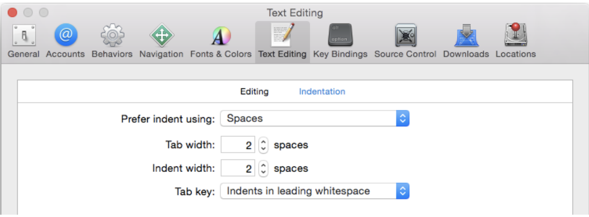

# Swift Style Guide by raywenderlich.com


### Naming 관련 유의 사항

- 함수를 호출하는 부분에서 명확성을 위해 노력
- 간결성보다 명확성 우선 순위 지정
- camelCase 사용 (snake_case 아님)
- **타입과 프로토콜에 UpperCamelCase**를 사용하고 **다른 모든 것에 대해서는 lowerCamelCase를 사용**
- 불필요한 단어를 생략하면서 필요한 모든 단어를 포함
- 유형이 아닌 역할을 기반으로 이름 사용
- 때때로 약한 유형 정보를 보상
- 유창한 사용을 위해 노력
- make로 팩토리 메소드 시작
- 부작용에 대한 명명 방법
  - 동사 메소드는 변경되지 않은 버전의 -ed, -ing 규칙을 따릅니다.
  - 명사 메서드는 변형 버전에 대한 formX 규칙을 따릅니다.
  - 부울 형식은 어설 션과 같이 읽어야합니다.
  - 명사로 읽어야 할 내용을 설명하는 프로토콜
  - 기능을 설명하는 프로토콜은 -able 또는 -ible로 끝나야합니다.
- 전문가를 놀라게하거나 초보자를 혼동하지 않는 용어 사용
- 일반적으로 약어 피하기
- 이름에 선례 사용
- 무료 함수보다 메소드와 속성 선호
- 케이싱 약어 및 이니셜 리즘을 균일하게 위 또는 아래로
- 동일한 의미를 공유하는 메소드에 동일한 기본 이름을 부여
- 리턴 타입의 과부하 방지
- 설명서 역할을하는 좋은 매개 변수 이름 선택
- 델리게이트에서 언급 한 것을 제외하고 메소드 이름에 이름을 포함하는 대신 첫 번째 매개 변수의 이름을 선호
- 라벨링 클로저 및 튜플 매개 변수
- 기본 매개 변수 활용


### Custom Delegates

- 커스텀 delegates를 만들때, 이름 없는 첫번째 파라미터는 delegate source가 되어야 한다

- ```swift
  // Prefered 
  func namePickerView(_ namePickerView: NamePickerView, didSelectName name: String)
  func namePickerViewShouldReload(_ namePickerView: NamePickerView) -> Bool
  
  // Not Prefered
  func didSelectName(namePicker: NamePickerViewController, name: String)
  func namePickerShouldReload() -> Bool
  ```

  

### User Type Inferrend Context

- 짧고 명확한 코드 작성을 위해서 컴파일러의 문맥 추론기능을 이용한다.

  - ```swift
    //Preferred:
    let selector = #selector(viewDidLoad)
    view.backgroundColor = .red
    let toView = context.view(forKey: .to)
    let view = UIView(frame: .zero)
    
    //Not Preferred:
    let selector = #selector(ViewController.viewDidLoad)
    view.backgroundColor = UIColor.red
    let toView = context.view(forKey: UITransitionContextViewKey.to)
    let view = UIView(frame: CGRect.zero)
    ```

    

## Code Organization

- extentions을 이용하여 기능기반의 논리적인 블럭으로 분류한다.

- 각각의 논리적 블럭은 `MARK: - ` 를 통하여 표기해준다.

  - ``` swift
    //Preferred: =================================
    
    class MyViewController: UIViewController {
      // class stuff here
    }
    
    // MARK: - UITableViewDataSource
    extension MyViewController: UITableViewDataSource {
      // table view data source methods
    }
    
    // MARK: - UIScrollViewDelegate
    extension MyViewController: UIScrollViewDelegate {
      // scroll view delegate methods
    }
    
    // Not Preferred: =================================
    
    class MyViewController: UIViewController, UITableViewDataSource, UIScrollViewDelegate {
      // all methods
    }
    ```

    

### Minimal Imports

- 소스코드를 작성하고 실행하는데 필요한 최소한의 모듈만 import 

- `Foundation`으로 충분한 경우에는 `UiKit ` 은 필요없다. ( 반대의 경우에도 동일 )

  - ```swift
    // Preferred:
    // 1
    import UIKit
    var view: UIView
    var deviceModels: [String]
    // 2
    import Foundation
    var deviceModels: [String]
    
    //Not Preferred:
    // 1
    import UIKit
    import Foundation
    var view: UIView
    var deviceModels: [String]
    // 2
    import UIKit
    var deviceModels: [String]
    ```

    

## Spacing

- 공간을 조절하기 위해 tab 대신 2개의 공백을 이용하여 들여쓰기 설정

  - 변경 방법
    - 

- `if` / `else` / `switch` / `while` 등을 사용 시  `{}` 오픈시 같은 라인에서 진행한다

  - ```swift
    //Preferred:
    
    if user.isHappy { 	 // <- 같은 라인에서 오픈
      
    } else {						// <- 같은 라인에서 오픈
      
    }
    
    //Not Preferred:
    if user.isHappy
    {  									// <- 다른 라인에서 오픈 
      
    }
    else {
    }
    ```

- `:` 의 경우 항상 왼쪽의 공백이 없도록 하고 오른쪽 하나의 공백을 넣음

  - **예외 경우**

    -  3항 연산자 `? : ` 
    - 빈 딕셔너리 정의 `[:]`
    -  `#selection` 문법 사용 시 `addTarget(_:action:)`

  - ```swift
    //Preferred:
    class TestDatabase: Database {
      var data: [String: CGFloat] = ["A": 1.2, "B": 3.2]
    }
    
    //Not Preferred:
    class TestDatabase : Database {
      var data :[String:CGFloat] = ["A" : 1.2, "B":3.2]
    }
    ```

### Function Declarations

- 짧은 함수를 정의할 때는 `( ) , {` 을 포함하여 한줄에 모두 작성한다.

  - ```swift
    func reticulateSplines(spline: [Double]) -> Bool {
      // reticulate code goes here
    }
    ```

- 긴 함수를 정의할때는 각각의 파라미터를 새로운 행으로 만들어 나열해준다

  - ```swift
    func reticulateSplines(
      spline: [Double], 
      adjustmentFactor: Double,
      translateConstant: Int, 
      comment: String
    ) -> Bool {
      // reticulate code goes here
    }
    ```

- `(Void)` 를 나타낼때 단순히 `()` 으로 표현하지 않는다. 

  - ```swift
    // Preferred:
    func updateConstraints() -> Void {
      // magic happens here
    }
    typealias CompletionHandler = (result) -> Void
    
    //Not Preferred:
    func updateConstraints() -> () {
      // magic happens here
    }
    
    typealias CompletionHandler = (result) -> ()
    ```


### Function Calls

- 함수를 정의하는 방식과 동일하게 짧은건 한줄에, 긴 함수를 호출할때는 각 파라미터로 나누어 호출

  - ```swift
    // Short Function
    let success = reticulateSplines(splines)
    
    // Long Function
    let success = reticulateSplines(
      spline: splines,
      adjustmentFactor: 1.3,
      translateConstant: 2,
      comment: "normalize the display")
    ```


### Closure Expressions

- trailing 클로저 문법은 마지막 Argument 리스트 중 하나의 파라미터만 오도록 되어있다. 클로저 파마미터에 충분히 설명되는 이름을 설정한다.

  - ```swift
    //Preferred:
    UIView.animate(withDuration: 1.0) {
      self.myView.alpha = 0
    }
    
    UIView.animate(withDuration: 1.0, animations: {
      self.myView.alpha = 0
    }, completion: { finished in
      self.myView.removeFromSuperview()
    })
    
    //Not Preferred:
    UIView.animate(withDuration: 1.0, animations: {
      self.myView.alpha = 0
    })
    
    UIView.animate(withDuration: 1.0, animations: {
      self.myView.alpha = 0
    }) { f in
      self.myView.removeFromSuperview()
    }
    ```

    

### Constants

- 상수는 변수와 다르게 `let` 으로 정의되며 값이 변하지 않는다.

- 상수로 Type Property를 사용할때는 `static let` 을 사용하면 좋다.

- 이런 방식으로 선언된 유형은 일반벅으로 전역 속성보다 선호된다.

  - ```swift
    // Preferred:
    enum Math {
      static let e = 2.718281828459045235360287
      static let root2 = 1.41421356237309504880168872
    }
    
    let hypotenuse = side * Math.root2
    
    // Not Preferred:
    let e = 2.718281828459045235360287  // pollutes global namespace
    let root2 = 1.41421356237309504880168872
    
    let hypotenuse = side * root2 // what is root2?
    ```

- `Tip` 모든 변수를 선언할때 `let` 으로 설정한뒤 후에 컴파일러가 변경해주는 변수만 `var` 로 변경해준다.


### Type Inference

- 컴팩트 코드를 선호하고 단일 인스턴스의 상수 또는 변수 유형은 컴파일러가 유추하도록 한다.

- 형식 유추는 비어 있지 않은 작은 배열 및 딕셔너리 변수에 적합하다.

- `CGFloat` ` Int16`와 같이 특별한 타입은 명확하게 적어준다.

  - ```swift
    // Preferred:
    
    let message = "Click the button"
    let currentBounds = computeViewBounds()
    var names = ["Mic", "Sam", "Christine"]
    let maximumWidth: CGFloat = 106.5
    
    // Not Preferred:
    
    let message: String = "Click the button"
    let currentBounds: CGRect = computeViewBounds()
    var names = [String]()
    ```


### Type Annotation for Empty Arrays and Dictionaries

- 빈 배열이나 딕셔너리를 초기화할때 타입  annotation을 사용한다.

  - ```swift
    // Preferred:
    var names: [String] = []
    var lookup: [String: Int] = [:]
    
    // Not Preferred:
    var names = [String]()
    var lookup = [String: Int]()
    ```


### Memory Management

- 코드는 참조 주기를 생성하지 않아야 한다. 프로젝트 오브젝트를 분석한 뒤 `weak`/ `unowned` 를 통해 Strong cycles을 방지해야 한다.
- 오프젝트의 ifetime을 `[weak self]` and `guard let self = self else { return }` 숙어를 통해 연장해야 한다.
- 옵셔널 chaining을 통해서 lifetime을 연장하는것보다 명시적으로 연장해주는 것이 좋다.

```swift
// Preferred

resource.request().onComplete { [weak self] response in
  guard let self = self else {
    return 	// --- deallocated  ----
  }
  let model = self.updateModel(response)
  self.updateUI(model)
}
// Not Preferred

// might crash if self is released before response returns
resource.request().onComplete { [unowned self] response in
  let model = self.updateModel(response)
  self.updateUI(model)
}
Not Preferred

// == deallocate could happen between updating the model and updating UI ==
resource.request().onComplete { [weak self] response in
  let model = self?.updateModel(response)
	// --- deallocated  ----
  self?.updateUI(model)
}

```


### Ternary Operator

```swift
// Preferred:

let value = 5
result = value != 0 ? x : y

let isHorizontal = true
result = isHorizontal ? x : y

// Not Preferred:

result = a > b ? x = c > d ? c : d : y
```


### Refernce

1. [Raywenderich Swift Style Guide](https://github.com/raywenderlich/swift-style-guide)
2. [SwiftLint](https://github.com/realm/SwiftLint) 

