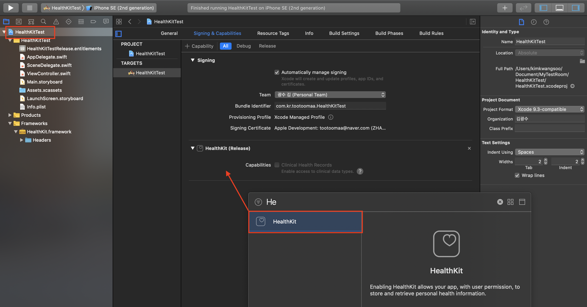
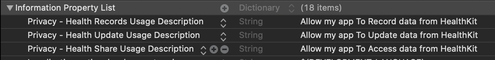

# HealthKit

## 이론

### 1. HealthKit 이란

- 개인정보에 대한 유지과 관리 하에 건강 및 피트니스 데이터에 접근하고 공유하는 기능
- 아이폰이나 애플워치에서 건강데이터를 수집하여 중앙 저장 공간의 역할
- 각각의 앱들은 healthKit store를 통해서 정보에 접근하고 공유할 수 있음
- 정보 수집이 완료되면, 개인적으로 수집된 건강과 피트니스 정보가 다양하게 분석된다
  - 건강 및 피트니스 데이터 수집 및 저장 
  - 비쥬얼 적인 분석
  - 소셜 상호 작용 가능
- 다른 헬스 관련 앱들에서 데이터를 저장, 수정, 삭제, 공유 등이 가능하다.

### 2. About the HealthKit Framework

1. HealthKit framwork
   - HealthKit 프레임 워크는 의미있는 방식으로 앱간 데이터를 공유하도록 설계됨
   - 개발자는 custom 데이터 타입을 사용할 수 없고, HealthKit이 제공하는 데이터 유형 및 단위를 사용할 수 있음
2. HealthKit Data
   - `Characteristic Data`
     - 이 기록은 사용자의 생년월일, 혈액형, 성별과 같이 변하지 않는 데이터를 나타낸다.
     - 이 내용은 앱에서 변경할 수 없고 Health앱을 통해 사용자가 직접 입력 해야 한다.
     - 관련 메소드
       -  [`dateOfBirth()`](https://developer.apple.com/documentation/healthkit/hkhealthstore/1614160-dateofbirth)
       -  [`bloodType()`](https://developer.apple.com/documentation/healthkit/hkhealthstore/1614164-bloodtype)
       -  [`biologicalSex()`](https://developer.apple.com/documentation/healthkit/hkhealthstore/1614171-biologicalsex)
       -  [`fitzpatrickSkinType()`](https://developer.apple.com/documentation/healthkit/hkhealthstore/1614161-fitzpatrickskintype)
   - `Sample data` 
     - 대부분의 사용자 건강 데이터는 특정 시점의 데이터를 나타내는 샘플에 저장됩니다. 모든 샘플 클래스는 클래스의 서브 클래스 인 [`HKSample`](https://developer.apple.com/documentation/healthkit/hksample)클래스의 서브 [`HKObject`](https://developer.apple.com/documentation/healthkit/hkobject)클래스입니다. 이러한 클래스는 [샘플](https://developer.apple.com/documentation/healthkit/samples) 에 자세히 설명되어 있습니다.
   - `Workout data`
     - 피트니스 및 운동 활동에 대한 정보는 [`HKWorkout`](https://developer.apple.com/documentation/healthkit/hkworkout)샘플로 저장
     - 관련 정보 : [Workout Data](https://developer.apple.com/documentation/healthkit#2943089)
   - `Source data`
     - 샘플 데이터는 이 데이터가 어디에서 생성되었는지에 대한 데이터를 가지고 있음
     - 데이터를 생성한 하드웨어 장치에 대한 정보를 포함 ([`HKSourceRevision`](https://developer.apple.com/documentation/healthkit/hksourcerevision)[`HKDevice`](https://developer.apple.com/documentation/healthkit/hkdevice))
   - `Deleged objects`
     - 일시적으로 HealthKit 저장소에서 삭제 된 항목의 UUID를 저장하는 데 사용
     - 관련 사항
       - [`HKDeletedObject`](https://developer.apple.com/documentation/healthkit/hkdeletedobject)[`HKAnchoredObjectQuery`](https://developer.apple.com/documentation/healthkit/hkanchoredobjectquery)[`HKDeletedObject`](https://developer.apple.com/documentation/healthkit/hkdeletedobject)
3. Properties of Objects and Sample
   1. HKObject 
      - 클래스는 모든 HealthKit 샘플 유형의 슈퍼 클래스
      - 모든 [`HKObject`](https://developer.apple.com/documentation/healthkit/hkobject)서브는 수정이 불가능
      - 속성정보
        1. UUID : 해당 특정 항목의 고유 식별자
        2. MetaData : 항목에 대한 추가 정보가 포함된 사전
        3. Source Revision : 샘플의 출처
        4. Device : 데이터가 생성된 디바이스의 정보
   2. HKSample
      - HKObject의 서브클래스로 특정 시점의 데이터를 보여줌
      - 모든 sample object 는 HKSample의 서브클레스임
      - 속성정보
        1. Type : 수면 분석 셀픔, 높이 샘플 또는 걸음 수 샘플과 같은 샘플 유형
        2. Start date : 셈플의 시작 시간
        3. End date : 샘플의 종료 시간
      - 샘플은 다음 네 가지 구체적인 하위 클래스로 나뉩니다.
        1. Category Samples : 유한 카테고리 세트로 분류 될 수있는 데이터 [`HKCategorySample`](https://developer.apple.com/documentation/healthkit/hkcategorysample)
        2. Quantity Sample : 숫자 값으로 저장할 수있는 데이터 수량 샘플은 HealthKit에서 가장 일반적인 데이터 유형 [`HKQuantitySample`](https://developer.apple.com/documentation/healthkit/hkquantitysample)
           - 사용자의 키, 몸무게, 걸음수, 온도, 맥박수와 같은 기타 데이터 포함 
        3. Correlations : 하나 이상의 샘플을 포함하는 복합 데이터  [`HKCorrelation`](https://developer.apple.com/documentation/healthkit/hkcorrelation)
           - 음식 또는 혈압 데이터를 만들 때는 항상 상관 관계를 사용
        4. Workouts : 운동정보! [`HKWorkout`](https://developer.apple.com/documentation/healthkit/hkworkout)

## HealthKit 적용

### HealthKit을 사용자기 전에 다음 단계 수행

1. 앱에서 HealthKit을 활성화하십시오.

   - HealthKit 추가
     - 

2. 현재 장치에서 HealthKit을 사용할 수 있는지 확인하십시오.

   - 메서드를 호출하여 사용자의 장비에서 사용가능 여부 확인

     - ```swift
       if HKHealthStore.isHealthDataAvailable() {
           // Add code to use HealthKit here.
       }
       ```

     - 오류 관련 내용

       - [`errorHealthDataUnavailable`](https://developer.apple.com/documentation/healthkit/hkerror/2320691-errorhealthdataunavailable)[`errorHealthDataRestricted`](https://developer.apple.com/documentation/healthkit/hkerror/2320683-errorhealthdatarestricted)

3. HealthKit Store 생성

   -  HealthKit이 활성화되고 사용 가능한 경우 다음와 같이 앱의 객체 인스턴스 생성

   - ```swift
     let healthStore = HKHealthStore()
     ```

4. 데이터를 읽고 공유 할 수있는 권한을 요청하십시오.


### Authorizing Access to Health Data

#### 개요

- 앱에서 데이터를 읽고 공유 할 수 있는 권한을 요청
- 사용자에 대한 개인정보 보호를 위해서 HealthKit에서는 세분화된 권한 설정이 필요
- 데이터를 엑세스 하거나 저장하기 전에 앱에서 사용하는 각 데이터 유형을 읽고 공유할수 있는 권한을 요청해야함

### 사용자의 권한 요청

- HealthKit 데이터를 읽고 쓰는 별도의 사용자 정의 메시지가 필요
  
  - 
  
- 아래 예는 SpeedySloth 앱이 연소 된 에너지, 자전거 거리, 도보 또는 달리기 거리 및 심박수 샘플을 읽고 공유 할 수있는 권한을 요청

  - ```swift
    let allTypes = Set([HKObjectType.workoutType(),
                        HKObjectType.quantityType(forIdentifier: .activeEnergyBurned)!,
                        HKObjectType.quantityType(forIdentifier: .distanceCycling)!,
                        HKObjectType.quantityType(forIdentifier: .distanceWalkingRunning)!,
                        HKObjectType.quantityType(forIdentifier: .heartRate)!])
    
    healthStore.requestAuthorization(toShare: allTypes, read: allTypes) { (success, error) in
        if !success {
            // Handle the error here.
        }
    }
    ```

### 데이터를 저장하기 전에 인증 확인

- 사용자가 데이터 유형을 공유 할 권한을 부여하면 해당 유형의 새 샘플을 작성하여 HealthKit저장소에 저장할 수 있다

- 데이터를 저장하기 전에 메소드를 호출하여 앱이 데이터 유형을 공유 할 권한이 있는지 확인 필요 

  - [`authorizationStatus(for:)`](https://developer.apple.com/documentation/healthkit/hkhealthstore/1614154-authorizationstatus)

  - ```swift
    let accessAtWalking = healthStore.authorizationStatus(for: HKObjectType.quantityType(forIdentifier: .walkingHeartRateAverage)!)
    let height = healthStore.authorizationStatus(for: HKQuantityType.quantityType(forIdentifier: .height)! )
    
    if accessAtWalking == .notDetermined {
      print("This App Not determined Access to walking imformatino")
    }
    if height == .sharingAuthorized {
      print("This App Access to Height Imformation")
    }
    ```

  - 

- 권한이 없다면 오류와 함께 데이터는 처리 안됨

  - [`HKError.Code.errorAuthorizationNotDetermined`](https://developer.apple.com/documentation/healthkit/hkerror/code/errorauthorizationnotdetermined) 

- 사용자가 권한을 차단한 경우 

  - [`HKError.Code.errorAuthorizationDenied`](https://developer.apple.com/documentation/healthkit/hkerror/code/errorauthorizationdenied)

  

### 사용자 건강 데이터 사용 요청

-  사용자 건강 데이터에 접근하여 읽고 저장하기 위한 접근권한 요청

- 요청 방법

  - Declaration

    - ```swift
      func requestAuthorization(toShare typesToShare: Set<HKSampleType>?, // 쓰기 권한
                                read typesToRead: Set<HKObjectType>?, 		// 읽기 권한
                                completion: @escaping (Bool, Error?) -> Void)	// 에러 처리
      ```

  - Prameters

    - `typesToShare`
      - A set containing the data types you want to share. 
      - 이 데이터 셋에는 HKSampleType의 클래스들이 포함될 수 있음
    - `typesToRead`
      - A set containing the data types you want to read.
    - `completion`
      - 완료시  bool 타입과 error 리턴하여 오류 처리 가능

### Health Store


### Refrence

- Apple
  - [HealthKit](https://developer.apple.com/documentation/healthkit)
  - [HealthKit Framework](https://developer.apple.com/documentation/healthkit/about_the_healthkit_framework)
  - [Setting Up HealthKit](https://developer.apple.com/documentation/healthkit/setting_up_healthkit)
  - [Authorizin Access to Health Data](https://developer.apple.com/documentation/healthkit/authorizing_access_to_health_data)
  - [HealthStroe](https://developer.apple.com/documentation/healthkit/hkhealthstore)
