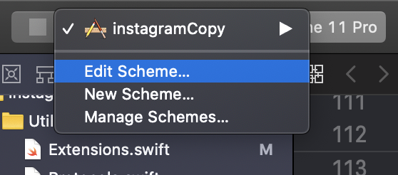
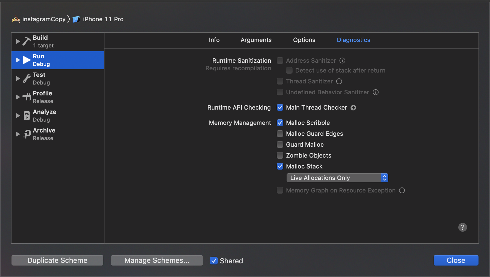
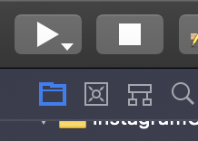
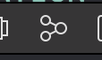
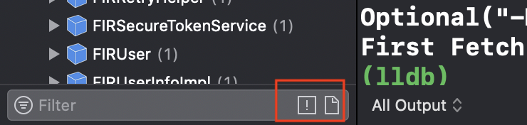
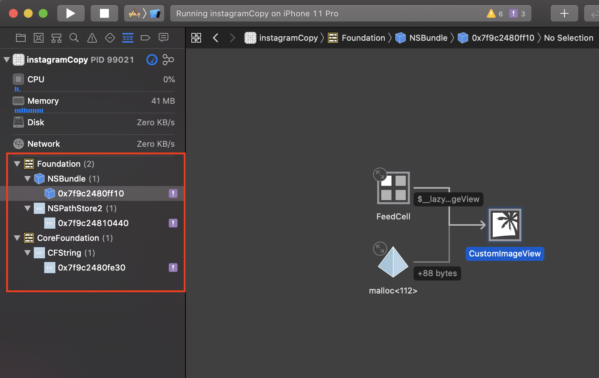

# Memory Leak

### Memory Leak 확인 방법

1. Scheme 수정

2. `Run` -> `Diagnostics`-> `MallocScribble`, `Malloc Stack`체크 -> Close

3. 프로젝트 Run

4. Debug Memory Graph 버튼 클릭

5. Debug Navigation 하단의 `느낌표 버튼` 클릭

6. 결과 확인

