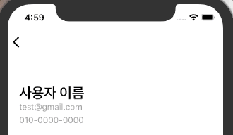

# UINavigationBarAppearance

### 구현 목표

- 네이게이션 바 LargeTitle 설정 후 화면이 최초 실행시에는 타이틀이 보이지 않고 위로 스크롤 했을때만 보이도록 설정



### 구현 코드

```swift
let appearance = UINavigationBarAppearance(idiom: .phone)
appearance.largeTitleTextAttributes = [.foregroundColor: UIColor.white] // largeTitle 설정
appearance.titleTextAttributes = [.foregroundColor: UIColor.black] // 일반 Title 설정
appearance.backgroundColor = .white
navigationItem.standardAppearance = appearance
navigationItem.scrollEdgeAppearance = appearance
```


### Reference

-  [ios - Changing the text color of a navigation bar title when "prefersLargeTitles" is set to true - Stack Overflow](https://stackoverflow.com/questions/44619396/changing-the-text-color-of-a-navigation-bar-title-when-preferslargetitles-is-s/44751501) 