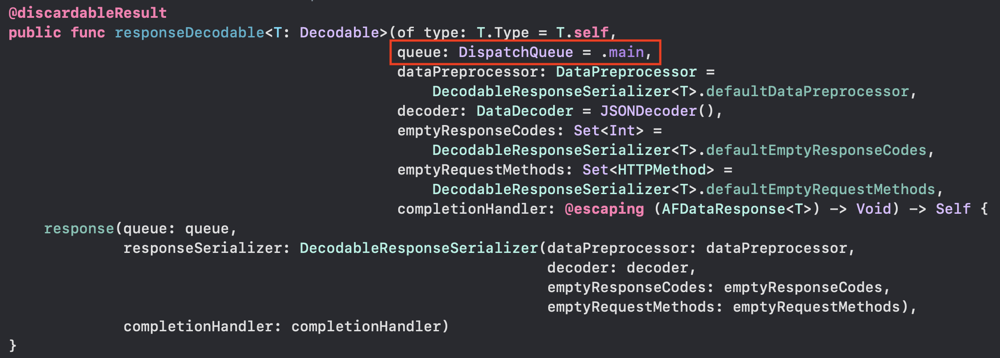

# Alamofire Tutorial


raywenderlich 튜토리얼 실습 내용


1. 기초적인 데이터 확인 방법

   - Alamofire

     - ```swift
       let request = AF.request("https://swapi.dev/api/films")
       request.responseJSON { (data) in
                             	print(data)
                            }
       ```

   - URLSession

     - ```swift
           let url = URL(string: "https://swapi.dev/api/films")!
           URLSession.shared.dataTask(with: url) { (data, response, error) in
             
             if let error = error {
               print("Error", error.localizedDescription)
               return
             }
             guard let data = data else { return }
             
             if let parsingData = try? JSONDecoder().decode(Films.self, from: data) {
               print(parsingData)
             }
             
           }.resume()
       ```

2. 디코딩 및 UI변경 

   alamofire에서는 자동으로 main 쓰레드에서 실행시켜 주기 때문에 DispatchQueue를 별도로 적용하지 않아도 된다

   

   

   - alamofire

     - ``` swift
       func fetchFilms() {    
       	AF.request("https://swapi.dev/api/films")
       		.validate(statusCode: 200..<300)
       		.responseDecodable(of: Films.self) { (response) in
       
       		guard let films = response.value else { return }
       		self.items = films.all
       		self.tableView.reloadData()
       	}
       }
       ```

   - URLSession

     - ```swift
       func fetchFilms() {
       	let url = URL(string: "https://swapi.dev/api/films")!
           URLSession.shared.dataTask(with: url) { (data, response, error) in
             
             if let error = error {
               print("Error", error.localizedDescription)
               return
             }
             guard let data = data else { return }
             
             if let parsingData = try? JSONDecoder().decode(Films.self, from: data) {
               self.items = parsingData.all
               DispatchQueue.main.async {
                 self.tableView.reloadData()
               }
             }
           }.resume()
       }
       ```


:point_right: [SourceCode](../sourceCode/AlamoFire_tuto/)

### Reference

-  [Alamofire 5 Tutorial for iOS: Getting Started | raywenderlich.com](https://www.raywenderlich.com/6587213-alamofire-5-tutorial-for-ios-getting-started) 