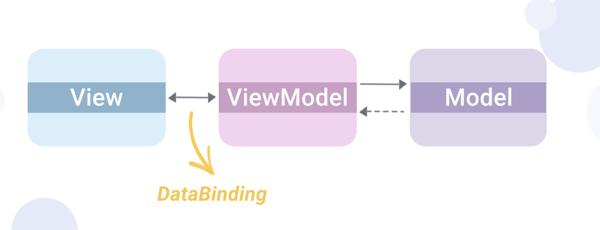

# Data Binding in MVVM

.

1. *View Model* is owned by the *view* and the *model* is owned by the *view model*.
2. *View Model* is responsible only for processing input to output and logic required for driving the UI.
3. *View Model* should not modify the UI.

### What Date Binding?

- 앱의 UI와 Data(ViewModel) 사이의 연결을 수립하는것
- 데이터 바인딩은 MVVM 패턴 뿐만 아니라 다른 곳에서도 사용됨

### Technique 1: Observables

```swift
class Observable<T> {

    var value: T {
        didSet {
            listener?(value)
        }
    }

    private var listener: ((T) -> Void)?

    init(_ value: T) {
        self.value = value
    }

    func bind(_ closure: @escaping (T) -> Void) {
        closure(value)
        listener = closure
    }
}
```

1. 초기화를 통해서 변수를 받음
2. 변수가 저장될때 Listener가 저장됨
3. Listener는 클로저로 메모리 상에 저장
4. bind 호출을 통해서 value 값을 방출

### Technique 2: Event Bus / Notification Center

 이벤트 버스는 안드로이드에서 잘 알려져 있다. iOS 에서는 Notification Wrappers을 통해 구현 가능하다. 

[cesarferreira/SwiftEventBus](https://github.com/cesarferreira/SwiftEventBus)

1. Event 생성, 이 event는 Event Bus에 의해서 모든 Subscribers 들에게 전달됨

```swift
lass EmployeesEvent: NSObject {
    var error: Bool
    var errorMessage: String?
    var employees: [Employee]?

    init(error: Bool, errorMessage: String? = nil, employees: [Employee]? = nil) {
        self.error = error
        self.errorMessage = errorMessage
        self.employees = employees
    }
}
```

2. ViewModel로 부터 EventBus를 이용하여 Event를 보낸다

```swift
func callEvent() {
    //Post Event (Publish Event)
    EventBus.post("fetchEmployees", sender: EmployeesEvent(error: error, errorMessage: errorMessage, employees: employees))
}
```

3. ViewController에서 이벤트를 Subscribe 한다. `setupEventBusSubscriber` 은 ViewController의 `viewDidLoad` 에서 불려진다.

```swift
func setupEventBusSubscriber() {
    _ = EventBus.onMainThread(self, name: "fetchEmployees") { result in
        if let event = result!.object as? EmployeesEvent {
            if event.employees != nil {
                self.showTableView()
            } else if let message = event.errorMessage {
                self.showAlert(title: "Error", message: message)
            }
        }
    }
}
```

### Technique 3: FRP Technique ( Reactive Cocoa / RxSwift):

- The Functional / Reactive Programming approach
- 

### Refernce

- [https://medium.com/flawless-app-stories/data-binding-in-mvvm-on-ios-714eb15e3913](https://medium.com/flawless-app-stories/data-binding-in-mvvm-on-ios-714eb15e3913)
- Rxcoco : [ReactiveCocoa/ReactiveCocoa](https://github.com/ReactiveCocoa/ReactiveCocoa) 
- RxSwift : [ReactiveX/RxSwift](https://github.com/ReactiveX/RxSwift)

### Technique 4: Combine

1. publisher 생성 ( ViewModel 내부 )
    - combine 설치 및 ObservableObject 상속
    - @Published property wrapper
    - publisher는 Property가 변경될때 마다  value 값을 방출

    ```swift
    class CombineViewModel: ObservableObject {

        var apiManager: APIManager?
        @Published var employees: [Employee] = [] //1
        init(manager: APIManager = APIManager()) {
            self.apiManager = manager
        }

        func setAPIManager(manager: APIManager) {
            self.apiManager = manager
        }

        func fetchEmployees() {
            self.apiManager!.getEmployees { (result: DataResponse<EmployeesResponse, AFError>) in
                switch result.result {
                case .success(let response):
                    if response.status == "success" {
                        self.employees = response.data
                    }
                case .failure:
                    print("Failure")
                }
            }
        }

    }
    ```

2. Then, attach a subscribe to this publisher
    - `bindViewModel` 에서 $employee을 subscribe 함
    - $employees using one of Combine’s default subscriber keywords — sink

    ```swift
    class CombineController: UIViewController {

    	@IBOutlet weak var tableView: UITableView!
    	@IBOutlet weak var emptyView: UIView!
    	@IBOutlet weak var activityIndicator: UIActivityIndicatorView!

        	lazy var viewModel: CombineViewModel = {
            	let viewModel = CombineViewModel()
            	return viewModel
        	}()

        	private var cancellables: Set<AnyCancellable> = []

    	override func viewDidLoad() {
    		super.viewDidLoad()
    		showLoader()
    		setupTableView()
            	bindViewModel()
    	}

        	private func bindViewModel() {
            	viewModel.$employees.sink { [weak self] _ in
                		self?.showTableView()
            	}.store(in: &cancellables)
        	}
        
      	//... Other delegate methods
      
    }
    ```

