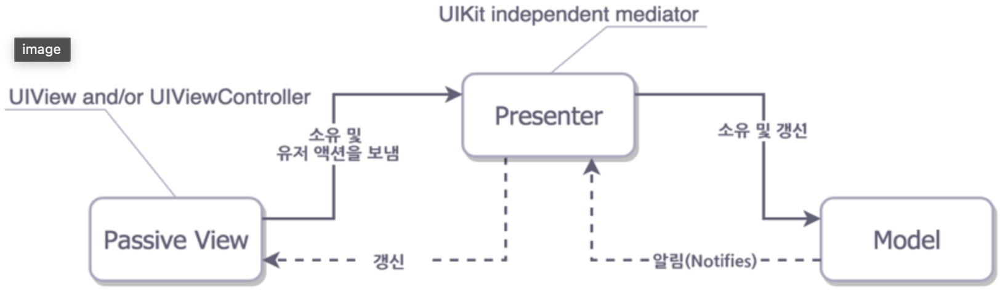
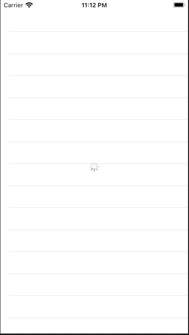

# MVP Design Pattern

### MVP 디자인 패턴 구조



- **Model**
  - MVC의 모델과 동일한 역활
  - 실제적 데이터를 가지고 있고, 이를  Presenter가 소유하고 갱신하는 역할
  - View와 독립
- **View**
  - iOS의 UIView와 UIViewController가 여기에 속하며 View와 관련된 코드
- **Presenter**
  - UIKit을 사용하지 않고 비지니스 로직을 담당
  - Model의 데이터를 가공해 View에서 보여주기 위한 UI 친화적인 포멧으로 바꾸는 역활

### 장점

- 기존 VMC 패턴이 가지고 있는 장점을 유지한 채 보여주는 부분과 비지니스 로직 부분을 나눠 모듈화
- 테스트의 용의성 (VC와 분리된 비지니스 로직만 테스트 가능)


### 구현 예제



- 사용자 데이터를 TableView에 보여주는 간단한 프로그램
- 비동기로 동작하는 것처럼 표현하기 위해서 아래와 같이 2초 후 데이터를 전달하도록 설정

```swift
DispatchQueue.main.asyncAfter(deadline: .now()+2)
```

### 소스코드

#### 사용자 Model 및 UserData Fetch 부분

- 사용자 Model

```swift
struct User{
  let uid: String
  let name: String
  let age: Int
  let number: String
  let country: String
}
```

- UserData  Fetch 부분

```swift
class UserService {
  
  func getUsers(completion: @escaping ([User]) -> Void) {
    
    let users = [ User(uid: "1", name: "Kim", age: 15, number: "111-1111-1111", country: "Korea"),
                  User(uid: "2", name: "Park", age: 20, number: "111-1111-1111", country: "Korea"),
                  User(uid: "3", name: "Lee", age: 25, number: "111-1111-1111", country: "Korea")]
    
    DispatchQueue.main.asyncAfter(deadline: .now()+2) {
      completion(users)
    }
  }
  
}
```

#### UserPresenter

- 사용자 데이터를 View에 표현하기 위한 비지니스 로직이 포함됨
- UserView을 통해 보여줄 데이터 Set 재정의

```swift
// User Data를 View에서 보여줄 데이터로 변환하기 위한 데이터셋
struct UserViewData {
  let name: String
  let age: String
}

// [View의 추상화 작업을 진행]
// 프로토콜을 통해 Presenter가 ViewController를 알지 못해도
// View 작업을 수행할수 있도록 한다
protocol UserView {
  func startLoading()
  func finishLoading()
  func setUsers(users: [UserViewData])
  func setEmptyUsers()
}

class UserPresenter {
  private let userService: UserService
  private var userView: UserView?
  
  init(userService: UserService) {
    self.userService = userService
  }
  
  func attachView(view: UserView) {
    userView = view
  }
  
  func detachView() {
    userView = nil
  }
  
  func getUsers() {
    userView?.startLoading()
    userService.getUsers { [weak self] users in
      DispatchQueue.main.async {
        self?.userView?.finishLoading()
      }
      
      guard !users.isEmpty else {
        DispatchQueue.main.async {
          // 사용자 데이터를 UI에 적용하기 때문에 main 큐에서 적용
          self?.userView?.setEmptyUsers()
        }
        
        return
      }
      
      let userViewDatas = users.map {
				// 화면에 보여줄 데이터로 전환
        UserViewData(name: "Mr. \\($0.name)", age:"\\($0.age) years")  }
      DispatchQueue.main.async {
        // 사용자 데이터를 UI에 적용하기 때문에 main 큐에서 적용
        self?.userView?.setUsers(users: userViewDatas)
      }
    }
  }
}
```

#### ViewController

```swift
class ViewController: UIViewController {
  
  let tableView = UITableView()
  let activityIndicator = UIActivityIndicatorView()
  
	// UserPresenter 인스턴스 생성
  private let userPresenter = UserPresenter(userService: UserService())
	// 화면에 표현할 데이터 셋 
  private var userToDisplay = [UserViewData]() 

  override func viewDidLoad() {
    super.viewDidLoad()
    
    configureUI()
    
		// ViewController에 UserView 주입
		// 하단의 UserView Extension을 통해 UserView관련 함수 실행 by Protocol
    userPresenter.attachView(view: self)
		// 사용자 데이터 Fetch -> setUsers() 함수 부분으로 데이터 전달됨
    userPresenter.getUsers()
    
  }
  
  private func configureUI() {
    tableView.dataSource = self
    activityIndicator.hidesWhenStopped = true
    
    [tableView, activityIndicator].forEach {
      view.addSubview($0)
      $0.translatesAutoresizingMaskIntoConstraints = false
    }
    
    let guid = view.safeAreaLayoutGuide
    NSLayoutConstraint.activate([
      tableView.topAnchor.constraint(equalTo: view.topAnchor),
      tableView.leadingAnchor.constraint(equalTo: guid.leadingAnchor),
      tableView.trailingAnchor.constraint(equalTo: guid.trailingAnchor),
      tableView.bottomAnchor.constraint(equalTo: view.bottomAnchor),
      
      activityIndicator.centerXAnchor.constraint(equalTo: view.centerXAnchor),
      activityIndicator.centerYAnchor.constraint(equalTo: view.centerYAnchor)
    ])
  }
}

extension ViewController: UserView {
  func startLoading() {
    activityIndicator.startAnimating()
  }
  
  func finishLoading() {
    activityIndicator.stopAnimating()
  }
  
	// 사용자 데이터가 전달된 후 실행되는 함수
  func setUsers(users: [UserViewData]) {
    userToDisplay = users
    
    tableView.isHidden = false
    tableView.reloadData()
  }
  
  func setEmptyUsers() {
    tableView.isHidden = true
  }
}

extension ViewController: UITableViewDataSource {
  func tableView(_ tableView: UITableView, numberOfRowsInSection section: Int) -> Int {
    return userToDisplay.count
  }
  
  func tableView(_ tableView: UITableView, cellForRowAt indexPath: IndexPath) -> UITableViewCell {
    let cell = UITableViewCell.init(style: .value1, reuseIdentifier: "UserCell")
    
    cell.textLabel?.text = userToDisplay[indexPath.row].name
    cell.detailTextLabel?.text = userToDisplay[indexPath.row].age
    
    return cell
  }
}
```


### 소스코드 :point_right: [링크](../sourceCode/20_MVPDesignPattern/)

### Reference

- [MVP 디자인 패턴](https://wnstkdyu.github.io/2018/04/13/mvpdesignpattern/)
- [A dumb UI is a good UI: Using MVP in iOS with swift](http://iyadagha.com/using-mvp-ios-swift/)