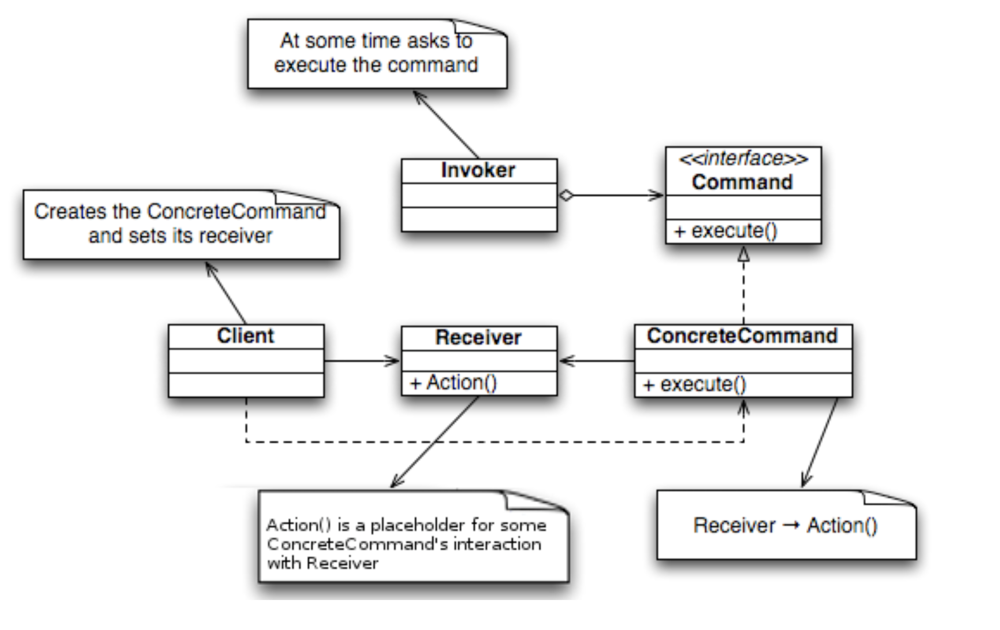

# Command Pattern

## Wiki 정의

- 커맨드 패턴(Command pattern)이란 요청을 객체의 형태로 [캡슐화](https://ko.wikipedia.org/wiki/캡슐화)하여 사용자가 보낸 요청을 나중에 이용할 수 있도록 매서드 이름, 매개변수 등 요청에 필요한 정보를 저장 또는 로깅, 취소할 수 있게 하는 패턴이다.

  



커맨드 패턴에는 명령(command), 수신자(receiver), 발동자(invoker), 클라이언트(client)의 네개의 용어가 항상 따른다. 커맨드 객체는 수신자 객체를 가지고 있으며, 수신자의 메서드를 호출하고, 이에 수신자는 자신에게 정의된 메서드를 수행한다. 커맨드 객체는 별도로 발동자 객체에 전달되어 명령을 발동하게 한다. 발동자 객체는 필요에 따라 명령 발동에 대한 기록을 남길 수 있다. 한 발동자 객체에 다수의 커맨드 객체가 전달될 수 있다. 클라이언트 객체는 발동자 객체와 하나 이상의 커맨드 객체를 보유한다. 클라이언트 객체는 어느 시점에서 어떤 명령을 수행할지를 결정한다. 명령을 수행하려면, 클라이언트 객체는 발동자 객체로 커맨드 객체를 전달한다.

## 예시 코드 Swift

wiki에 있는 java 코드를 기반으로 Swift 언어로 재작성

```swift
// Command Interface
protocol Command {
    func execute()
}

// Invoker Class
class Swith {
    private var fileUpCommand: Command
    private var fileDownCommand: Command
    
    init(fileUpCommand: Command, fileDownCommand: Command) {
        self.fileUpCommand = fileUpCommand
        self.fileDownCommand = fileDownCommand
    }
    
    func fileUp() {
        fileUpCommand.execute()
    }
    
    func fileDown() {
        fileDownCommand.execute()
    }
}

// Receiver Class
class Light {
    
    func light() { }
    
    func turnOn() {
        print("The light is on")
    }
    
    func turnOff() {
        print("The light is off")
    }
}

// The Command for turning on the light

class TurnOnLightCommand: Command {
    
    private let theLight: Light
    
    init(_ light: Light) {
        self.theLight = light
    }
    
    func execute() {
        theLight.turnOn()
    }
}

class TurnOffLightCommand: Command {
    
    private let theLight: Light
    
    init(_ light: Light) {
        self.theLight = light
    }
    
    func execute() {
        theLight.turnOff()
    }
}

// the Test
var light = Light()

var switchUp = TurnOnLightCommand(light)
var switchDown = TurnOffLightCommand(light)

let myButton = Swith(fileUpCommand: switchUp,
                     fileDownCommand: switchDown)

myButton.fileDown()
myButton.fileUp()
```


## 요약

사용자 요청 -> invoker -> Command 상속 객체 -> Receiver  -> Action

요청을 객채화하고 프로토콜을 통해서 실행 방식을 통일한다. 또한 전체 요청을 가지고 있는 invoker를 통해서 인터페이스를 단순화하고, 인터페이스를 통해서 실행 시 Receiver를 통해 최종 Action이 수행되는 과정.


### Reference

-  [커맨드 패턴 - 위키백과, 우리 모두의 백과사전](https://ko.wikipedia.org/wiki/%EC%BB%A4%EB%A7%A8%EB%93%9C_%ED%8C%A8%ED%84%B4) 