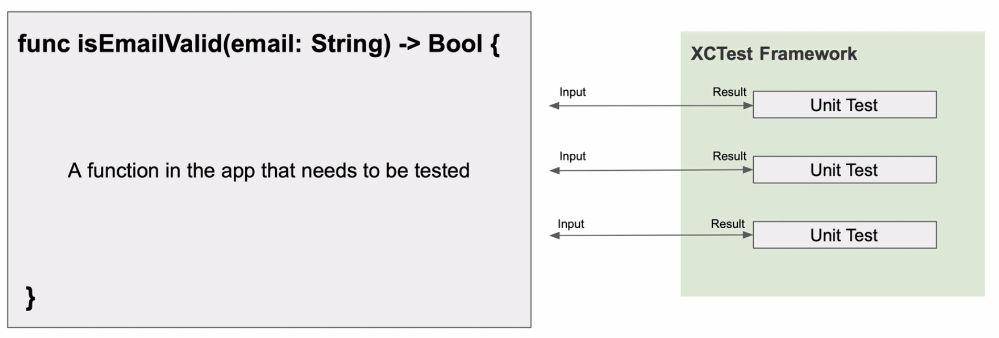
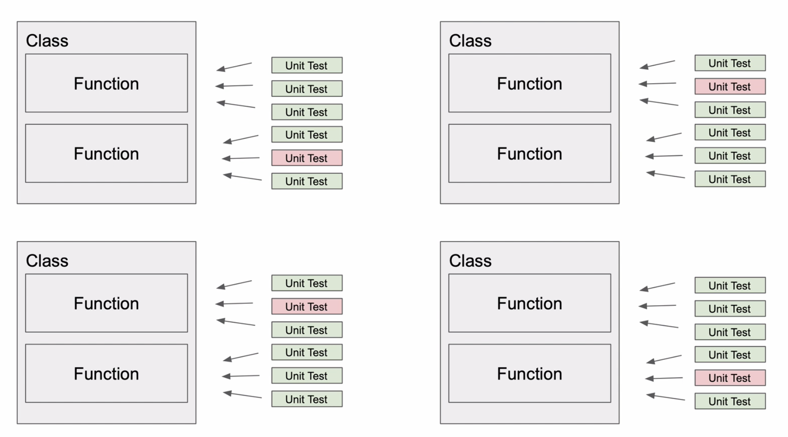
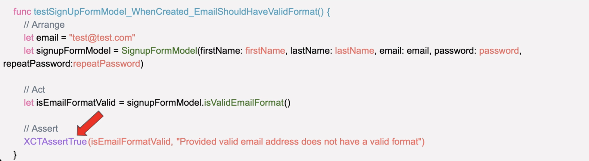
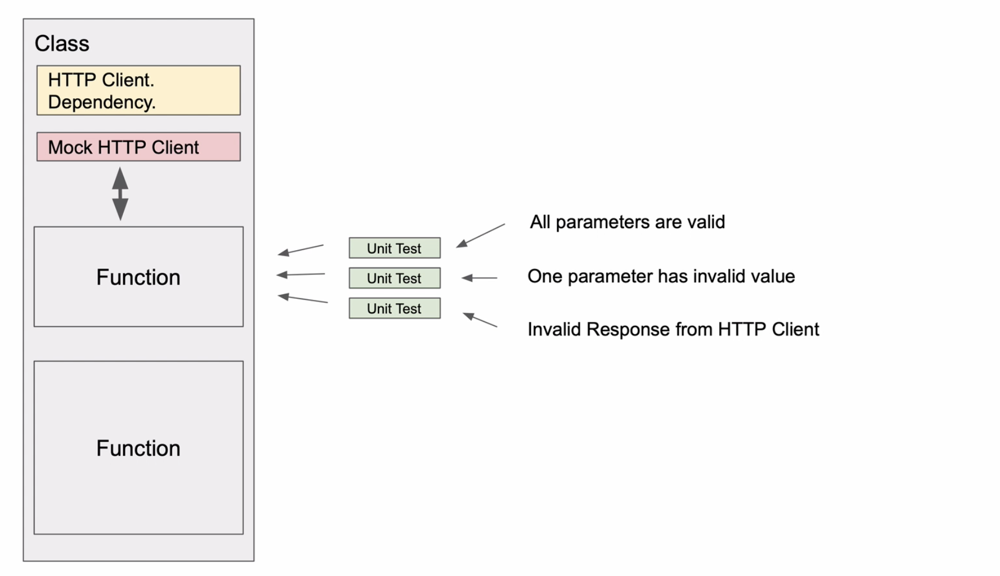
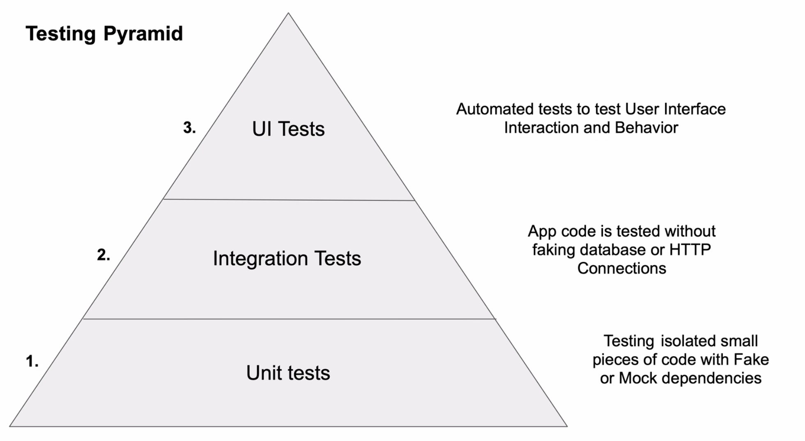

# Unit Test Basic

## Unit Test 개요

- 유닛테스트는 개발자가 작성한 코드의 작은 일부분을 테스트하기 위해 아주 작은 함수이다.
- 아주 심플하고 비지니스 로직을 포함하지 않는다
- 한번에 하나의 함수를 테스트한다.



## XCTest Framework

- xcode에서 지원하는 테스트 자동화 프레임워크이다
- 모바일 앱은 기본적으로 많은 클래스와 함수들을 구현하고 있기 때문에 많은 클레스, 함수에 대한 테스트 함수가 필요하다



- 많은 테스트 중에 빨간 항목들이 실패한 경우이다.

## Unit Test Example

- 테스트 대상 코드

```swift
struct SignupFormModel {
  let firstName: String
  let lastName: String
  let email: String
  let password: String
  let repeatPasword: String
}

extension SignupFormModel {
  func isValidEmailFormat() -> Bool {
    return email.contains("@") && email.contains(".")
  }
}

```

- 테스트 코드



1. 테스트에 필요한 요소(변수, 함수)등을 정의

2. 테스트하려는 함수를 실행하여 결과 값을 저장

   - ```swift
     let isEmailFormatValid = singupFormModel.isValiedEmailFormat()
     ```

3. `XCTAssertTrue()`를 통해서 결과 값이 참 인지 검증

4. 테스트 결과에 따라서 붉은색 or 초록색으로 표시됨


## Unit Test 방법

- 테스트 단위는 하나 이상의 파라미터를 가진 함수이거나 메소드이다. 또한 테스트 결과 측정을 위한 리턴값을 가져야 한다
- 테스트들은 매우 빠르게 실행되며, 서버나 DB에서 데이터를 요청하는 함수의 경우 실제 서비스를 위한 객체가 아닌 테스트를 위한 `Mock 객체` 로 대체 된다.
- 선택한 기능 코드만 테스트하고 모든 외부 종속성은 미리 정의된 하드 코딩이나 더미 객체로 대체
  - Dummy, Fake, Mock 등으로 대체됨



- 특정 function내에서도 여러가지 테스트를 할수 있다. 단, <u>Unit Test는 하나의 기능한 테스트함</u>을 기억해야 한다.

## Test Pyramid

- 테스트 피라미드를 통해 테스딩의 세가지 종류를 알아보자
- 전체적인 테스팅에는 Unit Tests, Integration Tests, UI Test등이 포함되어 있다.



1. Unit Test
   - 어플리케이션 내에 있는 각각의 로직들을 최대한 테스트하는 것이 중요
   - 테스트 커버리지라는 지표를 통해서 테스트에 대한 정량화 가능
2. Integration Test
   - 실제로 운영하게 될 DB, HTTP 접속들을 통해 데이터를 확인한다
   - 코드와 실제 시스템의 상호작용 확인
3. UITest
   - UI/UX를 통해 테스트 되는 단계이다.
   - 실제 운영될 디바이스에서 실행되며 사용자 측면에서 테스트가 가능하다

