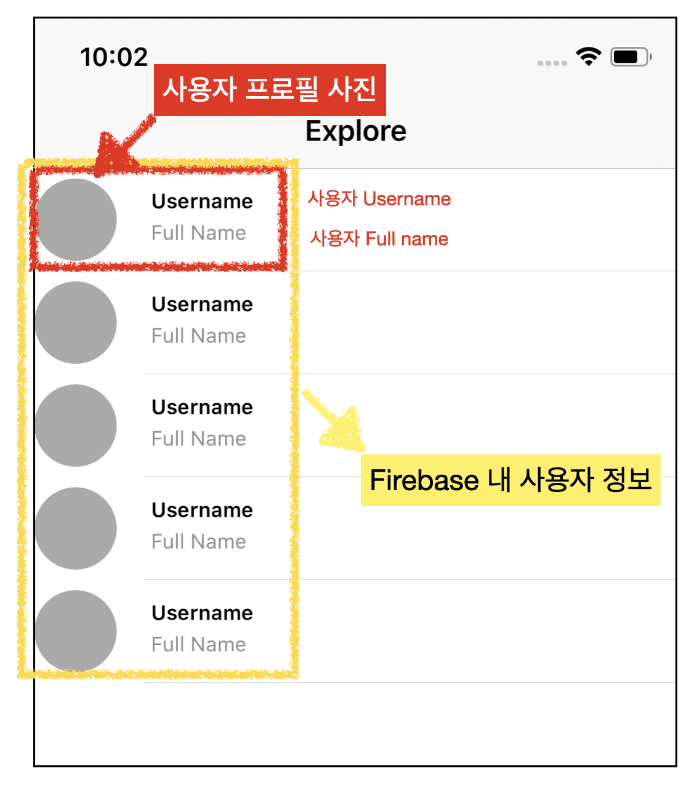
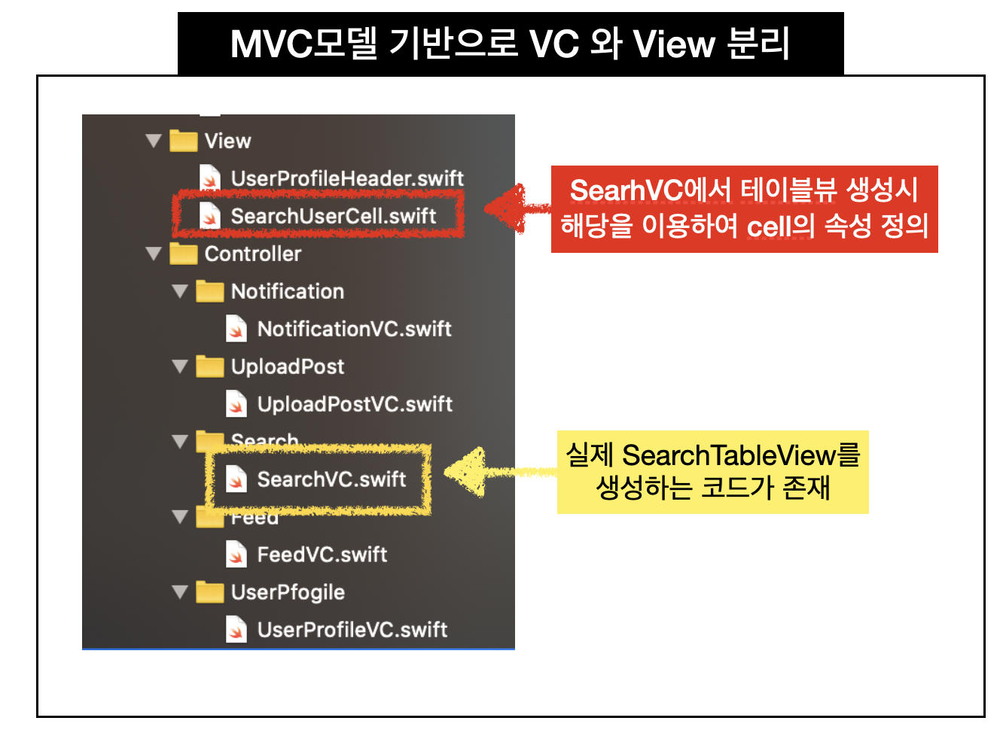

# SearchVC 화면 구현

## 구현 화면

-   SearchVC 접속 시 해당 화면에 인스타그램 Clone 앱에 저장된 사용자들의 정보를 Firebase에서 가져와 보여주는 화면
-   화면 UI 먼저 작성 후 데이터 연동 예정



## 소스코드

- SearchUserCell.swift 와 SearchVC.swift의 관계



- SearchUserCell.swift
  - 테이블뷰를 만들때 각 셀의 속성을 정의하는 UITableViewCell 

```swift
import UIKit

class SearchUserCell: UITableViewCell {
    
    //MARK: - Properties 
    let profileImageView: UIImageView = {
        let iv = UIImageView()
        iv.contentMode = .scaleAspectFill
        iv.clipsToBounds = true
        iv.backgroundColor = .lightGray
        return iv
    }()
    
    override init(style: UITableViewCell.CellStyle, reuseIdentifier: String?) {
        super.init(style: .subtitle, reuseIdentifier: reuseIdentifier)
        
        // add profile image View
        addSubview(profileImageView)
        profileImageView.anchor(top: nil, left: leftAnchor, bottom: nil, right: nil, paddingTop: 0, paddingLeft: 0, paddingBottom: 0, paddingRight: 0, width: 48, height: 48)
        profileImageView.centerYAnchor.constraint(equalTo : self.centerYAnchor).isActive = true
        profileImageView.layer.cornerRadius = 48 / 2
        profileImageView.clipsToBounds = true
        // 테스트용 임시 저장
        self.textLabel?.text = "Username"
        self.detailTextLabel?.text = "Full Name"
    }
    
    override func layoutSubviews() {
        super.layoutSubviews()
        
        textLabel?.frame = CGRect(x: 68, y: (textLabel?.frame.origin.y)! - 2 , width: (textLabel?.frame.width)!, height: (textLabel?.frame.height)!)
        textLabel?.font = UIFont.boldSystemFont(ofSize: 12)
        
        detailTextLabel?.frame = CGRect(x: 68, y: detailTextLabel!.frame.origin.y , width: self.frame.width - 108, height: detailTextLabel!.frame.height)
        detailTextLabel?.font = UIFont.systemFont(ofSize: 12)
        detailTextLabel?.textColor = .systemGray
    }
    
    required init?(coder: NSCoder) {
        fatalError("init(coder:) has not been implemented")
    }
}

```

- SearchVC.swift

```swift
import UIKit

private let reuseIdentifier = "SearchUserCell"

class SearchVC: UITableViewController {

  override func viewDidLoad() {
    super.viewDidLoad()

    //register cell classes
    tableView.register(SearchUserCell.self, forCellReuseIdentifier: reuseIdentifier)
    configureNavController()

    // separator insets
    tableView.separatorInset = UIEdgeInsets(top: 0, left: 64, bottom: 0, right: 0)

  }

  // MARK: - Table view data source

  override func tableView(_ tableView: UITableView, heightForRowAt indexPath: IndexPath) -> CGFloat {
    return 60
  }

  override func numberOfSections(in tableView: UITableView) -> Int {
    // #warning Incomplete implementation, return the number of sections
    return 1
  }

  override func tableView(_ tableView: UITableView, numberOfRowsInSection section: Int) -> Int {
    // #warning Incomplete implementation, return the number of rows
    return 5
  }
	// SearchUserCell과 연결 되는 부분
  override func tableView(_ tableView: UITableView, cellForRowAt indexPath: IndexPath) -> UITableViewCell {
    let cell = tableView.dequeueReusableCell(withIdentifier: reuseIdentifier, for: indexPath) as! SearchUserCell
		// 해당 코드에는 cell에 대한 상세한 부분이 없음
    return cell
  }

  func configureNavController() {
    navigationItem.title = "Explore"
  }
}
```


### 같이 보기

- [Wearher table With TableView](https://github.com/tootoomaa/MyStudyRoom/tree/master/Make12App/note/01_weatherTable.md)


