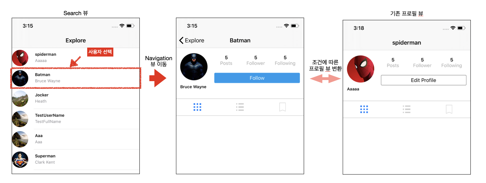
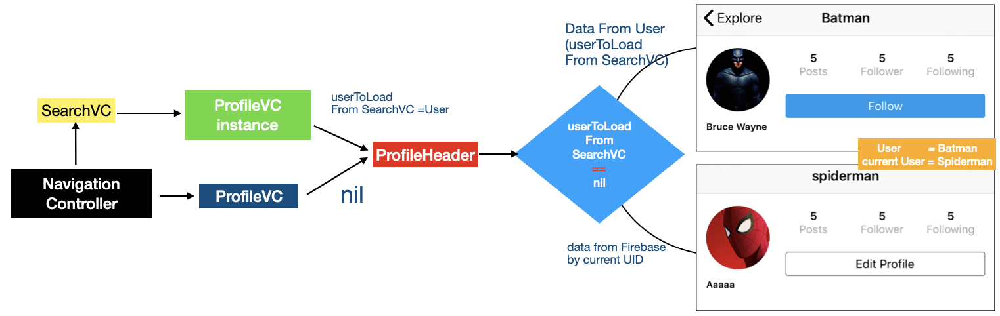

# SearchVC 화면 구현 2

## 구현 화면

1. Search 뷰에서 사용자 선택시 사용자에 대한 프로필 뷰로 이동
   - navigation View Controller 이용
   - searchVC 로딩 시 사용자 정보에 대한 리스트를 가지고 있기 때문에 선택되는 row값을 통해서 다음 ProfileVC로 데이터를 넘겨준다.
2.  UIProfileheader  부분에 사용자 벙보 및 사용자 버튼을 상황에 맞게 변경하기




## 실행 구조




## 소스코드

### UserProfileHeader.swift

```swift
// 1. 사용자 정보 변경시 Button을 변경하는 didset부분
var user: User? {
  didSet {

    // 버튼의 속성을 정의해주는 함수
    configureProfileFollowButton()

    let fullname = user?.name
    nameLabel.text = fullname

    guard let profileImageUrl = user?.profileImageUrl else { return }
    profileImageView.loadImage(with: profileImageUrl)
  }
}

// 2. 실제 버튼 정의부분
let editProfileFollowButton: UIButton = {
  let button = UIButton(type: .system)
  button.setTitle("Loading..", for: .normal) // 기본 값을 loading으로 설정 후 상황에 맞게 변경됨
  button.layer.cornerRadius = 3
  button.layer.borderColor = UIColor.black.cgColor
  button.layer.borderWidth = 0.5
  button.setTitleColor(.black, for: .normal)
  return button
}()

// 3. 로그인된 사용자에 따라서 변경되는 버튼 정의 부분
// ★☆★☆★☆★☆★☆★☆★ 중요 ☆★☆★☆★☆★☆★☆★☆
func configureProfileFollowButton() {
 	// 현재 로그인 되어 있는 사용자의 UID 가져오기
  guard let currentUid = Auth.auth().currentUser?.uid else { return }
  guard let user = self.user else { return }
	// 사용자에 따른 버튼 변경
  if currentUid == user.uid {
    // 로그인 사용자가 ProfileVC를 오픈할 경우 "Edit Profile" 버튼 적용 
    editProfileFollowButton.setTitle("Edit Profile", for: .normal)
  } else {
		// 로그인 사용자가 아닐 경우 "Follow" 버튼 적용
    editProfileFollowButton.setTitle("Follow", for: .normal)
    editProfileFollowButton.layer.borderColor = CGColor(srgbRed: 17/255, green: 154/255, blue: 237/255, alpha: 1)
    editProfileFollowButton.setTitleColor(.white, for: .normal)
    editProfileFollowButton.backgroundColor = UIColor(red: 17/255, green: 154/255, blue: 237/255, alpha: 1)
  }
}
```


### UserProfileVC

```swift
// SearchVC에서 사용자 정보를 전달하는 Property
var userToLoadFromSearchVC: User?

override func viewDidLoad() {
  super.viewDidLoad()

  // MARK: - Properties
  // Register cell classes
  // collectionView의 일반 Cell 표시
  collectionView.register(UICollectionViewCell.self, forCellWithReuseIdentifier: reuseIdentifier)
  // collectionView의 Header를 표시
  collectionView.register(UserProfileHeader.self, forSupplementaryViewOfKind: UICollectionView.elementKindSectionHeader, withReuseIdentifier: headerIdentifier)

  //backgtound color
  self.collectionView.backgroundColor = .white

  // 사용자 데이터를 가져오는 부분
  // SearchVC에서 받은 데이터가 없는 경우, 실제 로그인된 사용자 정보 불러오기
  if userToLoadFromSearchVC == nil {
    //실제로 로그인된 사용자의 정보를 Firebase로 부터 가져오는 함수
    fetchCurrentUserData()
  }
}

func fetchCurrentUserData() {
        // 실제 사용자 데이터 추출 
        guard let currentUid = Auth.auth().currentUser?.uid else {return}
        
        Database.database().reference().child("users").child(currentUid).observeSingleEvent(of: .value) { (snapshot) in
            guard let dictionanry = snapshot.value as? Dictionary<String, AnyObject> else { return }
            let uid = snapshot.key
            let user = User(uid: uid, dictionary: dictionanry)
            self.currentUser = user
            self.navigationItem.title = user.username
            self.collectionView.reloadData()
        }
    }
```


### SearchVC.swift

```swift
// 사용자의 정보가 저장되어 있는 배열
// SearchVC의 사용자 테이블 정보를 완성하기 위해서 이미 생성해둠
var users = [User]()

// tableView에서 특정 row를 선택했을때 실행되는 함수
override func tableView(_ tableView: UITableView, didSelectRowAt indexPath: IndexPath) {

  let user = users[indexPath.row] 	// indexPath.row >> 사용자가 선택한 tableView의 row
  // ProfileVC 인스턴스 생성 -> 사용자가 SearchVC에서 선택한 사용자의 정보를 넘기기 위한 인스턴스
  let userProfileVC = UserProfileVC(collectionViewLayout: UICollectionViewFlowLayout())

  // 해당 인스턴스로 사용자 정보 전달
  userProfileVC.userToLoadFromSearchVC = user

  // 뷰 컨트롤러 Push
  navigationController?.pushViewController(userProfileVC, animated: true)
}
```


## New Know..

1. View 를 재사용 하는 방법
2. didset 내부에 함수를 넣어 사용자에 따라서 UI를 변경 하는 방법