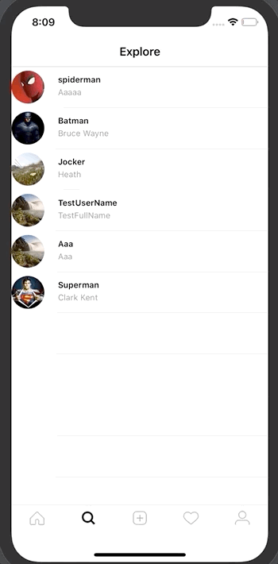
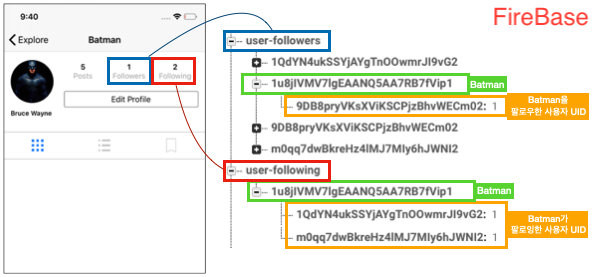

# Follow, Following 구현

## 구현 화면



1. Search 뷰에서 개별 사용자에 대한 Follow, Following 기능 구현
2. Following 한 사용자와 하지 않은 사용자 프로필 뷰의 버튼 변경
   - Follow 안된 사람 -> "Follow" 버튼으로 변경
   - Following한 사함 - > "Following" 버튼으로 변경

## 데이터 및 실행 구조

### 데이터 구조



- 팔로우, 팔로잉 생성시 데이터를 최소화 하기 위해서 사용자의 UID만을 저장


## 소스코드

### User.swift

```swift
let USER_FOLLOWING_REF = Database.database().reference().child("user-following")
let USER_FOLLOWER_REF = Database.database().reference().child("user-followers")

class User {
    // attribute
    var username:String!
    var name:String!
    var profileImageUrl:String!
    var uid:String!
    var isFollowed:Bool! // 팔로우되어 있는지 체크하기 위한 변수
    
    init(uid:String, dictionary: Dictionary<String, AnyObject>) {
        self.uid = uid
 // follow버튼을 눌렀을때, 실제 Firebase내에 Follow 데이터를 삽입하는 함수    
 func follow() { // unfollow -> follow
  guard let currnetUid = Auth.auth().currentUser?.uid else { return }
      
  // Update: - get uid like this to work with update
  guard let uid = uid else { return }
  // set is followed to true
  self.isFollowed = true
  // add followed to true
  USER_FOLLOWING_REF.child(currnetUid).updateChildValues([uid: 1])

  // add current user to followed user-follower structure
  USER_FOLLOWER_REF.child(self.uid).updateChildValues([currnetUid: 1])
}
      
//  following버튼을 눌렀을때, 실제 Firebase내에 Follow 데이터를 삭제하는 함수
func unfollow() { // follow -> unfollow
  guard let currnetUid = Auth.auth().currentUser?.uid else { return }

  // set is followed to false
  self.isFollowed = false
  // remove user frome current user-following structure
  USER_FOLLOWING_REF.child(currnetUid).child(self.uid).removeValue()

  // remove current user from user-following structure
  USER_FOLLOWING_REF.child(self.uid).child(currnetUid).removeValue()
}
    
func checkIfUserIsFollowed(completion: @escaping(Bool)->()) {
  guard let currnetUid = Auth.auth().currentUser?.uid else { return }
        
  USER_FOLLOWING_REF.child(currnetUid).observeSingleEvent(of: .value) { (snapchot) in
		if snapchot.hasChild(self.uid) {
      self.isFollowed = true
      completion(true)
      self.follow()
    } else {
      self.isFollowed = false
      completion(false)
      self.unfollow()
    }         
	}  
}
```


### UserProfileHeader.swift

```swift
// Follow, Following 눌렀을시 처리되는 함수
@objc func handleEditProfileFollow() {
  guard let user = self.user else { return }
	// button의 이름이 "Edit Profile"인 경우
  if editProfileFollowButton.titleLabel?.text == "Edit Profile" {
    print("Edir Profile")
  } else {
		// button의 이름이 "Follow", "Following"일 경우
    if editProfileFollowButton.titleLabel?.text == "Follow" {
      editProfileFollowButton.setTitle("Following", for: .normal)
      user.follow()
    } else {
      editProfileFollowButton.setTitle("Follow", for: .normal)
      user.unfollow()
    }
  }
}

func configureProfileFollowButton() {
  guard let currentUid = Auth.auth().currentUser?.uid else { return }
  guard let user = self.user else { return }
	
  if currentUid == user.uid {
    //configure Button as edit profile
    editProfileFollowButton.setTitle("Edit Profile", for: .normal)
  } else {

    //configure button as follow btton
    editProfileFollowButton.layer.borderColor = CGColor(srgbRed: 17/255, green: 154/255, blue: 237/255, alpha: 1)
    editProfileFollowButton.setTitleColor(.white, for: .normal)
    editProfileFollowButton.backgroundColor = UIColor(red: 17/255, green: 154/255, blue: 237/255, alpha: 1)
		// Follow 여부에 따라서 button의 타이틀 변경
    user.checkIfUserIsFollowed (completion: { (followed) in
		 if followed {
			self.editProfileFollowButton.setTitle("Following", for: .normal)
		 } else {
      self.editProfileFollowButton.setTitle("Follow", for: .normal)
		}
	}

// 사용자 Follow, Following 표시
func setUserStats(for user: User?) {

	guard let uid = user?.uid else { return }
        
	var numberOfFollowers:Int!
	var numberOfFollowing:Int!
        
  // get number of following
  USER_FOLLOWER_REF.child(uid).observeSingleEvent(of: .value) { (snapshot) in
    
  	if let snapshot = snapshot.value as? Dictionary<String, AnyObject> {
    	numberOfFollowers = snapshot.count
    } else {
     	numberOfFollowers = 0
		}
            
    let attributedText = NSMutableAttributedString(string: "\(numberOfFollowers!)\n",     			attributes: [NSAttributedString.Key.font: UIFont.boldSystemFont(ofSize: 14)])
			attributedText.append(NSAttributedString(string: "Followers", attributes: 								[NSAttributedString.Key.font: UIFont.systemFont(ofSize: 14), 															NSAttributedString.Key.foregroundColor: UIColor.lightGray]))
            self.followersLabel.attributedText = attributedText
     }
        
  	USER_FOLLOWING_REF.child(uid).observeSingleEvent(of: .value) { (snapshot) in
    // get number of followed
    if let snapshot = snapshot.value as? Dictionary<String, AnyObject> {
    	numberOfFollowing = snapshot.count
    } else {
     	numberOfFollowing = 0
		}

      let attributedText = NSMutableAttributedString(string: "\(numberOfFollowing!)\n",
  		attributes: [NSAttributedString.Key.font: UIFont.boldSystemFont(ofSize: 14)]),
  		attributedText.append(NSAttributedString(string: "Following", attributes:
			[NSAttributedString.Key.font: UIFont.systemFont(ofSize: 14),
  		NSAttributedString.Key.foregroundColor: UIColor.lightGray]))
  		self.followingLabel.attributedText = attributedText
		}
	}
```


