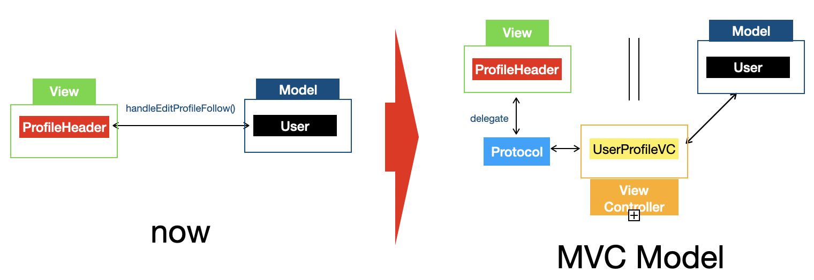
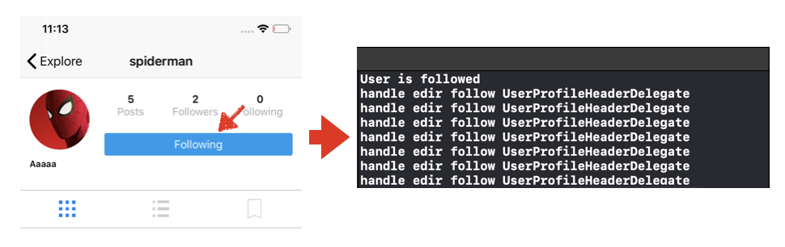

# Code Refactor Using Protocol Recap (Delegate)

## Protocol를 통한 Code Refactor

- 개선 사항 : MVC모델 기반으로 Code Refactor



-> 참고 : [MVP Model](https://github.com/tootoomaa/MyStudyRoom/tree/master/Others/note/01_MVPModel.md)

## 

## UserProfileHeaderDelegate 생성

### 1. Protocols.swift 생성

```swift
import Foundation

protocol UserProfileHeaderDelegate {
    func handleEditFollowTapped(for header: UserProfileHeader)
}
```


### 2. UserProfileHeader.swift 파일

```swift
var delegate: UserProfileHeaderDelegate?

@objc func handleEditProfileFollow() {      
  delegate?.handleEditFollowTapped(for: self)
  //        guard let user = self.user else { return }
  //
  //        if editProfileFollowButton.titleLabel?.text == "Edit Profile" {
  //            print("Edir Profile")
  //        } else {
  //
  //            if editProfileFollowButton.titleLabel?.text == "Follow" {
  //                editProfileFollowButton.setTitle("Following", for: .normal)
  //                user.follow()
  //            } else {
  //                editProfileFollowButton.setTitle("Follow", for: .normal)
  //                user.unfollow()
  //            }
  //        }
}
```


### 3. UserProfileVC.swift

```swift
class UserProfileVC: UICollectionViewController, UICollectionViewDelegateFlowLayout, UserProfileHeaderDelegate {
   	//== 생략 ==
    //MARK: - UserProfileHeader Protocols
    
    func handleEditFollowTapped(for header: UserProfileHeader) {
        print("handle edir follow UserProfileHeaderDelegate")
    }
  	 //== 생략 ==
}
```


### 4. 실행 결과 확인




### 5. 최종 적용

```swift
func handleEditFollowTapped(for header: UserProfileHeader) {
  guard let user = header.user else { return }

  if header.editProfileFollowButton.titleLabel?.text == "Edit Profile" {
    print("Edir Profile")
  } else {

    if header.editProfileFollowButton.titleLabel?.text == "Follow" {
      header.editProfileFollowButton.setTitle("Following", for: .normal)
      user.follow()
    } else {
      header.editProfileFollowButton.setTitle("Follow", for: .normal)
      user.unfollow()
    }
  }
}
```


## setUserStats Delegate 생성

### 1. protocol 생성

```swift
protocol UserProfileHeaderDelegate {
    func handleEditFollowTapped(for header: UserProfileHeader)
    func setUserStats(for header: UserProfileHeader)
}
```


### 2. UserProfileVC.swift

```swift
func setUserStats(for user: User?) {
  delegate?.setUserStats(for: self)
}
```


### 3. UserProfileVC.swift

```swift
func setUserStats(for header: UserProfileHeader) {

  guard let uid = header.user?.uid else { return }

  var numberOfFollowers:Int!
  var numberOfFollowing:Int!
        
  // get number of following
  // observe - > DB에 변화가 있을 경우 즉시 갱싱
  // observeSingleEvent -> DB에서 한번만 가져옴
  USER_FOLLOWER_REF.child(uid).observe(.value) { (snapshot) in
            
  if let snapshot = snapshot.value as? Dictionary<String, AnyObject> {
    numberOfFollowers = snapshot.count
  } else {
    numberOfFollowers = 0
  }
 
  let attributedText = NSMutableAttributedString(string: "\(numberOfFollowers!)\n", 
		attributes: [NSAttributedString.Key.font: UIFont.boldSystemFont(ofSize: 14)])
		attributedText.append(NSAttributedString(string: "Followers", attributes:
		[NSAttributedString.Key.font: UIFont.systemFont(ofSize: 14), 	
    NSAttributedString.Key.foregroundColor: UIColor.lightGray]))
		header.followersLabel.attributedText = attributedText
	}
        
  USER_FOLLOWING_REF.child(uid).observe(.value) { (snapshot) in
	// get number of followed
  if let snapshot = snapshot.value as? Dictionary<String, AnyObject> {
  	numberOfFollowing = snapshot.count
  } else {
  	numberOfFollowing = 0
  }
            
  let attributedText = NSMutableAttributedString(string: "\(numberOfFollowing!)\n", 
	attributes: [NSAttributedString.Key.font: UIFont.boldSystemFont(ofSize: 14)])
  attributedText.append(NSAttributedString(string: "Following", attributes:
	[NSAttributedString.Key.font: UIFont.systemFont(ofSize: 14),
   NSAttributedString.Key.foregroundColor: UIColor.lightGray]))
  header.followingLabel.attributedText = attributedText
 }
}
```

