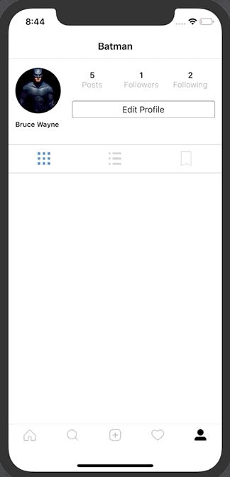

# Follow, Following User Check Page Build

## 구현 화면

- UserProfileVC화면에서 사용자의 "Following", "Followers" Label을 누를때 사용자가 팔로우, 팔로잉한 사용자의 리스트 출력
- 라벨 선택시 UITableView 형태의 사용자 리스트 출력하고 해당 화면에서 Follow, Following 할 수 있는 버튼 추가




## 소스코드

- UserProfileHeader.swift
  - label을 터치했을때 Action연결

```swift
// ----------- label Define -----------------
lazy var followersLabel: UILabel = {
  let label = UILabel()
  label.numberOfLines = 0
  label.textAlignment = .center

  let attributedText = NSMutableAttributedString(string: "\n", attributes: [NSAttributedString.Key.font: UIFont.boldSystemFont(ofSize: 14)])
  attributedText.append(NSAttributedString(string: "follows", attributes: [NSAttributedString.Key.font: UIFont.systemFont(ofSize: 14), NSAttributedString.Key.foregroundColor: UIColor.lightGray]))
  label.attributedText = attributedText

  // add gesture recognizer
  let followTap = UITapGestureRecognizer(target: self, action: #selector(handleFollowersTapped))
  followTap.numberOfTouchesRequired = 1
  label.isUserInteractionEnabled = true
  label.addGestureRecognizer(followTap)
  return label
}()

lazy var followingLabel: UILabel = {
  let label = UILabel()
  label.numberOfLines = 0
  label.textAlignment = .center

  let attributedText = NSMutableAttributedString(string: "\n", attributes: [NSAttributedString.Key.font: UIFont.boldSystemFont(ofSize: 14)])
  attributedText.append(NSAttributedString(string: "following", attributes: [NSAttributedString.Key.font: UIFont.systemFont(ofSize: 14), NSAttributedString.Key.foregroundColor: UIColor.lightGray]))
  label.attributedText = attributedText

  // add gesture recognizer
  let followingTap = UITapGestureRecognizer(target: self, action: #selector(handleFolloweringTapped))
  followingTap.numberOfTouchesRequired = 1
  label.isUserInteractionEnabled = true
  label.addGestureRecognizer(followingTap)

  return label
}()

lazy var followingLabel: UILabel = {
  let label = UILabel()
  label.numberOfLines = 0
  label.textAlignment = .center

  // add gesture recognizer
  let followingTap = UITapGestureRecognizer(target: self, action: #selector(handleFolloweringTapped))
  followingTap.numberOfTouchesRequired = 1
  label.isUserInteractionEnabled = true
  label.addGestureRecognizer(followingTap)

  return label
}()

// ----------- Label Action -----------------
@objc func handleFollowersTapped() {
  delegate?.handleFollowersTapped(for: self)
}

@objc func handleFolloweringTapped() {
  delegate?.handleFollowingTapped(for: self)
}
```


- Protocol.swift

```swift
protocol UserProfileHeaderDelegate {
  func handleEditFollowTapped(for header: UserProfileHeader)
  func setUserStats(for header: UserProfileHeader)
  // 추가된 protocol
  func handleFollowersTapped(for header: UserProfileHeader)
  func handleFollowingTapped(for header: UserProfileHeader)
}
```


- UserProfileVC.swift
  - UserProfileHeader의 요청을 delegate를 통해서 위임 받아 처리해줌
  - MVC모델 준수
  - followVC.viewFollowers 변수에 따라서 화면상 navigationItem title이 변경됨

```swift
func handleFollowersTapped(for header: UserProfileHeader) {
  let followVC = FollowVC()
  followVC.viewFollowers = true
  navigationController?.pushViewController(followVC, animated: true)
}

func handleFollowingTapped(for header: UserProfileHeader) {
  let followVC = FollowVC()
  followVC.viewFollowing = true
  navigationController?.pushViewController(followVC, animated: true)
}
```


- FolliwVC.swift

```swift
import UIKit

class FollowCell: UITableViewCell {
  //MARK: - Properties
  let profileImageView: UIImageView = {
    let iv = UIImageView()
    iv.contentMode = .scaleAspectFill
    iv.clipsToBounds = true
    iv.backgroundColor = .lightGray
    return iv
  }()

  let followButton: UIButton = {
    let bt = UIButton(type: .system)
    bt.setTitle("Loading", for: .normal)
    bt.setTitleColor(.white, for: .normal)
    bt.layer.borderColor = CGColor(srgbRed: 17/255, green: 154/255, blue: 237/255, alpha: 1)
    bt.backgroundColor = UIColor(red: 17/255, green: 154/255, blue: 237/255, alpha: 1)

    return bt
  }()

  //MARK: - handler
  @objc func handleFollowTapped() {
    print("handle Follow Tapped")
  }

  //MARK: - init

  override init(style: UITableViewCell.CellStyle, reuseIdentifier: String?) {
    super.init(style: .subtitle, reuseIdentifier: reuseIdentifier)

    // add profile image View
    addSubview(profileImageView)
    profileImageView.anchor(top: nil, left: leftAnchor, bottom: nil, right: nil, paddingTop: 0, paddingLeft: 8, paddingBottom: 0, paddingRight: 0, width: 48, height: 48)
    profileImageView.centerYAnchor.constraint(equalTo : self.centerYAnchor).isActive = true
    profileImageView.layer.cornerRadius = 48 / 2

    addSubview(followButton)
    followButton.anchor(top: nil, left: nil, bottom: nil, right: rightAnchor, paddingTop: 0, paddingLeft: 0, paddingBottom: 0, paddingRight: 12, width: 90, height: 30)
    followButton.centerYAnchor.constraint(equalTo: self.centerYAnchor).isActive = true
    followButton.layer.cornerRadius = 3

    // 버튼 target Action지정
    followButton.addTarget(self, action: #selector(handleFollowTapped), for: .touchUpInside)

    // 임시 저장 타이틀
    self.textLabel?.text = "Username"
    self.detailTextLabel?.text = "Full Name"
  }

  override func layoutSubviews() {
    super.layoutSubviews()

    textLabel?.frame = CGRect(x: 68, y: (textLabel?.frame.origin.y)! - 2 , width: (textLabel?.frame.width)!, height: (textLabel?.frame.height)!)
    textLabel?.font = UIFont.boldSystemFont(ofSize: 12)

    detailTextLabel?.frame = CGRect(x: 68, y: detailTextLabel!.frame.origin.y , width: self.frame.width - 108, height: detailTextLabel!.frame.height)
    detailTextLabel?.font = UIFont.systemFont(ofSize: 12)
    detailTextLabel?.textColor = .systemGray
  }

  required init?(coder: NSCoder) {
    fatalError("init(coder:) has not been implemented")
  }

}
```


