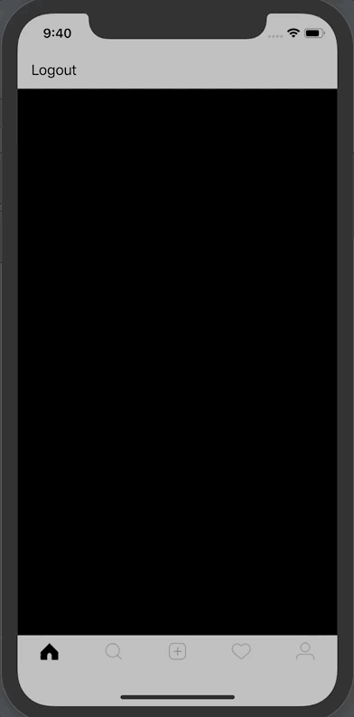
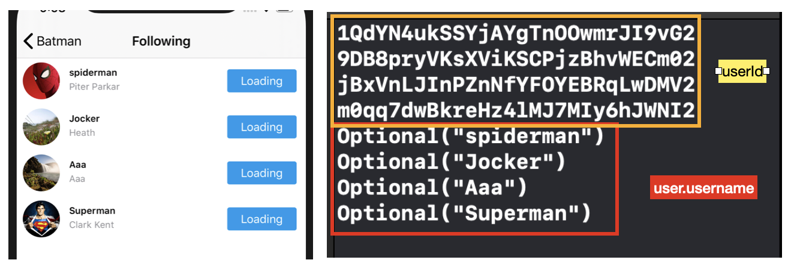

# Follow, Following User Check Page Build 2

## 구현 화면

- 사용자 프로필 화면에서 Follow, Following 라벨을 누를경우 실제로 팔로우, 팔로잉한 사용자 리스트 출력
- searchVC 화면에서도 동일하게 작동 But 선택한 실제 사용자의 팔로우 팔로잉한 사용자 리스트 출력




## 소스코드

- UserProfileVC.swift
  - 헤더 부분에서 팔로우, 팔로잉 라벨 선택시 FollowVC 호출
  - viewFollowers, viewFollowing Bool 변수에 따라서 출력되는 화면 타이틀이 변경 (화면 동일)

```swift
//MARK: - UserProfileHeader Protocols
// curruntUser (search뷰에서 불러온 화면은 currnetUser데이터를 가지고 있음)
// 사용자가 프로필 헤더 부분의 팔로우, 팔로잉 라벨을 눌렀을때 수행 되는 사항
func handleFollowersTapped(for header: UserProfileHeader) {
  let followVC = FollowVC()
  followVC.uid = currentUser?.uid
  followVC.viewFollowers = true
  navigationController?.pushViewController(followVC, animated: true)
}

func handleFollowingTapped(for header: UserProfileHeader) {
  let followVC = FollowVC()
  followVC.uid = currentUser?.uid
  followVC.viewFollowing = true
  navigationController?.pushViewController(followVC, animated: true)
}
```


- FolliwVC.swift

```swift
// 사용자 데이터를 불러오는 함수 부분
func fetchUser() {
  guard let uid = self.uid else { return }
  var ref: DatabaseReference!
	// searchVC에서 받은 변수 Follow, Following구별 하게 해줌
  if viewFollowers ?? false {
    //fetch Followers
    ref = USER_FOLLOWER_REF
  } else {
    //fetch Following
    ref = USER_FOLLOWING_REF
  }
     
  // firebase에서 데이터 추출
  ref.child(uid).observe(.childAdded) { (snapshot) in        
		let userId = snapshot.key
		print(userId) // 로그출력 부분
    USER_REF.child(userId).observeSingleEvent(of: .value, with: { (snapshot) in
		 guard let dictionary = snapshot.value as? Dictionary<String,AnyObject> else { return }
		 let user = User(uid: userId, dictionary: dictionary)
		 print(user.username) // 로그 출력 부분 
		 self.users.append(user)
		 self.tableView.reloadData()
		})
  }
}
```

FireBase 데이터 인출 부분 로그 




## Important Thing

- Firebase observe 함수관련
  1. observe : DB에 변화가 있을 경우 즉시 갱신
  2. observeSingleEvent : DB에서 한번만 가져옴