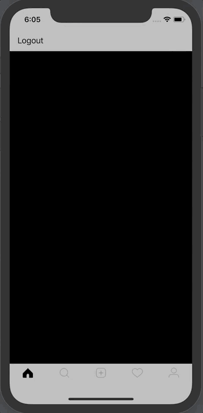
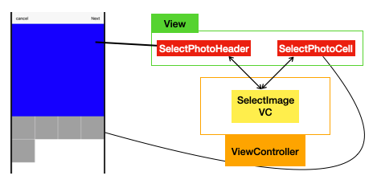

# Select Image ViewController with CollectionVeiw

## 구현 화면

- 사용자가 업로드한 이미지를 보여주는 화면 화면
- 상단에는 header, 하단에는 Collection View




## 화면 구성



- 상단의 navigationItem추가
  - 오른쪽 Next, 왼쪽 cancel
- CollectionView의 Custom Cell을 설정하기 위한 view파일 생성
  - SelectPhotoHeader, SelectPhotoCell

## 소스코드

- MainTabVC.wift
  - tabBarButton을 눌렀을때 인덱스가 2번째이면 SelectImageVC 띄우기

```swift
// 정의 부분
let selectImageVC = constructNavController(unselectedImage: #imageLiteral(resourceName: "plus_unselected"), selectedImage: #imageLiteral(resourceName: "plus_unselected"))

//함수
func tabBarController(_ tabBarController: UITabBarController, shouldSelect viewController: UIViewController) -> Bool {
  let index = viewControllers?.firstIndex(of: viewController)
	// 버튼 인덱스가 2명
  if index == 2 {
    let selectImageVC = SelectImageVC(collectionViewLayout: UICollectionViewFlowLayout())
    let navController = UINavigationController(rootViewController: selectImageVC)
    navController.navigationBar.tintColor = .black

    navController.modalPresentationStyle = .fullScreen
    present(navController, animated: true, completion: nil)
    return false
  }
  return true
}
```

- SelectImageVC.swift

```swift
import UIKit

private let reuseIdentifier = "SelectPhotoCell"
private let headerIdentifier = "SelectPhotoHeader"

class SelectImageVC: UICollectionViewController, UICollectionViewDelegateFlowLayout {
    
    //MARK: - Properties
    
    override func viewDidLoad() {
        super.viewDidLoad()
        
      	// cell 연결
        collectionView?.register(SelectPhotoCell.self, forCellWithReuseIdentifier: reuseIdentifier)
      	// header 연결
        collectionView?.register(SelectPhotoHeader.self, forSupplementaryViewOfKind: UICollectionView.elementKindSectionHeader, withReuseIdentifier: headerIdentifier)
        
        collectionView?.backgroundColor = .white
        
        // configure Navigation Button
        configureNabigationButtons()
    }
    
    //MARK: - UICollectionVeiwFlowLayout
    
    func collectionView(_ collectionView: UICollectionView, layout collectionViewLayout: UICollectionViewLayout, referenceSizeForHeaderInSection section: Int) -> CGSize {
        let width = view.frame.width
        // 정사각형으로 유지하기 위해서
        return CGSize(width: width, height: width)
    }
    
    func collectionView(_ collectionView: UICollectionView, layout collectionViewLayout: UICollectionViewLayout, sizeForItemAt indexPath: IndexPath) -> CGSize {
        let width = (view.frame.width - 3)/4 // spacing between image
        return CGSize(width: width, height: width)
    }
    
    //spaing between collectionView images
    func collectionView(_ collectionView: UICollectionView, layout collectionViewLayout: UICollectionViewLayout, minimumInteritemSpacingForSectionAt section: Int) -> CGFloat {
        return 1
    }
    

    func collectionView(_ collectionView: UICollectionView, layout collectionViewLayout: UICollectionViewLayout, minimumLineSpacingForSectionAt section: Int) -> CGFloat {
        return 1
    }

    
    //MARK: - UICollectionView DataSource
    
    override func numberOfSections(in collectionView: UICollectionView) -> Int {
        return 1
    }
    
    override func collectionView(_ collectionView: UICollectionView, numberOfItemsInSection section: Int) -> Int {
        return 5
    }
    
    override func collectionView(_ collectionView: UICollectionView, viewForSupplementaryElementOfKind kind: String, at indexPath: IndexPath) -> UICollectionReusableView {
        
        let header = collectionView.dequeueReusableSupplementaryView(ofKind: kind, withReuseIdentifier: headerIdentifier, for: indexPath) as! SelectPhotoHeader
        
        return header
    }
    
    override func collectionView(_ collectionView: UICollectionView, cellForItemAt indexPath: IndexPath) -> UICollectionViewCell {
        let cell = collectionView.dequeueReusableCell(withReuseIdentifier: reuseIdentifier, for: indexPath) as! SelectPhotoCell
        return cell
    }
    
    //MARK: - Handlers
    
    @objc func handleCancel() {
        self.dismiss(animated: true, completion: nil)
    }
    
    @objc func handleNext() {
        print("Handle next cliecked ")
    }
    
    func configureNabigationButtons() {
        
        navigationItem.leftBarButtonItem = UIBarButtonItem(title: "cancel", style: .plain, target: self, action: #selector(handleCancel))
        
        navigationItem.rightBarButtonItem = UIBarButtonItem(title: "Next", style: .plain, target: self, action: #selector(handleNext))
    }
}

```


## Important Thing

- tabBarItem 눌렸을시 처리 방법

```swift
// viewControllers = [feedVC, searchVC, selectImageVC , notificationVC, userProfileVC] 정의

func tabBarController(_ tabBarController: UITabBarController, shouldSelect viewController: UIViewController) -> Bool {
  //단, viewControllers 배열을 만들어서 정의해야함
 	let index = viewControllers?.firstIndex(of: viewContoller) 
  // 선택된 VC가 뷰컨트롤러 배열에서 몇번째 인지 확인
  
  if index == (Int) {
     //처리 할 내용
  }

  return true // 띄우기 false 안띄우기
}
```
