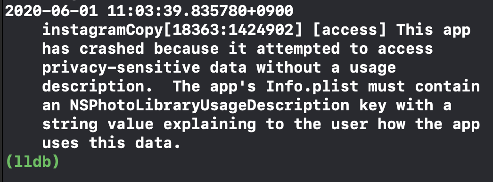
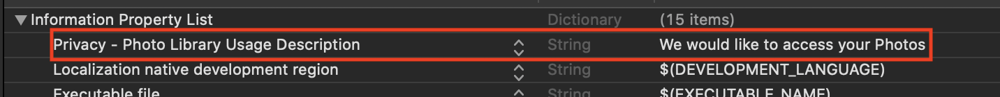
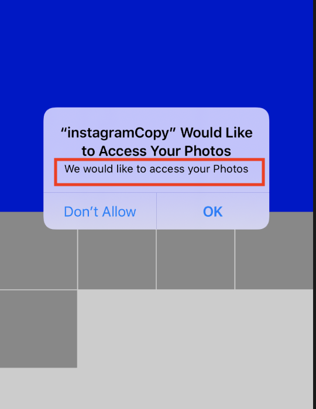

# SelectImageVC with PhotoKit

## 구현 화면

- 사용자가 사진 업로드를 위해 사진첩에서 이미지를 선택하는 화면
- 사용자의 apple 디바이스의 사진 라이브러리에서 사진을 불러와서 보여줌


## 소스코드

- SelectImageVC.swift
  - 이미지를 사진 라이브러리에서 불러와 image배열에 저장하는 함수

```swift
func getAssetFetchOptions() -> PHFetchOptions {
  let options = PHFetchOptions()

  //가져올 사진의 갯수 제한
  options.fetchLimit = 30

  // 가져온 데이터를 생성일을 기준으로 정렬
  let sortDescription = NSSortDescriptor(key: "creationDate", ascending: false)

  //set sort description for options
  options.sortDescriptors = [sortDescription]

  // retrun options
  return options
}

func fetchPhotos() {
  // 애플 디바이스내 이미지를 가져옴 ( 카메라롤, 사진첩, photo library )

  let allPhotos = PHAsset.fetchAssets(with: .image, options: getAssetFetchOptions())

  DispatchQueue.global(qos: .background).async {

    //enumerate objects
    allPhotos.enumerateObjects({ (asset, count, stop) in
                
		let imageManager = PHImageManager.default()
		let targetSize = CGSize(width: 200, height: 200)
		let options = PHImageRequestOptions()
		options.isSynchronous = true
                
		imageManager.requestImage(for: asset, targetSize: targetSize, contentMode: .aspectFill, options: options) { (image, info) in
                                                                                                                        				if let image = image {                                                                                                            					// append image to data Source
 					self.images.append(image)	// 실제 이미지 저장
					self.assets.append(asset) // 메타데이터만 저장됨                                                                                                                  
                                                                                                                     						if self.selectedImage == nil {                                                                                                        								self.selectedImage = image
						}                                                                                                 						// reload collection view with images once count has completed
                                                                                                             						if count == allPhotos.count - 1 {                                                                        							 DispatchQueue.main.async {                                                                                                    							 self.collectionView?.reloadData()                                                                                                  					 }                                                                                                  					}                                                                                                   				}                                                                                                   			}
		})
  }
}

// collectionVeiw 중 이미지를 선택하였을 때 발상하는 이벤트
override func collectionView(_ collectionView: UICollectionView, didSelectItemAt indexPath: IndexPath) {

  self.selectedImage = images[indexPath.row]
  self.collectionView.reloadData()

  // 이미지를 선택하면 화면을 가장 위로 이동
  let indexPath = IndexPath(item: 0, section: 0)
  collectionView.scrollToItem(at: indexPath, at: .bottom, animated: true)
}
```


## Important Thing

### 사진 라이브러리 접근을 위한 사용자 동의 Alert 적용 ( Privacy 관련 )

- 에러 사항



- 발생 원인
  - Apple의 개인정보보호 정책에 의한 민감정보 접근시 사용자의 동의 필요

- 설정 방법 "info.plist"



- 설정 완료 후 아이폰 화면 내용



#### 참조

- [Apple - Privacy](https://www.apple.com/privacy/control/)
- [Apple - Protecting the User’s Privacy](https://developer.apple.com/documentation/uikit/protecting_the_user_s_privacy)
- [Apple - PHImageManager](https://developer.apple.com/documentation/photokit/phimagemanager)
- [Apple - PHAsset](https://developer.apple.com/documentation/photokit/phasset)
  - PHAsset은 이미지,비디오와 라이브포토등을 `Photo`라이브러리에서 표현하는 방법이다
  - Assets은 메타데이터만 가지고 있으며 변경이 불가능하다