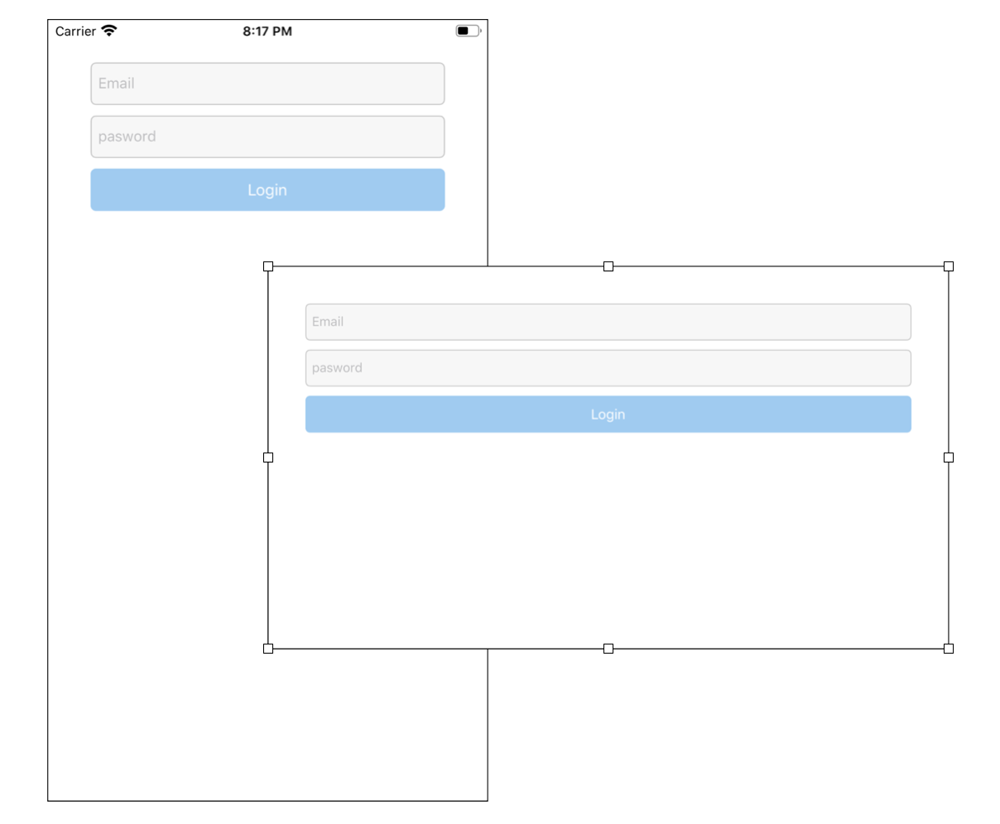
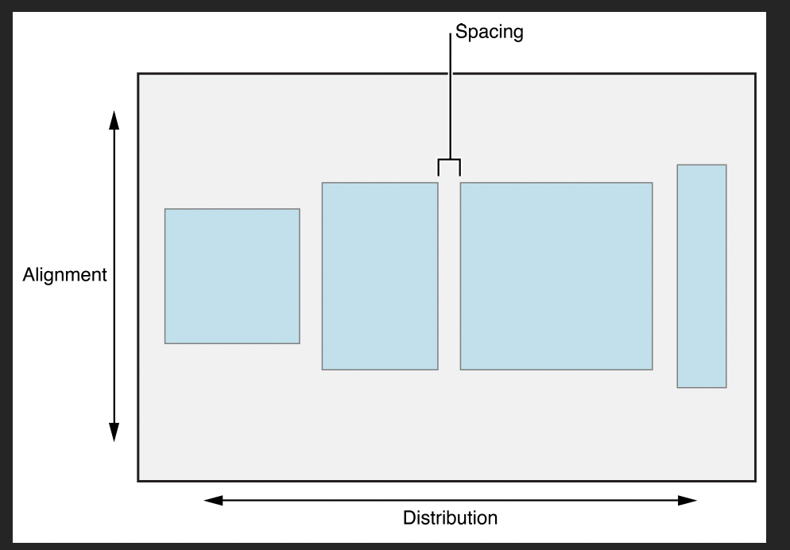

# LoginPage with NSLayoutAnchor


## 구현 화면 

- Login 화면을 만들고 이미지 회전 시 자동으로 UI 재 조정




## 소스코드

- **LoginVC.swift**
  - 사용자의 이메일과 패스워드를 통해 로그인 하도록 하는 페이지

```swift
import UIKit

class LoginVC: UIViewController {
		//이메일 받는 텍스트 필드
    let emailTexField: UITextField = {
        let tf = UITextField()
        tf.placeholder = "Email"
        tf.backgroundColor = UIColor(white: 0, alpha: 0.03)
        tf.borderStyle = .roundedRect
        tf.font = UIFont.systemFont(ofSize: 14)
        return tf
    }()
    //패스워드 텍스트 필드 생성
    let passwordTexField: UITextField = {
        let tf = UITextField()
        tf.placeholder = "pasword"
        tf.backgroundColor = UIColor(white: 0, alpha: 0.03)
        tf.borderStyle = .roundedRect
        tf.isSecureTextEntry = true
        tf.font = UIFont.systemFont(ofSize: 14)
        return tf
    }()
    //로그인 버튼 생성
    let loginButton: UIButton = {
        let button = UIButton(type: .system)
        button.setTitle("Login", for: .normal)
        button.setTitleColor(.white, for: .normal)
        button.backgroundColor = UIColor(red: 149/255, green: 204/255, blue: 244/255, alpha: 1)
        button.layer.cornerRadius = 5
        return button
    }()
    
    override func viewDidLoad() {
        super.viewDidLoad()
        
        //backgroundColor 지정
        view.backgroundColor = .white
        //실제 화면 상에 버튼 및 TF를 표시해주는 함수
        configureViewComponets()
    }

    
    func configureViewComponets() {
        let stackVeiw = UIStackView(arrangedSubviews: [emailTexField,passwordTexField,loginButton])
        
        stackVeiw.axis = .vertical
        stackVeiw.spacing = 10
        stackVeiw.distribution = .fillEqually
        
        view.addSubview(stackVeiw)
        stackVeiw.anchor(top: view.topAnchor, left: view.leftAnchor, bottom: nil, right: view.rightAnchor, paddingTop: 40, paddingLeft: 40, paddingBottom: 0, paddingRight: 40, width: 0, height: 140)
        
    }
}

```

- **Extensions.swit**
  - NSLayoutAnchor를 사용하면 화면 변화 및 다양한 화면 크기에 자동으로 적절하게 비율이 유지되도록 함

```swift
import UIKit

extension UIView {
    
    func anchor(
        top: NSLayoutYAxisAnchor?,
        left: NSLayoutXAxisAnchor?,
        bottom: NSLayoutYAxisAnchor?,
        right: NSLayoutXAxisAnchor?,
        paddingTop: CGFloat,
        paddingLeft: CGFloat,
        paddingBottom: CGFloat,
        paddingRight: CGFloat,
        width: CGFloat,
        height: CGFloat
        ) {
      
        //코드를 통한 오토레이아웃 구성시 반듯이 False 필요
        translatesAutoresizingMaskIntoConstraints = false

        if let top = top {
            self.topAnchor.constraint(equalTo: top, constant: paddingTop).isActive = true
        }
        
        if let left = left {
            self.leftAnchor.constraint(equalTo: left, constant: paddingLeft).isActive = true
        }
        
        if let bottom = bottom {
            self.bottomAnchor.constraint(equalTo: bottom, constant: -paddingBottom).isActive = true
        }
        
        if let right = right {
            self.rightAnchor.constraint(equalTo: right, constant: -paddingRight).isActive = true
        }
        
        if width != 0 {
            widthAnchor.constraint(equalToConstant: width).isActive = true
        }
        
        if height != 0 {
            heightAnchor.constraint(equalToConstant: height).isActive = true
        }
    }
}

```


---

## Important Things

### stackview

- 오토 레이아웃에서 뷰에 요소들을 미리 사전에 정의한 뒤 보여주는 방식
- StackView 생성한 뒤 옵션 적용
  1. stackView.asix : 객체들의 나열 방식 설정
     - .vertical : 수직
     - .horizontal : 수평
  2. stackView.spacing  : 객체 사이의 간격 조정
  3. stackView.distribution : 객체간 너비 조정

```swift
// 이메일 tf,패스워드 tf, 로그인 버튼을 하나의 스텍뷰로 생성
let stackVeiw = UIStackView(arrangedSubviews: [emailTexField,passwordTexField,loginButton])
        
stackVeiw.axis = .vertical		// 수직으로 나열
stackVeiw.spacing = 10				// 객체간 간격 10
stackVeiw.distribution = .fillEqually	// 각 객체의 너비 조정

//실제 stackView의 크기를 조절하는 코드 부분
stackVeiw.anchor(top: view.topAnchor, left: view.leftAnchor, bottom: nil, right: view.rightAnchor, paddingTop: 40, paddingLeft: 40, paddingBottom: 0, paddingRight: 40, width: 0, height: 140)
```





### NSLayoutAnchor

- Audto Layout를 프로그래밍으로만 작성할 때 사용 하는 constraints
- NSLayoutAnchor 클래스를 직접 접근해서 사용하지 못하고 서버클래스 중 하나를 사용해야 함
  - NSLayoutXAxisAnchor : 슈평 제약 만드는 용도
  - NSLayoutYAxisAnchor : 수직 제약 만드는 용도
  - NSLayoutDimension : View의 높이와 넓이에 영향을 미치는 제약사항 만드는 용도

