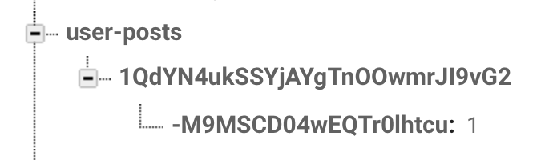

# PostDataStructure & SavePosting Index Data

## 구현 화면

- 포스틴한 내용을 저장하고 불러오기 위한 Post.swift 데이터 구조 생성
- 사용자가 포스팅한 갯수를 확인하기 위한 Index  데이터 구조 생성 -  [user-posts]


## 소스코드

- Post.swift
  - 사용자가 입력한 포스팅 내용을 저장하고 불러오기위한 데이터 구조 설정

```swift
import Foundation

class Post {
  
  var caption: String!
  var likes: Int!
  var imageUrl: String!
  var ownerUid: String!
  var creationDate: Date!
  var postId: String!
  
  init(postId: String!, dictionary: Dictionary<String, AnyObject>) {
    
    self.postId = postId
    
    if let caption = dictionary["caption"] as? String {
      self.caption = caption
    }
      
    if let likes = dictionary["likes"] as? Int {
      self.likes = likes
    }
    
    if let imageUrl = dictionary["imageUrl"] as? String {
      self.imageUrl = imageUrl
    }
    
    if let ownerUid = dictionary["ownerUid "] as? String {
      self.ownerUid = ownerUid
    }
    
    if let creationDate = dictionary["creationDate"] as? Double {
      self.creationDate = Date(timeIntervalSince1970: creationDate)
    }
  }
}
```

- UploadPostVC.swift
  - 포스트가 저장될때 사용자가 포스팅한 포트트의 갯수를 확인하기 위한 추가 데이터 저장
  - 사용자 UID 아래 postId를 계속 추가 해줌

```swift
//update user-post structure
guard let postidKey = postId.key else {return}
DB_REF.child("user-posts").child(currentUid).updateChildValues([postidKey:1])
```



- UserProfileVC.swift
  - 사용자 프로파일 화면 클릭시 사용자가 포스팅한 포스트 내용을 불러오는 함수 추가

```swift
func fetchPosts() {
  guard let currentUid = Auth.auth().currentUser?.uid else { return }

  USER_POSTS_REF.child(currentUid).observe(.childAdded) { (snapshot) in

	 let postId = snapshot.key
		POSTS_REF.child(postId).observeSingleEvent(of: .value, with: { (snapshot) in

	guard let dictionary = snapshot.value as? Dictionary<String,AnyObject> else { return }
	let post = Post(postId: postId, dictionary: dictionary)
	self.posts.append(post)                                                                                                                    	})
}
```


## Important Thing

### [Error] Firebase 저장시 optional value일 경우 오류 발생

- 아래 postId.key의 경우 optional 값으로 guard 문을 통해 옵셔널 처리를 한 뒤 정상 저장 가능

``` swift
//update user-post structure
guard let postidKey = postId.key else {return}
DB_REF.child("user-posts").child(currentUid).updateChildValues([postidKey:1])
```