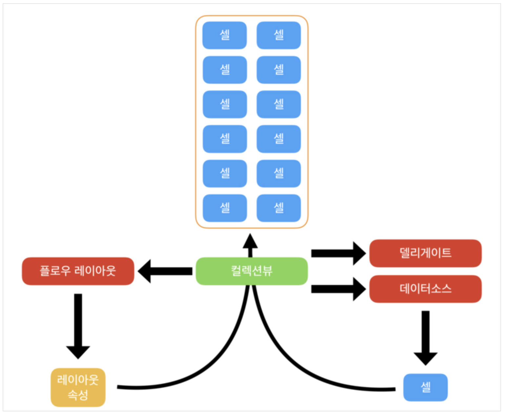

# Show Posting Data With collectionView

## 구현 화면

- 서버에 저장된 포스팅 데이터를 불러 프로필 화면에 뿌려준다
- 로그인 사용자 및 다른 사용자 포함


## 소스코드

- UserProfileVC.swift // CollectionView 구성 부분
  - 사용자의 포스팅 데이터를 CollectionView를 통해 보여줌

```swift
//MARK: - UICollectionViewFlowLayout
  func collectionView(_ collectionView: UICollectionView, layout collectionViewLayout: UICollectionViewLayout, sizeForItemAt indexPath: IndexPath) -> CGSize {
    //header의 크기 지정
    let width = (view.frame.width - 2)/3  // -2의 경우 이미지당 간격 계산
    return CGSize(width: width, height: width)
  }
  
  override func collectionView(_ collectionView: UICollectionView, cellForItemAt indexPath: IndexPath) -> UICollectionViewCell {
    let cell = collectionView.dequeueReusableCell(withReuseIdentifier: reuseIdentifier, for: indexPath) as! UserPostCell
    
    cell.post = posts[indexPath.row] // 포스팅 이미지의 간격
    
    return cell
  }
  
  func collectionView(_ collectionView: UICollectionView, layout collectionViewLayout: UICollectionViewLayout, minimumInteritemSpacingForSectionAt section: Int) -> CGFloat {
    return 1 //아이탬 별 간격 ( 좌우 )
  }
  
  func collectionView(_ collectionView: UICollectionView, layout collectionViewLayout: UICollectionViewLayout, minimumLineSpacingForSectionAt section: Int) -> CGFloat {
    return 1 // section별 간격 (위 아래)
  }

  override func numberOfSections(in collectionView: UICollectionView) -> Int {
    // #warning Incomplete implementation, return the number of sections
    return 1
  }
  
  override func collectionView(_ collectionView: UICollectionView, numberOfItemsInSection section: Int) -> Int {
    // collectionVeiw 를 통해서 보여줄 아이탬 갯수
    return posts.count
  }
```

- UserProfileVC.swift // 사용자 데이터 추출 함수
  - 사용자 프로파일 화면 클릭시 사용자가 포스팅한 포스트 내용을 불러오는 함수 추가

```swift
func fetchPosts() {
    
    var uid:String!
    
    if let currentUid = user?.uid { 	// 로그인한 사용자 일 경우
      uid = currentUid
    } else {													// SearchVC 를 통해 보여지는 사용자 처리
      uid = Auth.auth().currentUser?.uid
    }
    
    USER_POSTS_REF.child(uid).observe(.childAdded) { (snapshot) in
      
			let postId = snapshot.key
			POSTS_REF.child(postId).observeSingleEvent(of: .value, with: { (snapshot) in
        
  		guard let dictionary = snapshot.value as? Dictionary<String,AnyObject> else { return }
        	
			let post = Post(postId: postId, dictionary: dictionary)
			self.posts.append(post)
			self.collectionView?.reloadData()
 			})
		}
	}
```


## Important Thing..

### UICollectionViewFlowLayout

- 그리드 혹은 라인기반(lined-based) 레이아웃을 구현하는 데 사용



### 참조

- [Apple Doc UICollectionVeiwFlowLayout](https://developer.apple.com/documentation/uikit/uicollectionviewflowlayout)

- ###### [부스트코스 iOS 프로그래밍 - UICollectionViewFlowLayout](https://www.edwith.org/boostcourse-ios/lecture/16912/)

