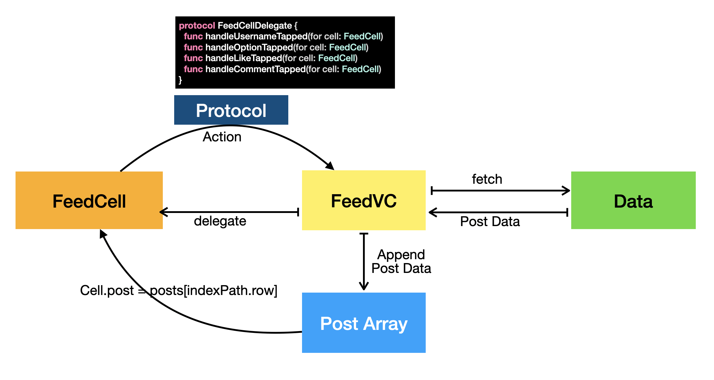
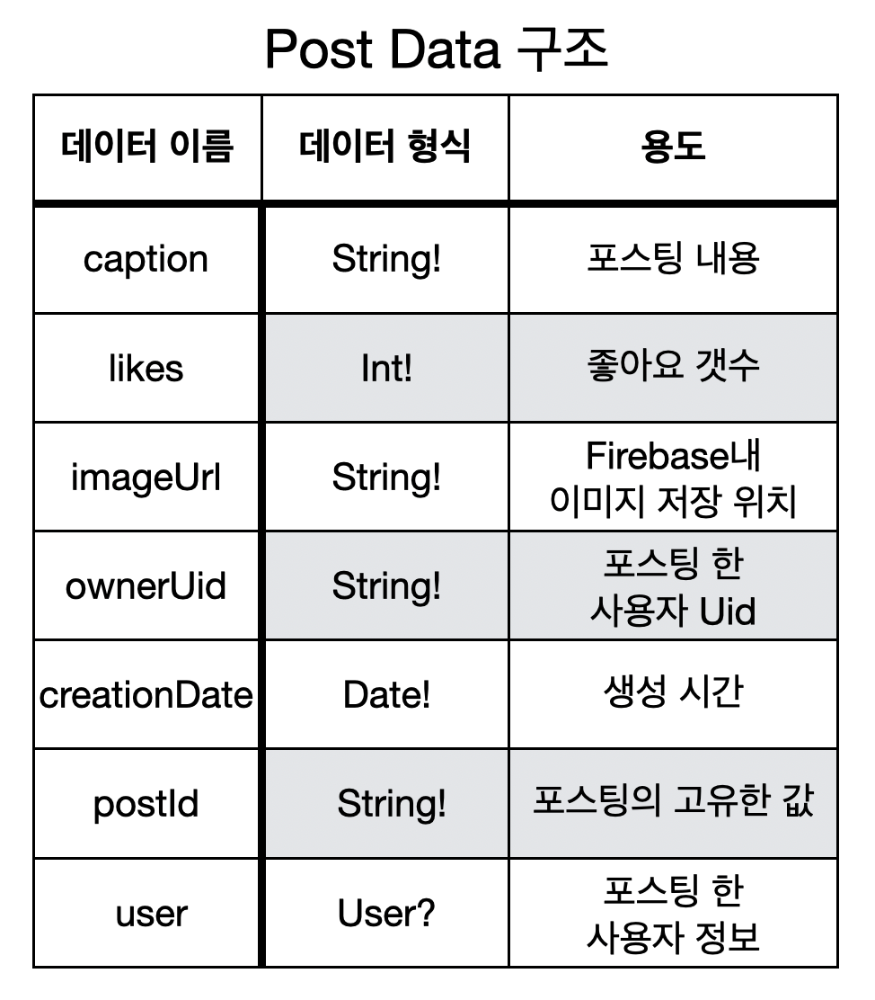

# Feed Main UI Function ( Username Tab )

## 구현 화면

- delegate를 통해 CustomCell(FeedCell)과 ViewController 연결
- 사용자의 포스팅 내용의 사용자 이름 클릭시 해당 사용자의 프로필로 이동
- Post 정보에 user Date를 통해서 프로필로 이동


## FeedVC 동작 개요

#### 동작 구조



####  Post 데이터 구조



## 소스코드

- FeedCell.swift
  - Feed화면의 collectionView에 적용된 커스텀 뷰

```swift
func fetchPosts() {
	POSTS_REF.observe(.childAdded) { (snaphot) in
	let postId = snaphot.key
      
	// extension을 통한 데이터 추출
	Database.fetchPost(with: postId, completion:  { (post) in	 
  		self.posts.append(post)  
    	self.posts.sort(by: {(post1, post2) -> Bool in  // 포스딩 정렬
    	return post1.creationDate > post2.creationDate
    })
 	  self.collectionView?.reloadData() // 데이터 새로고침
 		})
	}
}
```

- extension.swift
  - Firebase에서 Post 데이터를 추출하는 부분

```swift
static func fetchPost(with postId: String, completion: @escaping(Post) -> ()) {
	POSTS_REF.child(postId).observeSingleEvent(of: .value, with: { (snapshot) in
  guard let dictionary = snapshot.value as? Dictionary<String, AnyObject> else { return }
  guard let ownerUid = dictionary["ownerUid"] as? String else {return}
		Database.fetchUser(with: ownerUid) { (user) in
		let post = Post(postId: postId, user: user, dictionary: dictionary)
		completion(post)                                                                                                 		}
  })
}
```

- Protocol.swift
  - FeedCell의 Delegate Protocol내용

```swift
protocol FeedCellDelegate {
  func handleUsernameTapped(for cell: FeedCell)
  func handleOptionTapped(for cell: FeedCell)
  func handleLikeTapped(for cell: FeedCell)
  func handleCommentTapped(for cell: FeedCell)
}
```


