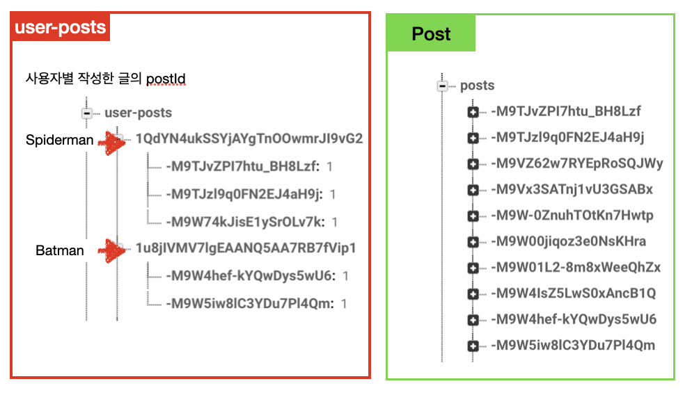
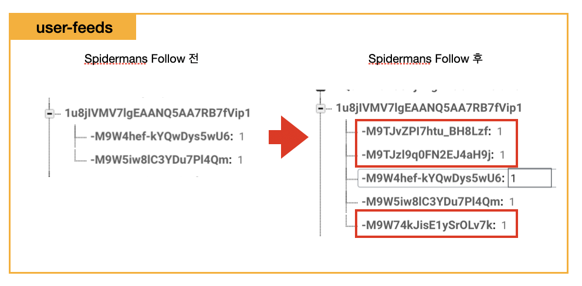

# Updating User Feeds(Follow&UnFollow)

## 구현 화면

- Feed 메인 화면에서 사용자가 팔로우한 사용자의 포스팅만 보도록 변경
- 사용자 팔로우, 언 팔로우시  Feed 화면에서 추가/ 해제 됨
- Feed  화면에서 아래로 화면을 내릴경우 새로 고침됨


## 데이터 구조 

#### post 데이터

- `post`데이터에는 모든 사용자의 포스트에 대한 `postId`가 존제함
- 프로필 데이터 조회시 보여지는 사용자 데이터를 최소화하기 위하여 `user-posts`에서 데이터를 가져옴



#### user-feeds 데이터 

-  접속한 사용자가  Following한 사용자의 post만을 보기 위한 데이터 구조
-  특정 사용자를 팔로우할 경우 user-posts에서 팔로우한 사용자의 작성글 전체를 `user-feeds` 에 추가해줌
- Feed 화면 조회시 사용자는 ` Post`에서 모든 사용자 데이터를 조회할 필요없이 ` user-feeds`에서 포스트 데이터를 가져오게됨



#### 팔로우, 팔로잉시 변경 사항

- 사용자가 신규 포스트를 등록할 때 팔로워들의 user-feeds 정보에 postId 추가 필요
- 팔로우를 종료할 경우 접속한 사용자의 user-feeds 정보에서 팔로우해제한 사용자의 postId  삭제

## 소스코드

- FeedCell.swift
  - Feed 메인 화면에서 사용자가 팔로우한 사용자만 보여주기 위한 함수

```swift
// collectionView 새로고침 함수
override func viewDidLoad() {
  super.viewDidLoad()  
  // configure refrech controll
  let refrechControl = UIRefreshControl()
  refrechControl.addTarget(self, action: #selector(handleRefresh), for: .valueChanged)
  collectionView.refreshControl = refrechControl
}
@objc func handleRefresh() {
  posts.removeAll(keepingCapacity: false)
  fetchPosts()
  collectionView?.reloadData()
}

// 데이터 변경처리 부분
// let USER_POSTS_REF = DB_REF.child("user-posts")
// let USER_FEED_REF = DB_REF.child("user-feeds")

func updateUserFeeds() {
  // 현재 사용자의 Uid추출
	guard let currentUid = Auth.auth().currentUser?.uid else {return}
  	//현재 사용자 UID를 통해, 현 사용자가 팔로잉한 사용자의 Uid추출
		USER_FOLLOWING_REF.child(currentUid).observe(.childAdded) { (snapshot) in
		
  	let followingUserId = snapshot.key
		// 팔로잉한 사용자의 Uid를 통해 팔로잉 유저의 포스팅한 데이터를 추출
		USER_POSTS_REF.child(followingUserId).observe(.childAdded, with: { (snapshot) in
		
		let postId = snapshot.key
		// 팔로우한 사용자의 postId를 현재 사용자의 user-feeds에 등록
		USER_FEED_REF.child(currentUid).updateChildValues([postId:1])
	})
 }
  // 사용자가 포스팅한 정보의 변경이 있을 경우 실행
	USER_POSTS_REF.child(currentUid).observe(.childAdded, with: { (snapshot) in
	
  	let postId = snapshot.key
		//user-feeds에 포스팅 id 추가
		USER_FEED_REF.child(postId).updateChildValues([postId:1])
  })
}
```

- UploadPostVC.swift
  - 사용자가 포스팅을 할때 변경될 사항

```swift
func updateUserFetchFeeds(with postId:String) {
  guard let currentUid = Auth.auth().currentUser?.uid else { return }

  //datavase value
  let values = [postId: 1]
	
	// 현재 사용자를 팔로우하고 있는 사용자들의 user-feeds에 데이터 추가
  USER_FOLLOWER_REF.child(currentUid).observe(.childAdded) { (snapshot) in
		let followerUid = snapshot.key
		USER_FEED_REF.child(followerUid).updateChildValues(values)
  }

  // 현재 사용자의 user-feeds에 추가 등록
  USER_FEED_REF.child(currentUid).updateChildValues(values)
}
```

