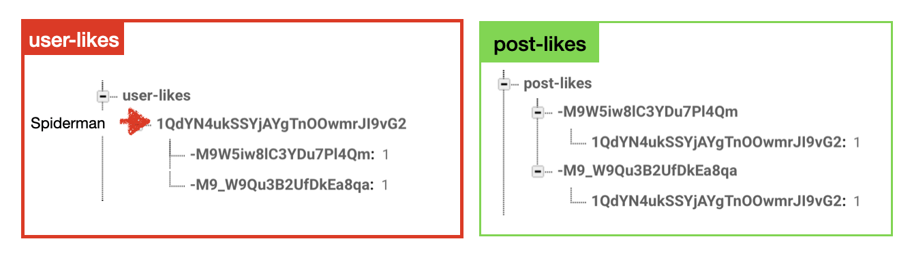

# Like Function & Like Data Structure

## 구현 화면

- Feed 메인 화면의 포스팅에서 사용자가 하트버튼을 통해 좋아요 가능 추가
- 접속 종료 후 재접속 시에도 좋아요를 누른 포스트 유지


## 데이터 구조 

#### likes 버튼을 위한 데이터 구조 추가

- **user-likes**
  - 사용자별 `좋아요` 누른 포스트 리스트

- **post-likes**
  - 포스트 별 `좋아요`누른 사용자 리스트



#### like, unlike 시 변경 필요 사항

- 특정 포스트를 like했을때 user-likes, post-likes를 동시에 업로드 해야함
- 재접속했을때 user-likes에 저장된 포스트 정보를 이용하여 likebutton의 이미지(모양)을 변경해야함

## 소스코드

- FeedVC.swift
  - like Button Action 구현 부분

```swift
func handleLikeTapped(for cell: FeedCell) { // delegate
    guard let post = cell.post else { return }
    
    if post.didLike { // completion 블럭을 통한 시스템 안정성 확보
      post.adjustLike(addLike: false, completion:  { (likes) in
        cell.likesButton.setImage(#imageLiteral(resourceName: "like_unselected"), for: .normal)
        cell.likesLabel.text = "\(likes) likes"
      })
      
    } else { // completion 블럭을 통한 시스템 안정성 확보
      post.adjustLike(addLike: true, completion:  { (likes) in
        cell.likesButton.setImage(#imageLiteral(resourceName: "like_selected"), for: .normal)
        cell.likesLabel.text = "\(likes) likes"
      })
    }
  }
  
  func handleConfigureLikeButton(for cell: FeedCell) { //delegate
  
    guard let post = cell.post else { return }
    guard let postId = post.postId else { return }
    guard let currentUid = Auth.auth().currentUser?.uid else { return }
    
    USER_LIKES_REF.child(currentUid).observeSingleEvent(of: .value) { (snaphost) in
      if snaphost.hasChild(postId){
        post.didLike = true
        cell.likesButton.setImage(#imageLiteral(resourceName: "like_selected"), for: .normal)
      } // didLike의 기본값은 false임으로 else문으로 별도 처리해야 하는 사항 없음
    }
  }
```


- Post.swift
  - like button Action에서 호출 하는 부분

```swift
var caption: String!
var likes: Int!
var imageUrl: String!
var ownerUid: String!
var creationDate: Date!
var postId: String!
var user: User?
var didLike = false

// 포스팅 정보중 Likes를 설정 해주는 부분
  func adjustLike(addLike: Bool, completion: @escaping(Int) -> ()) {
    
    guard let currentUid = Auth.auth().currentUser?.uid else { return }
    guard let postId = postId else { return }
    if addLike {
      //update user-likes structure
      USER_LIKES_REF.child(currentUid).updateChildValues([postId:1], withCompletionBlock: { (err, ref) in
        
        // update posr-likes structure
        POST_LIKES_REF.child(self.postId).updateChildValues([currentUid:1]) { (err, ref) in
          self.likes = self.likes + 1
          self.didLike = true
          completion(self.likes)
          // 좋아요를 누른 포스트의 BD내 likes 숫자 업데이트
          POSTS_REF.child(self.postId).child("likes").setValue(self.likes)
        }
      })
    } else {

      // remove like from user-likes structure
      USER_LIKES_REF.child(currentUid).child(self.postId).removeValue { (err, ref) in
        
        // remove like from post-likes structure
        POST_LIKES_REF.child(self.postId).child(currentUid).removeValue { (err, ref) in
          guard self.likes > 0 else {return}
          self.likes = self.likes - 1
          self.didLike = false
          completion(self.likes)
          // 좋아요를 누른 포스트의 BD내 likes 숫자 업데이트
          POSTS_REF.child(self.postId).child("likes").setValue(self.likes)
        }
      }
    }
  }
```


## 추가 기능

### 구현 화면

- Feed 메인 화면의 좋아요 갯수를 보여주는 label을 클릭할 경우 해당 포스트를 좋아요 한 사용자 리스트 출력


### 소스코드

- FeedCell.swift의 like label 정의

```swift
  lazy var likesLabel: UILabel = {
    let label = UILabel()
    label.font = UIFont.boldSystemFont(ofSize: 12)
    label.text = "3 likes"
    
    // label에 guesture regonizer 추가
    let liketap = UITapGestureRecognizer(target: self, action: #selector(handleShowLikes))
    liketap.numberOfTouchesRequired = 1
    label.isUserInteractionEnabled = true 	// 라벨이지만 클릭이 가능하도록 변경
    label.addGestureRecognizer(liketap)
    return label
  }()
	// FeedVC로 delegate 처리
  @objc func handleShowLikes() {
    delegate?.handleShowLikes(for: self)
  }
```

- FeedVC.swift
  - 버튼엑션에 대한 delegate처리 함수 정의

```swift
  func handleShowLikes(for cell: FeedCell) {
    print("tab likes Label")
    
    guard let post = cell.post else { return }
    guard let postId = post.postId else { return }
    
    let followLikeVC = FollowLikeVC()
    followLikeVC.viewingMode = FollowLikeVC.ViewingMode(index: 2)
    followLikeVC.postId = postId
    navigationController?.pushViewController(followLikeVC, animated: true)
  }
```

- FolloewLikeVC.swift 
  - 사용자 리스트 추출 및 상황에 따른 화면 용도 변경

```swift
// Properties
enum ViewingMode:Int { // enum을 통한 사용자 화면 구성 변경
  case Following
  case Followers
  case Likes

  init(index: Int) {
    switch index {
      case 0: self = .Following
      case 1: self = .Followers
      case 2: self = .Likes
      default: self = .Following
    }
  }
}  

//MARK: - Handler
func configureNavigationTitle() { // enum을 통한 title 변경
  guard let viewingMode = self.viewingMode else { return }

  switch viewingMode {
    case .Followers: self.navigationItem.title = "Followers"
    case .Following: self.navigationItem.title = "Following"
    case .Likes: self.navigationItem.title = "Likes"
  }
}

//MARK: - API

func getDatabaseRefernce() -> DatabaseReference? { // 데이터 참조 변경
  guard let viewingMode = self.viewingMode else { return nil }

  switch viewingMode {
    case .Followers: return USER_FOLLOWER_REF
    case .Following: return USER_FOLLOWER_REF
    case .Likes: return POST_LIKES_REF // <- post-likes

  }
}

func fetchUser() { // 실제 데이터를 추출하는 함수
  guard let ref = getDatabaseRefernce() else { return }
  guard let viewingMode = self.viewingMode else { return }

  switch viewingMode {

    case .Followers, .Following:
    //UserProfileVC 에서 받아온 Uid
    guard let uid = self.uid else { return }

    ref.child(uid).observeSingleEvent(of: .value) { (snapshot) in

		guard let allObjects = snapshot.children.allObjects as? [DataSnapshot] else {return}
			allObjects.forEach { (snapshot) in
    	let userId = snapshot.key
      self.fetchUser(with: userId)
		}
	}
 	case .Likes:
	guard let postId = self.postId else {return}
	ref.child(postId).observe(.childAdded, with: { (snaphost) in
		let uid = snaphost.key
		self.fetchUser(with: uid)
		})
  }
}
```


