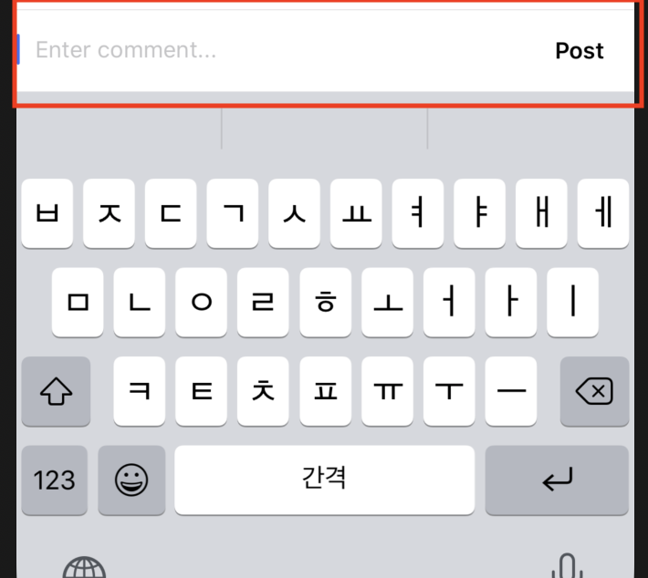

# Comment Function

## 구현 화면

- Feed 메인 화면의 포스트 내에 있는 `Comment` 버튼을 눌러 사용자가 Comment를 입력하게 하도록 하는 기능


## 데이터 구조 

#### Comment 버튼을 위한 데이터 구조 추가

- **Coment**
  - 코멘트 정보를 저장하기 위한 데이터 구조


## 소스코드

- **Comment.swift**
  - Comment를 데이터베이스에 저장하기 위한 구조

```swift
class Comment {
  
  var uid: String!
  var commentText: String!
  var creationDate: NSDate!
  var user: User?
  
  init(user: User, dictionary: Dictionary<String,AnyObject>) {
    
    self.user = user
    
    if let uid = dictionary["uid"] as? String {
      self.uid = uid
    }
    
    if let commentText = dictionary["commentText"] as? String {
      self.commentText = commentText
    }

    if let creationDate = dictionary["creationDate"] as? Double {
      self.creationDate = Date(timeIntervalSince1970: creationDate) as NSDate
    }
  }
}
```


- **CommentVC.swift**
  - comment처리에 대한 컨트롤러 부분

```swift

lazy var containerView: UIView = {
  let containerView = UIView()
  containerView.frame = CGRect(x: 0, y: 0, width: 100, height: 50)

  containerView.addSubview(postButton)
  postButton.anchor(top: nil, left: nil, bottom: nil, right: containerView.rightAnchor, paddingTop: 0, paddingLeft: 0, paddingBottom: 0, paddingRight: 8, width: 50, height: 0)
  postButton.centerYAnchor.constraint(equalTo: containerView.centerYAnchor).isActive = true

  containerView.addSubview(commentTextField)
  commentTextField.anchor(top: containerView.topAnchor, left: containerView.leftAnchor, bottom: containerView.bottomAnchor, right: postButton.leftAnchor, paddingTop: 0, paddingLeft: 0, paddingBottom: 0, paddingRight: 8, width: 0, height: 0)

  let separatorView = UIView()
  separatorView.backgroundColor = UIColor(red: 230/255, green: 230/255, blue: 230/255, alpha: 1)
  containerView.addSubview(separatorView)
  separatorView.anchor(top: containerView.topAnchor, left: containerView.leftAnchor, bottom: nil, right: containerView.rightAnchor, paddingTop: 0, paddingLeft: 0, paddingBottom: 0, paddingRight: 0, width: 0, height: 0.5)

  containerView.backgroundColor = .white
  return containerView
}()

	// tabBarController를 숨기기고 나타나게 하기 위한 코드
  override func viewWillAppear(_ animated: Bool) {
    super.viewWillAppear(animated)
    tabBarController?.tabBar.isHidden = true	// 숨김
  }
  	// tabBarController를 숨기기고 나타나게 하기 위한 코드
  override func viewWillDisappear(_ animated: Bool) {
    super.viewDidAppear(animated)
    tabBarController?.tabBar.isHidden = false // 없앰
  }
  
  override var inputAccessoryView: UIView? {
    get {
      return containerView
    }
  }
  
  //키보트의 커서가 자동을 이동됨
  override var canBecomeFirstResponder: Bool {
    return true
  }

	//MARK: - handlers
	// comment화면 내에서 POST 버튼을 누를경우 처리 하는 구분  
  @objc func handleUploadComment() {
    // 필수 값 확인 
    guard let postId = postId else { return }
    guard let commentText = commentTextField.text else {return}
    guard let uid = Auth.auth().currentUser?.uid else {return}
    
    // 생성 시간 생성
    let creationDate = Int(NSDate().timeIntervalSince1970)
    // FireBaseDB 에 저장할 데이터 생성
    let value = ["commentText": commentText,
                 "creationDate": creationDate,
                 "uid": uid] as [String:Any]
    
    // 자동으로 key를 생성(childByAutoId()) 한뒤 Value값을 저장
    COMMENT_REF.child(postId).childByAutoId().updateChildValues(value) { (err, ref) in
      self.commentTextField.text = nil // 사용자가 comment를 입력하는 텍스트 필드 초기화
    }
  }
  
 	// 해당 포스트의 Comment데이터를 가져오는 함수 
  func fetchComment() {
    guard let postId = postId else { return }
    
    COMMENT_REF.child(postId).observe(.childAdded) { (snapshot) in
      
      guard let dictionary = snapshot.value as? Dictionary<String, AnyObject> else { return }
      guard let uid = dictionary["uid"] as? String else { return }
      
      Database.fetchUser(with: uid, completion: { (user) in
        
        let comment = Comment(user: user, dictionary: dictionary)
        self.comments.append(comment)
        self.collectionView.reloadData()

      })
    }
  }
```


## Important Thing...

- inputAccessoryView

  - The custom input accessory view to display when the receiver becomes the first responder.

  

  

  - ```swift
    var inputAccessoryView: UIView? { get }
    ```

## Reference

- apple
  - [InputAccessoryView](https://developer.apple.com/documentation/uikit/uiresponder/1621119-inputaccessoryview)


