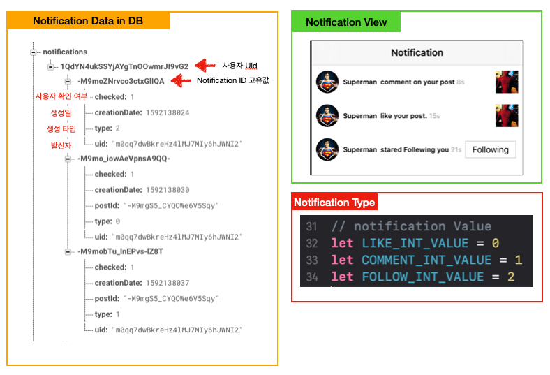

# Notification Function

## 구현 화면

- 사용자들이 특정 사용자의 post를 좋아요, 팔로우 및 Comment를 입력할때 특정 사용자에게 변경 이력을 알려주는 화면
- 알릴 내용이 있을경우 tabBar 버튼 하단에 빨간색 점을 찍어서 보여줌
- 사용자가 내용을 확인하면 해당 점은 없어짐


## 데이터 구조 

#### Notification 알람을 위한 데이터 구조 필요

- 특정 사용자의 Uid를 key로 Notification id를 저장

  1. checked : 사용자가 해당 Notification을 확인 하였는지 확인
     - 0 = 미확인 , 1 = 확인

  2. creationDate : 생성일
     - Notification 발생하고 얼마나 시간이 지났는지 체크 용
  3. type : 해당 Notification의 타입을 알려줌
     - 0 : 좋아요를 눌러 발생
     - 1 : 코멘트가 추가되어 발생
     - 2 : 팔로우가 발생 ( 언팔로우시에는 알람이 생성되지 않음 )




## 소스코드

#### 서버로 데이터 전달 하는 부분

- **like 전달 부분** 

```swift
func sendLikeNotificationToServer() {
    
    guard let currentUid = Auth.auth().currentUser?.uid else { return }
		// notification 전달 시 현재 사용자에게는 전달하지 않음
    let creationDate = Int(NSDate().timeIntervalSince1970)
    
    if currentUid != self.ownerUid {  // 자기 자신한테는 보내지 않음
      
      guard let postId = self.postId else { return }
      let values = ["checked": 0,
                    "creationDate": creationDate,
                    "uid": currentUid,
                    "type": LIKE_INT_VALUE, // 0 전달
                    "postId": postId] as [String : Any]
      
      // notification ID 생성
      let nofiticationRef = NOTIFICATION_REF.child(self.ownerUid).childByAutoId()
      
      // 데이터베이스로 데이터 전송
      nofiticationRef.updateChildValues(values, withCompletionBlock: { (err,ref) in
        USER_LIKES_REF.child(currentUid).child(postId).setValue(nofiticationRef.key)
      })
    }
  }
```

- Comment 전달 부분 

```swift
func uploadCommentNotificationToServer() {
    
    guard let currentUid = Auth.auth().currentUser?.uid else { return }
    guard let postId = self.post?.postId else { return }
    guard let uid = post?.user?.uid else { return  }
    let creationDate = Int(NSDate().timeIntervalSince1970)
    
    // notification 저장 값 생성
    let values = ["checked": 0,
                  "creationDate": creationDate,
                  "uid": currentUid,
                  "type": COMMENT_INT_VALUE, // 1
                  "postId": postId] as [String : Any]
    
    // Notification 데이터 업데이트
    if uid != currentUid {
      NOTIFICATION_REF.child(uid).childByAutoId().updateChildValues(values)
    }
  }
```

- Follow 데이터 전달 부분

```swift
// User.swift 사용자 데이터 처리 부분 추가

func uploadFollowNotificationToServer() {
    
    guard let currentUid = Auth.auth().currentUser?.uid else { return }
    let creationDate = Int(NSDate().timeIntervalSince1970)
    
    // notification Values
    let values = ["checked": 0,
                  "creationDate": creationDate,
                  "uid": currentUid,
                  "type": FOLLOW_INT_VALUE] as [String : Any] // 2
    
    NOTIFICATION_REF.child(self.uid).childByAutoId().updateChildValues(values)
  }
```


#### TabBar에 Notification표시를 위한 코드 부분

- MainTabVC.swift

```swift
 //MARK: - Properties
  var dot = UIView()
  var notificationIDs = [String]()

func tabBarController(_ tabBarController: UITabBarController, shouldSelect viewController: UIViewController) -> Bool {
    let index = viewControllers?.firstIndex(of: viewController)
    
    if index == 2 {
      let selectImageVC = SelectImageVC(collectionViewLayout: UICollectionViewFlowLayout())
      let navController = UINavigationController(rootViewController: selectImageVC)
      navController.navigationBar.tintColor = .black
      
      navController.modalPresentationStyle = .fullScreen
      present(navController, animated: true, completion: nil)
      return false
    } else if index == 3 { // 3번 -> Notification VC
      dot.isHidden = true
      return true
    }
    return true
  }

func configureNotificationDot() {
    let tabBarHeight = tabBar.frame.height
    
    if UIDevice().userInterfaceIdiom == .phone {
      print(UIScreen.main.nativeBounds.height)
      if UIScreen.main.nativeBounds.height == 2436 {
        // iphone x 이상의 기기에서 dot 설정
        print("iphon x")
        dot.frame = CGRect(x: view.frame.size.width / 5 * 3, y: view.frame.height - tabBarHeight, width: 6, height: 6)
        
      } else {
        // iphone x이하의 기기에서 do 설정
        print("iphon othres")
        dot.frame = CGRect(x: view.frame.size.width / 5 * 3, y: view.frame.height, width: 6, height: 6)
      }
      
      // dot 생성 ( 위치 및 색상 지정 )
      dot.center.x = (view.frame.width / 5 * 3 + (view.frame.width / 5) / 2)
      dot.backgroundColor = UIColor(red: 233/255, green: 30/255, blue: 99/255, alpha:1)
      self.view.addSubview(dot)
      dot.isHidden = false	// 기본 값으로 안보이도록 처리
      
    }
  }

//MARK: - API
// Notification의 변화를 확인하고 뷰를 보여주도록 하는 API
func observeNotification() {
    guard let currentUid = Auth.auth().currentUser?.uid else { return }
    self.notificationIDs.removeAll() // 임시로 가지고 있는 배열을 비움
    // 사용자에게 등록되어 있는 Notification id들을 하나씩 가져옴
    NOTIFICATION_REF.child(currentUid).observeSingleEvent(of: .value) { (snapshot) in
      guard let allObject = snapshot.children.allObjects as? [DataSnapshot] else { return }
      allObject.forEach({ (snapshot) in
        // Notification id 추출
        let notificaitonId = snapshot.key

        // Notification id를 통해 각각의 notification 내에 checked 값을 확인하여 dot 표시 여부 결정
                         NOTIFICATION_REF.child(currentUid).child(notificaitonId).child("checked").observeSingleEvent(of: .value, with: { (snapshot) in
          
          guard let checked = snapshot.value as? Int else { return }
          if checked == 0 { // 사용자가 확인 안한 Notication 존재 
            self.dot.isHidden = false // dot 보여줌
          } else {					// 사용자가 확인 안한 Notication 없음
            self.dot.isHidden = true // dot 숨김
          }
        })
      })
    }
  }
```


