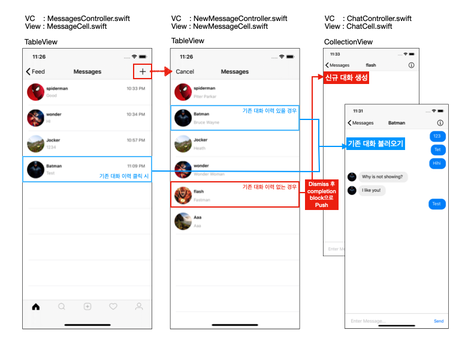
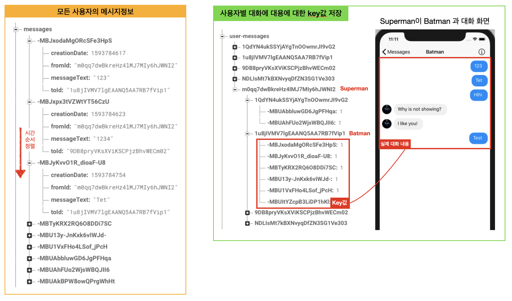
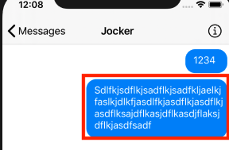

# Direct Message Feature

## 구현 화면

- 대화할 상대를 선택가능하도록 사용자 리스트 보여줌
- 특정 사용자와 대화를 시작할 경우 새로운 대화방생성
- 내가 쓴 글은 오른쪽 정렬에 파란색 바탕의 흰색 글씨
- 상대방이 작성한 글은 왼쪽 정렬에 회색 바탕에 까만 글씨, 프로필 사진 출력


## 화면 구조

- 총 3가지 화면으로 구성됨
  1. MessageController.swift
     - 사용자별 대화 이력을 보여주는 화면
     - 다른 사용자와 새로운 대화를 하기 위한 LeftbarButton 추가
     - 기존 사용자와의 대화 이력 클릭시 기존 대화 화면 띄워줌
  2. NewMessageController.swift
     - 새로운 사용자를 선택하기 위한 화면
     - 모든 사용자의 리스트를 보여줌
     - 선택한 사용자와 이미 대화한 이력이 있을 경우 기존 대화이력 보여줌, 없을 경우 신규 대화창 생성
  3. ChatController.swift
     - collectionView로 구성되어 있으며 로그인 사용자가 선택한 사용자와의 대화 이력을 가져옴
     - 대화 이력에서 상대방이 보낸 이력은 오른쪽 정렬 / 로그인 사용자가 보낸 이력의 경우 왼쪽 정렬




## 데이터 구조

### Message 클래스

```swift
import Foundation
import Firebase

class Message {
  
  var messageText: String!
  var fromId: String!
  var toId: String!
  var creationDate: Date!
  
  init(dictionary: Dictionary<String, AnyObject>) {
    
    if let messageText = dictionary["messageText"] as? String {
      self.messageText = messageText
    }
    
    if let fromId = dictionary["fromId"] as? String {
      self.fromId = fromId
    }
    
    if let toId = dictionary["toId"] as? String {
      self.toId = toId
    }
    
    if let creationDate = dictionary["creationDate"] as? Double {
      self.creationDate = Date(timeIntervalSince1970: creationDate)
    }
  }

  // 채팅을 하는 사용자의 정보를 받아옴
  func getChatPartnerId() -> String {
    guard let currentUid = Auth.auth().currentUser?.uid else { return "Error" }
    
    if fromId == currentUid {
      return toId
    } else {
      return fromId
    }
  } 
}
```


### 데이터 저장 방식 및 화면 비교

- 모든 사용자에게서 메세지가 생성되면 생성 시간을 기준으로 순서대로 추가됨
  - [왼쪽] 추가적으로 사용자가 누구에게 보낸 메시지 인지 데이터 저장 ( fromId, toId 로 확인 가능 )
  - [오른쪽] 대화방 기능을 위해 A 사용자가 B 사용자와 이야기한 내용은 별도의 message의 key들을 별도 저장




## 주요 소스코드

### MessagesController.swift

- 기존 메시지 정보를 불러오는 부분

  - ```swift
      // MARK: - API
      
      func fetchMessages() {
        
        guard let currentUid = Auth.auth().currentUser?.uid else { return }
        
        self.messages.removeAll()
        self.messagesDictionary.removeAll()
        self.tableView.reloadData()
        
        USER_MESSAGES_REF.child(currentUid).observe(.childAdded) { (snapshot) in
          
          let uid = snapshot.key
          
          USER_MESSAGES_REF.child(currentUid).child(uid).observe(.childAdded, with: { (snapshot) in
            //각각의 메시지 key를 통해 실제 메시지에 대한 내용을 불러옴
            let messageId = snapshot.key
            self.fetchMessage(withMessageId: messageId)
          })
        }
      }
      
      func fetchMessage(withMessageId messageId: String) {
        MESSAGES_REF.child(messageId).observeSingleEvent(of: .value) { (snaphost) in
          guard let dictionary = snaphost.value as? Dictionary<String, AnyObject> else { return }
          
          let message = Message(dictionary: dictionary)
          
          let chatPartnerId = message.getChatPartnerId()
    			// 대화창에 보여줄 정보만 저장 (마지막 대화 정보)
          self.messagesDictionary[chatPartnerId] = message			
          
    			self.messages = Array(self.messagesDictionary.values)	// 모든 사용자와의 메시지 정보
          
          self.tableView?.reloadData()
        }
    ```

-  테이블에서 사용자 정보 선택시 대화창으로 넘어가는 코드

  - ```swift
    // 사용자와 마지막 대화를 클릭한 경우
    override func tableView(_ tableView: UITableView, didSelectRowAt indexPath: IndexPath){
    
      let message = messages[indexPath.row]
      let chatpartnerId = message.getChatPartnerId()
      // 기존 사용자와의 대화 정보를 추출
      Database.fetchUser(with: chatpartnerId) { (user) in
    		// 새로운 화면으로 넘김
    		self.showChatController(forUser: user)
    	}
    }
    
    // 새로운 대화를 위해서 `+` 버튼을 눌러 사용자 목록을 띄워주는 버튼 액션
    @objc func handleNewMessage() {
      let newMessageController = NewMessageController()
      // 사용자 선택이 완료되면 아래의 showChatController를 통해 새로운 화면으로 넘어가기 위한 코드
      newMessageController.messagesController = self
      let navigationController = UINavigationController(rootViewController: newMessageController)
      navigationController.modalPresentationStyle = .fullScreen
      self.present(navigationController, animated: true, completion: nil)
    }
    
    // 상세한 대화 화면을 띄워주기 위한 코드
    func showChatController(forUser user: User) {
      let chatController = ChatController(collectionViewLayout: UICollectionViewFlowLayout())
      chatController.user = user	// 대화 상대의 데이터 정보 전달
      navigationController?.pushViewController(chatController, animated: true)
    }
    
    ```


### NewMessageController.swift

- 로그인 사용자가 대화 상대를 클릭했을 때 처리하는 부분

  - ``` swift
      override func tableView(_ tableView: UITableView, didSelectRowAt indexPath: IndexPath) {
        // 화면이 사라질때 상위 뷰의 함수 실행
        self.dismiss(animated: true) {
          let user = self.users[indexPath.row]
          // MessageController.swift의 showChatContoller 실행
          self.messagesController?.showChatController(forUser: user)
        }
      }
    ```


### ChatController.swift

- 사용자의 채팅 내용을 왼쪽, 오른쪽으로 변경해주는 코드

  - ```swift
    // collectionView의 cell를 생성하는 코드
    override func collectionView(_ collectionView: UICollectionView, cellForItemAt indexPath: IndexPath) -> UICollectionViewCell {
      let cell = collectionView.dequeueReusableCell(withReuseIdentifier: reuseIdentifier, for: indexPath) as! ChatCell
    
      // cell에 메시지 정보 전달
      cell.message = messages[indexPath.item]
      
    	// cell의 정렬 방식 설정
      configureMessage(cell: cell, message: messages[indexPath.item])
    
      return cell
    }
    
    func configureMessage(cell: ChatCell, message: Message) {
      guard let currentUid = Auth.auth().currentUser?.uid else { return }
    
      cell.bubbleWidthAnchor?.constant = estimateFrameForText(message.messageText).width + 32
      cell.frame.size.height = estimateFrameForText(message.messageText).height + 20
    
      if message.fromId == currentUid {
        // 로그인 사용자가 보낸 메시지인 경우 오른쪽정렬 활성화
        cell.bubbleViewRightAnchor?.isActive = true // 오른쪽
        cell.bubbleViewleftAnchor?.isActive = false // 왼쪽
        cell.bubbleView.backgroundColor = UIColor.rgb(red: 0, green: 137, blue: 249)
        cell.textView.textColor = .white
        cell.profileImageView.isHidden = true // 프로필 사진 숨김
      } else {
        // 체팅 대상이 보낸 메시지인 경우 왼쪽 정렬 활성화
        cell.bubbleViewRightAnchor?.isActive = false // 오른쪽 
        cell.bubbleViewleftAnchor?.isActive = true	// 왼쪽
        cell.bubbleView.backgroundColor = UIColor.rgb(red: 240, green: 240, blue: 240)
        cell.textView.textColor = .black
        cell.profileImageView.isHidden = false // 프로필 사진 표시
      }
    }
    ```

- 메시지를 서버에 저장하는 부분

  - ```swift
    // "Send" 버튼 액션
    @objc func handleSend() {
      uploadMessageToServer()			// 데이터 저장
      messageTextField.text = nil	// 텍스트 필드 초기화
    }
    
    // 메시지 데이터를 실제로 서버에 저장 하는 부분
    func uploadMessageToServer() {
    	// 데이터 검증
      guard let messageText = messageTextField.text else { return }
      guard let currnetUid = Auth.auth().currentUser?.uid else { return }
      guard let user = self.user else { return }
      guard let toUserUid = user.uid else { return }
    	
      // message key 생성
      let messageRef = MESSAGES_REF.childByAutoId()
      if let messageKey = messageRef.key {
    		
        let creationDate = Int(NSDate().timeIntervalSince1970)
        // 저장 데이터 생성
        let messageValues = ["creationDate": creationDate,
                             "fromId": currnetUid,
                             "toId": toUserUid,
                             "messageText": messageText] as [String: Any]
        // 메시지 데이터 저장
        messageRef.updateChildValues(messageValues)
    
    // 사용자별 메시지 인덱스를 위한 추가정보 저장
        USER_MESSAGES_REF.child(currnetUid).child(toUserUid).updateChildValues([messageKey:1])
        USER_MESSAGES_REF.child(toUserUid).child(currnetUid).updateChildValues([messageKey:1])
      }
    }
    ```

- 메시지 데이터를 불러오는 부분 

  - ```swift
    func observeMesages() {
        guard let currnetUid = Auth.auth().currentUser?.uid else { return }
        guard let chatPartnerId = user?.uid else { return }
        
        USER_MESSAGES_REF.child(currnetUid).child(chatPartnerId).observe(.childAdded) { (snapshot) in
          
          let messageId = snapshot.key
          
          self.fetchMessage(withMessageId: messageId)
        }
        
      }
      
      func fetchMessage(withMessageId messageId: String) {
        MESSAGES_REF.child(messageId).observeSingleEvent(of: .value) { (snaphost) in
          guard let dictionary = snaphost.value as? Dictionary<String, AnyObject> else { return }
          let message = Message(dictionary: dictionary)
          self.messages.append(message )
          self.collectionView.reloadData()
        }
      }
    ```

- 메시지의 크기에 따라서 크기 조절하는 부분

  - 메시지의 길이가 길어질때 가로(width)의 크기는 고정으로 하고, 세로(height)의 높이만 텍스트의 크기에 맞게 증가하도록 설정하는 부분

    - 

  - ```swift
    // CollectionVeiw의 아이탬 크기 설정 부분
    func collectionView(_ collectionView: UICollectionView, layout collectionViewLayout: UICollectionViewLayout, sizeForItemAt indexPath: IndexPath) -> CGSize {
    
      var height: CGFloat = 80
      let message = messages[indexPath.item]
    
      height = estimateFrameForText(message.messageText).height + 20
    
      return CGSize(width: view.frame.width, height: height)
    }
    
    // 크기 계산
    func estimateFrameForText(_ text: String) -> CGRect {
      let size = CGSize(width: 200, height: 1000)
      let options = NSStringDrawingOptions.usesFontLeading.union(.usesLineFragmentOrigin)
      return NSString(string: text).boundingRect(with: size, options: options, attributes: [
        NSAttributedString.Key.font: UIFont.systemFont(ofSize: 16)], context: nil)
    }
    ```