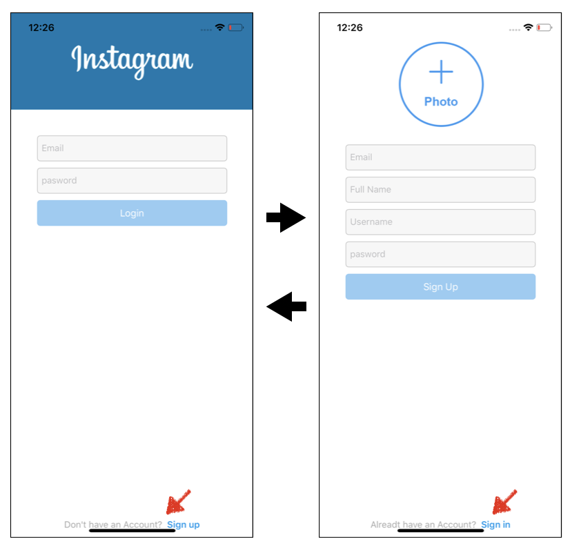
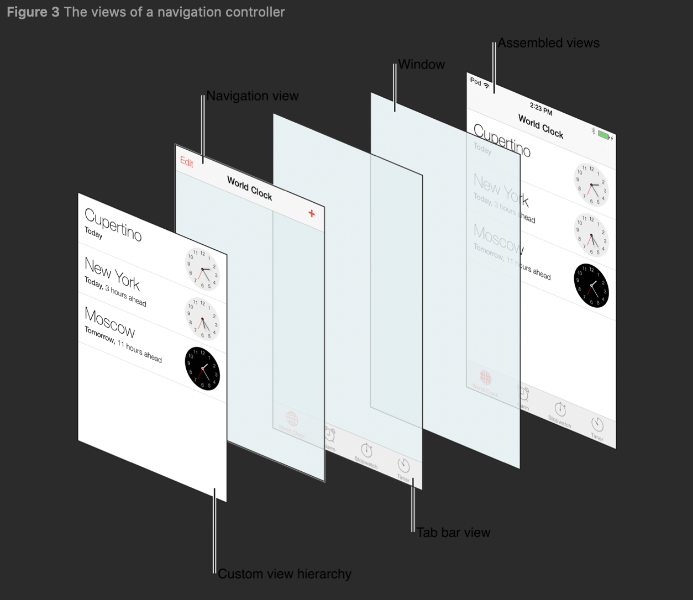

# Logo add & button Button

## 구현 화면

1. 상단의 인스타그램 이미지 삽입
2. 하단의 계정이 없는 사람들을 위한 가입 버튼 생성


## Logo Add

- LoginVC.swift 내 이미지 추가 내용

```swift
let logoContainerview: UIView = {
	//이미지를 담을 신규 view 생성
  let view = UIView()
  // UIImageView 생성
	let logoImageView = UIImageView(image: #imageLiteral(resourceName: "Instagram_logo_white"))
	// 이미지를 체우는 방식을 scaleAspectFill로 지정
  logoImageView.contentMode = .scaleAspectFill
  // 새로운 뷰에 이미지뷰 추가
  view.addSubview(logoImageView)
  // 새로운 뷰안에 이미지뷰 위치 지정, 해당뷰에는 이 이미지 밖에 없음으로 넓이랑 높이만 
  logoImageView.anchor(top: nil, left: nil, bottom: nil, right: nil, paddingTop: 0, paddingLeft: 0, paddingBottom: 0, paddingRight: 0, width: 200, height: 50)
  logoImageView.centerXAnchor.constraint(equalTo: view.centerXAnchor).isActive = true
  logoImageView.centerYAnchor.constraint(equalTo: view.centerYAnchor).isActive = true
  view.backgroundColor = UIColor(red: 0/255, green: 120/255, blue: 175/255, alpha: 1)
  return view
}()

```


### Bottom button

#### 화면 UI

- 로그인화면에서 계정이 없는 사용자가 가입을 하기위한 페이지로 넘어기 위한 버튼
- 해당 버튼을 누르면 회원가입 페이지로 넘어감
- 계정이 이미 있는 사용자를 위해 화원가입 페이지에서 하단의 버튼 누를시 메인 페이지로 이동




#### 소스코드

- AppDelegate.swift
  - NavigationController 추가를 위한 코드 

```swift
import UIKit

@UIApplicationMain
class AppDelegate: UIResponder, UIApplicationDelegate {

  var window: UIWindow?

  func application(_ application: UIApplication, didFinishLaunchingWithOptions launchOptions: [UIApplication.LaunchOptionsKey: Any]?) -> Bool {

    window = UIWindow()
    //window?.rootViewController = LoginVC()  기존 작성 코드
    // 변경된 코드 UINavigationController 내용 추가
    window?.rootViewController = UINavigationController(rootViewController: LoginVC())

    return true
  }
}	
```


- LoginVC.swift
  - 로그인페이지에서 회원가입 페이지로 넘어가기 위한 버튼

```swift
//화면 하단의 버튼 생성 - 로그인 페이지에서 계정이 없을 경우
let dontHaveAccountButtn: UIButton = {
  let button = UIButton(type: .system)
  let attributedTitle = NSMutableAttributedString(
    string: "Don't have an Account?  ", 
    attributes: [NSAttributedString.Key.font: UIFont.systemFont(ofSize: 14),
                 NSAttributedString.Key.foregroundColor: UIColor.lightGray]
  )
  	attributedTitle.append(
      NSMutableAttributedString(string: "Sign up",
        attributes:  [NSAttributedString.Key.font: UIFont.boldSystemFont(ofSize: 14) ,
          NSAttributedString.Key.foregroundColor: UIColor(red: 17/255,
                      green: 154/255, blue: 237/255, alpha:1)]
     )
  )
  button.setAttributedTitle(attributedTitle, for: .normal)
  // 버튼을 눌렀을때 발생하는 사항 연결
  button.addTarget(self, action: #selector(handleShowSignUp), for: .touchUpInside)
  return button
}()

//버튼을 눌렀을때 이벤트 처리 함수
@objc func handleShowSignUp(_ sender:UIButton) {
  let signUpVC = SignUpVC()
  // signUpVC를 스택에 push
  navigationController?.pushViewController(signUpVC, animated: true)
}
```


- SignUpVC.swift
  - 계정이 이미 있는 경우, 가입(SignIn) 페이지에서 로그인 화면으로 돌아오는 버튼

```swift
let alreadyHaveAccountButton: UIButton = {
  let button = UIButton(type: .system)
  let attributedTitle = NSMutableAttributedString(string: "Alreadt have an Account?  ", attributes: [NSAttributedString.Key.font: UIFont.systemFont(ofSize: 14), NSAttributedString.Key.foregroundColor: UIColor.lightGray])
  attributedTitle.append(NSMutableAttributedString(string: "Sign in",attributes:  [NSAttributedString.Key.font: UIFont.boldSystemFont(ofSize: 14) ,NSAttributedString.Key.foregroundColor: UIColor(red: 17/255, green: 154/255, blue: 237/255, alpha:1)]))
  button.setAttributedTitle(attributedTitle, for: .normal)
  button.addTarget(self, action: #selector(handleShowLogin), for: .touchUpInside)
  return button
}()

// 스택에 있는 뷰 컨트롤러를 pop하고 화면에 디스플레이 해줌 
@objc func handleShowLogin(_ sender:UIButton) {
  _ = navigationController?.popViewController(animated: true)
}
```


## Important Thing@@

### navigationController

- 뷰컨트롤러의 컨테이너로써 스택기반의 스키마를 통해 계층적 뷰를 이동시켜 줌


- 화면 전환 시 자동으로 상단에 navigationController ( < Settings, < General ) 를 자동으로 추가해주고 이전화면으로 지동으로 이동할수 있도록  해줌




- **관련 함수**

```swift
class UINavigationController : UIViewController


// --- Pushing and Popping Stack Items --- //
// push 뷰 컨트롤러 
func pushViewController(UIViewController, animated: Bool)
Pushes a view controller onto the receiver’s stack and updates the display.
 
// pop 뷰 컨트롤러 
func popViewController(animated: Bool) -> UIViewController?
Pops the top view controller from the navigation stack and updates the display.

// navigationBar 관련 함수
var navigationBar: UINavigationBar
The navigation bar managed by the navigation controller.
```


### NSAttributedString

- 문자열 일부분에 특별한 속성을 부여하기 위해 사용 (Visual Style, hyperlinks, accessiblity Data )

### NSMutableAttributedString

- A string that has associated attributes (such as visual style, hyperlinks, or accessibility data) for portions of its text.

- **관련 함수**

```swift
class NSMutableAttributedString : NSAttributedString

func attributes(at: Int, effectiveRange: NSRangePointer?) -> [NSAttributedString.Key : Any]
Returns the attributes for the character at a given index.

// 사용 예

let attributedTitle = NSMutableAttributedString
  (// 속성을 지정할 문자를 지정, string
   string: "Alreadt have an Account?  ",
   attributes: // 문자에 부여할 속성 값 정의
      [NSAttributedString.Key.font: UIFont.systemFont(ofSize: 14), 		
       NSAttributedString.Key.foregroundColor: UIColor.lightGray]
  )
  attributedTitle.append 
  (
    NSMutableAttributedString
    (
      string: "Sign in",
      attributes:  
        [NSAttributedString.Key.font: UIFont.boldSystemFont(ofSize: 14) ,
         NSAttributedString.Key.foregroundColor: UIColor(red: 17/255, green: 154/255, blue: 237/255, alpha:1)]
    )
  )
```


### NSAttributedString.Key

- [Struct] attriduted string에 적용할 수 있는 속성 값들이 정의됨
  - font, foreground, backgound color

## Reference 

- [Navigation Controller 자유롭게 다루기](http://labs.brandi.co.kr/2019/05/21/leejh.html)

- [UINavigationController in apple Document](https://developer.apple.com/documentation/uikit/uinavigationcontroller)

  

