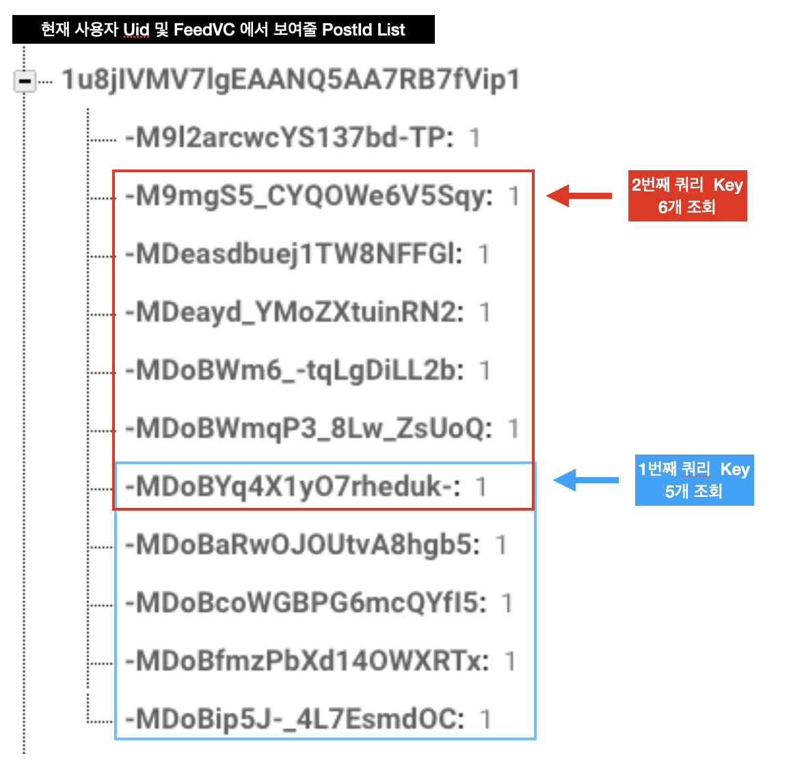

# Pagination

- pagination이란?
  - 데이터의 양이 아주 많은 경우 이를 일부분만 다운로드 하고 사용자에게 보여줌
  - 추가적인 정보가 필요한 경우 사용자에 의해서 트리거를 발생하도록 하고 (예를 들어 아래로 스크롤 등) 트리거가 발생했을때 추가적인 데이터를 받아와 보여주는 기능

## 구현 기능

- 메인 페이지에서 사용자들이 올린 Posting을 Firebase에서 불러와 보여주는 화면
- 기존 방식
  -  모든 포스딩 정보를 불러와 보여주는 방식
- 변경 방식
  - 5개 단위로 포스딩 정보를 불러온 후 사용자의 스크롤에 따라서 추가적인 정보를 가져옴


1. 최초 로딩 시 5개의 화면 가져옴, 그중 마지막 PostId는 키 값으로 저장
2. 두번째 로딩이 저장된 PostId 키 값을 통해서 다음 값 6개를 가져옴,


### 데이터 구조 및 데이터 로딩 함수

#### 데이터 구조

- 사용자가 Following 한 사용자를 포함한 모든 PostId의 List에서 최초 5개 그 다음부터는 키 값을 포함한 6개를 조회 하는 방식



#### 사용 함수

- FireBase DBQuery

  - ```swift
    queryLimited(toLast: <#Int>)
    queryOrderedByKey()
    queryEnding(atValue: <#EndValue>)
    ```

### 주요 소스코드

- 사용자의 포스팅 정보를 가져오는 부분

  - ```swift
    func fetchPosts() {
      guard let currentUid = Auth.auth().currentUser?.uid else { return }
    	// 저장된 기준 값이 없을 경우
      if self.currentKey == nil {
        // 최초의 데이터 불러옴
        print("Fisrt Post Fetch Start")
        USER_FEED_REF.child(currentUid).queryLimited(toLast:5).observeSingleEvent(of: .value) { (snapshot) in 
                                                                                                		print("First Fetch: ",snapshot)                                    							self.collectionView?.refreshControl?.endRefreshing()                                                                                        		
        // 다음 쿼리를 위한 기준 값을 first에 설정
    		guard let first = snapshot.children.allObjects.first as? DataSnapshot else { return }                                                                                           		guard let allObject =  snapshot.children.allObjects as? [DataSnapshot] else { return }
                                                                                                		allObject.forEach({ (snapshot) in                                                                                                              			let postId = snapshot.key                                                                                                              			self.fetchPost(withPostId: postId)                                                                                                              		})
                                                                                            		self.currentKey = first.key                                                                                   		print("First Fetch End")                                                                                       	}
     	 } else {
        // 두번째 데이터를 불러올 때부터 사용되는 구문
        print("Second Fetch Start")
        USER_FEED_REF.child(currentUid).queryOrderedByKey().queryEnding(atValue: self.currentKey).queryLimited(toLast: 6).observeSingleEvent(of: .value, with:  { (snapshot) in
       	print("Second Fetch: ",snapshot)
    
        guard let first = snapshot.children.allObjects.first as? DataSnapshot else { return }
        guard let allObject =  snapshot.children.allObjects as? [DataSnapshot] else { return }
    
        allObject.forEach({ (snapshot) in
        	let postId = snapshot.key
    			if postId != self.currentKey { // 키 값의 포스팅이 중복되지 않도록 처리
          	self.fetchPost(withPostId: postId)
          }
        })
        self.currentKey = first.key // 키 값 갱신
        print("Second Fetch End")
        })
      }
    }
    // postId를 통해서 포스딩 정보 불러옴
    func fetchPost(withPostId postId: String) {
      print("Fetch Poat by Postid : ",postId)
      Database.fetchPost(with: postId) { (post) in
    		self.posts.append(post)
    
        self.posts.sort(by:{ (post1, post2) -> Bool in
       		return post1.creationDate > post2.creationDate
        })
        self.collectionView?.reloadData()
      }
    }
    ```

- CollectionView의 willDisplay 부분

  - 현재 로드되어있는 포스팅의 갯수보다 사용자가 더 스크롤 할 때 데이터를 더 가져오기 위한 역할

  - ```swift
    override func collectionView(_ collectionView: UICollectionView, willDisplay cell: UICollectionViewCell, forItemAt indexPath: IndexPath) {
      if posts.count > 4 {
        if indexPath.item == posts.count - 1{
          fetchPosts()
        }
      }
    }
    ```


