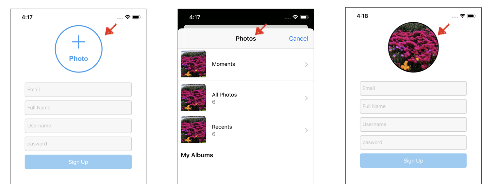

# Profile Image Add in SigUpPage


## 구현 화면



- SignUp 화면에서 프로필 사진을 등록하는 기능 구현
- photo버튼 클릭스 로컬 이미지 앱 실행하여 프로필 이미지 선택
- 선택된 이미지 버튼내 화면 표시
- 프로필 사진, email, fullname, username, password 가 모두 입력되지 않을 경우 signUp 버튼 비활성화


## 소스코드

- SingUpVC.swift

```swift
//signup버튼 활성화 비활성화를 위한 Bool값
var imageSelected = false

// photo 버튼
let plusPhotoButton: UIButton = {
  let button = UIButton()
  button.setImage(#imageLiteral(resourceName: "plus_photo").withRenderingMode(.alwaysOriginal), for: .normal)
  //버튼 누를때의 action 연결
  button.addTarget(self, action: #selector(handleSelectProfilePhoto), for: .touchUpInside)
  return button
}()

// photo 버튼 누를 시 실행되는 action
@objc func handleSelectProfilePhoto() {

  let imagePicker = UIImagePickerController()
  imagePicker.delegate = self
  imagePicker.allowsEditing = true

  // imagePicker 뷰 나타내기
  self.present(imagePicker, animated: true, completion: nil)
}

// 
func imagePickerController(_ picker: UIImagePickerController, didFinishPickingMediaWithInfo info: [UIImagePickerController.InfoKey : Any]) {

  //selected image
  guard let profileImage = info[UIImagePickerController.InfoKey.editedImage] as? UIImage else {
    imageSelected = false
    return
  }

  //set imageSelected true
  imageSelected = true

  // 가져온 이미지를 버튼크기에 맞게 설정 조정 및 버튼 옵션 설정
  plusPhotoButton.layer.cornerRadius = plusPhotoButton.frame.width / 2
  plusPhotoButton.layer.masksToBounds = true
  plusPhotoButton.layer.borderColor = UIColor.black.cgColor
  plusPhotoButton.layer.borderWidth = 2
  
	// photo 버튼에 새로운 프로필 이미지로 지정 
 plusPhotoButton.setImage(profileImage.withRenderingMode(.alwaysOriginal), for: .normal)
	// 이미지 피커뷰 컨트롤러 화면 닫기
  self.dismiss(animated: true, completion: nil)
}

@objc func formValidation(_ sender: UITextField) {
  guard
    emailTexField.hasText,
    passwordTexField.hasText,
    fullNameTexField.hasText,
    usernameTexField.hasText,
    imageSelected == true
  else { // 위 조건중에 하나라도 값이 없는 경우 else문 실행
    signUpButton.isHidden = false
    signUpButton.backgroundColor = UIColor(red: 149/255, green: 204/255, blue: 244/255, alpha: 1)
    return
  } 
	// 모든 값이 정상일떄 조치 사항
  signUpButton.isEnabled = true
  signUpButton.backgroundColor = UIColor(red: 17/255, green: 154/255, blue: 235/255, alpha: 1)

}

// ---- TextField 추가 사항 ---- 
// 각각의 textField에 아래 함수를 추가하여 해당 필드의 값이 변경될 경우 forValidation 함수에 변경 사항을 새로 알려줌
tf.addTarget(self, action: #selector(formValidation), for: .editingChanged)

```


## Important Thing

### UIImagePickerController

- 사용자의 미디어 라이브러리로부터 사진, 동영상등을 고를수 있는 시스템 인터페이스를 불러오는 뷰를 관리하는 컨트롤러
- 이 컨트롤러를 사용하기 위해서는 UIImagePickerControllerDelegate protocol을 준수해야 함.

```swift
class UIImagePickerController : UINavigationController
```


### UIImagePickerControllerDelegate

 ```swift
func imagePickerController(UIImagePickerController, didFinishPickingMediaWithInfo: [UIImagePickerController.InfoKey : Any])
//Tells the delegate that the user picked a still image or movie.


func imagePickerControllerDidCancel(UIImagePickerController)
//Tells the delegate that the user cancelled the pick operation.
 ```


## Reference

- [UIImagePickerController](https://developer.apple.com/documentation/uikit/uiimagepickercontroller)
- [UIImagePickerControllerDelegate](apple-reference-documentation://hs4c4RTKv5)
- 

