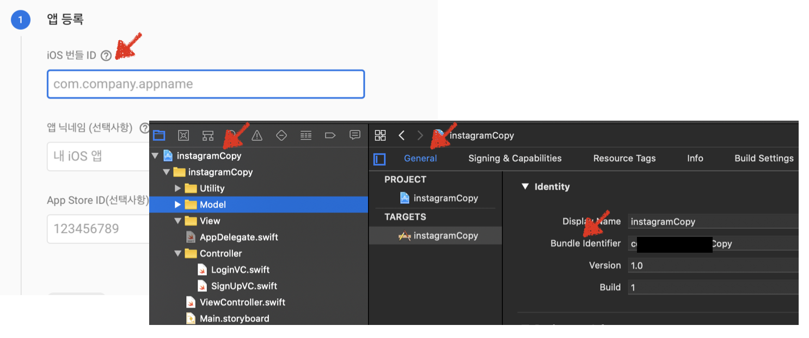
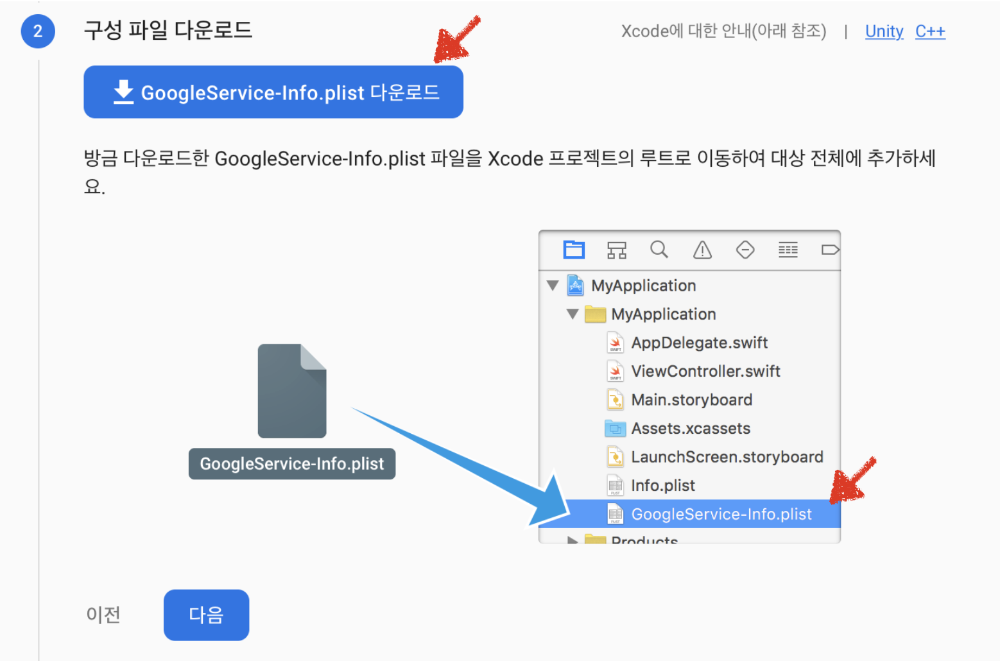
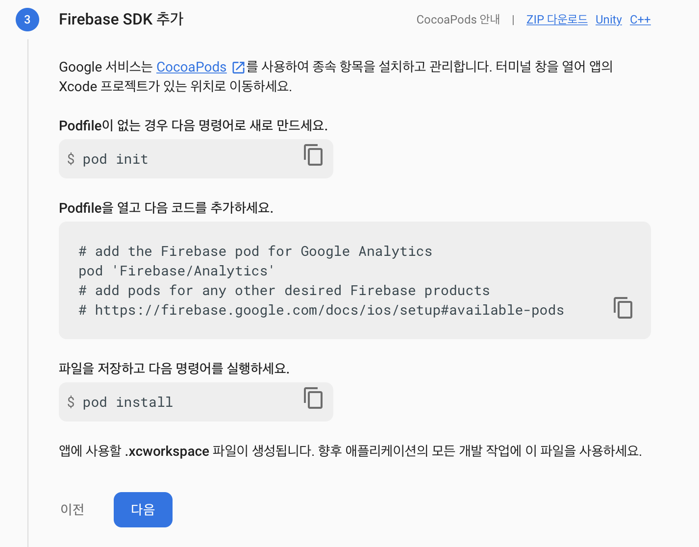
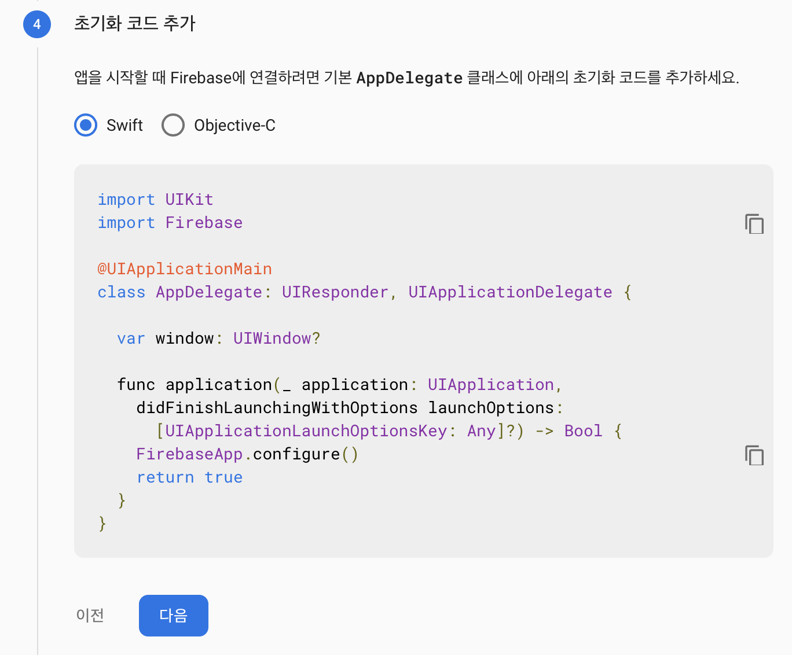
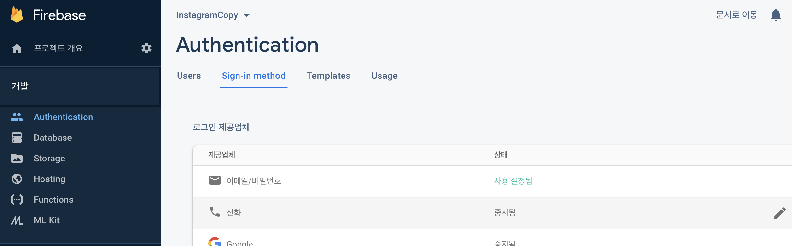
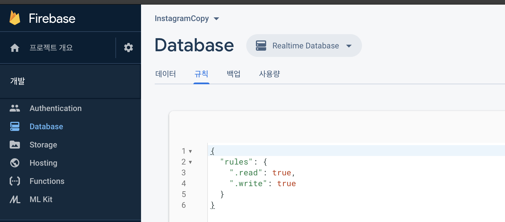

# Setting Firebase

## Firebase 설치하기

### iOS 앱에 Firebase 추가 방법

1. [공식홈페이지](https://firebase.google.com) 접속 후 프로젝트 생성




2. 구성 파일 다운로드 및 프로젝트 추가




3. Firebase SDK 추가 하기




4. 초기화 코드 추가




### Firebase 설정

- 사용자 인증 방식(Authentication) 설정
  - 이메일/패스워드를 통해 사용자를 인증하도록 설정




-   Database rule 설정
  - 테스트 중임으로 true, ture 로 설정




## 소스코드

- AppDelegate.swift

  - Firebase 사용을 위한 SDK import

  - ```swift
    import UIKit
    import Firebase  // Firebase 모듈 추가
    
    @UIApplicationMain
    class AppDelegate: UIResponder, UIApplicationDelegate {
    
        var window: UIWindow?
    
        func application(_ application: UIApplication, didFinishLaunchingWithOptions launchOptions: [UIApplication.LaunchOptionsKey: Any]?) -> Bool {
            // Override point for customization after application launch.
            
            
            window = UIWindow()
            window?.rootViewController = UINavigationController(rootViewController: LoginVC())
            
            FirebaseApp.configure()    // Firebase 공유 인스턴스 구성    
            return true
        }
    }
    
    ```


## Firebase 란?

- 2011년 파이어베이스 사가 개발하고, 2014년 구글에 인수된 모바일 및 웹 애플리케이션 개발 플랫폼

### Firebase 업로드 & 다운로드

- **업로드**

  - Cloud Storage에서 파일을 업로드할 위치를 가리키는 [Cloud Storage 참조를 만듬

  - 파일 업로드 방법

    1. 메모리의 데이터에서 업로드
    
     ```swift
       // Data in memory
       let data = Data()
       
       // Create a reference to the file you want to upload
       let riversRef = storageRef.child("images/rivers.jpg")
       
       // Upload the file to the path "images/rivers.jpg"
       let uploadTask = riversRef.putData(data, metadata: nil) { (metadata, error) in
         guard let metadata = metadata else {
           // Uh-oh, an error occurred!
           return
         }
         // Metadata contains file metadata such as size, content-type.
         let size = metadata.size
         // You can also access to download URL after upload.
         riversRef.downloadURL { (url, error) in
           guard let downloadURL = url else {
             // Uh-oh, an error occurred!
             return
           }
         }
       } 
     ```
    
       
    
    2. 기기의 파일을 나타내는 URL에서 업로드
    
       ```swift
       // File located on disk
       let localFile = URL(string: "path/to/image")!
       
       // Create a reference to the file you want to upload
       let riversRef = storageRef.child("images/rivers.jpg")
       
       // Upload the file to the path "images/rivers.jpg"
       let uploadTask = riversRef.putFile(from: localFile, metadata: nil) { metadata, error in
         guard let metadata = metadata else {
           // Uh-oh, an error occurred!
           return
         }
         // Metadata contains file metadata such as size, content-type.
         let size = metadata.size
         // You can also access to download URL after upload.
         riversRef.downloadURL { (url, error) in
           guard let downloadURL = url else {
             // Uh-oh, an error occurred!
             return
           }
         }
       }
       ```
    
       
    

- **다운로드**

  - 파일을 다운로드 하기 위해서 우선 다운로드를 할 파일을 가리키는 Cloud Storage 참조를 만듬

  - 저장소 루트에 하위 경로를 추가하여 참조를 만들거나, CloudStorage의 객체를 참조하는 기존 `gs://` 또는  `https://` URL로 참조를 만들 수 있음

  - 파일 다운로드 방법

    1. 메모리의 NSData로 다운로드

       ```swift
       // Create a reference to the file you want to download
       let islandRef = storageRef.child("images/island.jpg")
       
       // Download in memory with a maximum allowed size of 1MB (1 * 1024 * 1024 bytes)
       islandRef.getData(maxSize: 1 * 1024 * 1024) { data, error in
         if let error = error {
           // Uh-oh, an error occurred!
         } else {
           // Data for "images/island.jpg" is returned
           let image = UIImage(data: data!)
         }
       }    
       ```

       

    2. 기기의 파일을 나타내는 NSURL로 다운로드

       ```swift
       // Create a reference to the file you want to download
       let islandRef = storageRef.child("images/island.jpg")
       
       // Create local filesystem URL
       let localURL = URL(string: "path/to/image")!
       
       // Download to the local filesystem
       let downloadTask = islandRef.write(toFile: localURL) { url, error in
         if let error = error {
           // Uh-oh, an error occurred!
         } else {
           // Local file URL for "images/island.jpg" is returned
         }
       }  
       ```

       

    3. 온라인 파일을 나타내는 NSURL 생성

       ```swift
       // Create a reference to the file you want to download
       let starsRef = storageRef.child("images/stars.jpg")
       
       // Fetch the download URL
       starsRef.downloadURL { url, error in
         if let error = error {
           // Handle any errors
         } else {
           // Get the download URL for 'images/stars.jpg'
         }
       }    
       ```

- 사용자 인증 관련

  - 사용자 비밀번호 기반 계정 생성

    - ```swift
      Auth.auth().createUser(withEmail: email, password: password) { authResult, error in
        // ...
      }
      ```

  - 이메일 주소와 비밀번호로 사용자 로그인 처리

    - ```swift
      Auth.auth().signIn(withEmail: email, password: password) { [weak self] authResult, error in
        guard let strongSelf = self else { return }
        // ...
      }
      ```

  - 사용자 로그아웃 처리

    - ```swift
      let firebaseAuth = Auth.auth()
      do {
        try firebaseAuth.signOut()
      } catch let signOutError as NSError {
        print ("Error signing out: %@", signOutError)
      }  
      ```

      

## Reference

- Firebase 공식문서
  - [iOS에서 시작하기](https://firebase.google.com/docs/storage/ios/start?authuser=0)
  - [iOS에서 저장소 참조 만들기](https://firebase.google.com/docs/storage/ios/create-reference?authuser=0)
  - [iOS에서 파일 다운로드](https://firebase.google.com/docs/storage/ios/download-files?authuser=0)
  - [iOS에서 파일 업로드](https://firebase.google.com/docs/storage/ios/upload-files?authuser=0)
  - [iOS에서 비밀번호 기반 계정으로 Firebase에 인증하기](https://firebase.google.com/docs/auth/ios/password-auth)

