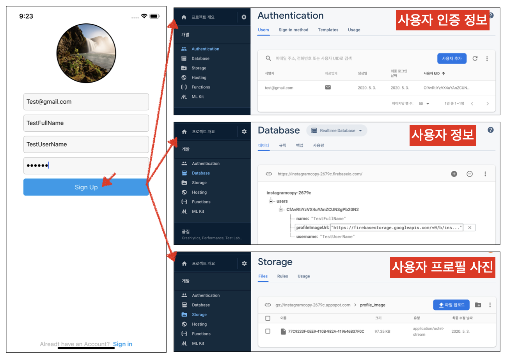

# SignUpPage with Firebase


## 구현 화면

- SignUp화면에서 사용자가 입력한 정보를 기반으로 Firebase내 인증, 데이터 베이스 및 스토리지에 프로필 사진을 저장




## 소스 코드

- SignUpVC.swift

```swift
@objc func handleSignUp(_ sender:UIButton) {     
   // 사용자 정보 수집
   guard let email = emailTexField.text else { return }
   guard let password = passwordTexField.text else { return }
   guard let fullName = fullNameTexField.text else { return }
   guard let userName = usernameTexField.text else { return }

   // Firebase에서 지원하는 사용자 인증 함수, 사용자를 생성하고 생성한 사용자를 리턴해줌     
   Auth.auth().createUser(withEmail: email, password: password) { (user, error) in
   // 에러 처리
   if let error = error {
       print("Fail to create user with error: ", error.localizedDescription)
       return
   }
            
   // 프로필 사진 버튼에 설정되어 있는 이미지 불러옴
   guard let profileImg = self.plusPhotoButton.imageView?.image else { return }
            
   // 불러온 데이터를 압축하여 저장히기 위한 업로드 데이터 보관 변수
   guard let uploadDate = profileImg.jpegData(compressionQuality: 0.3) else { return }
            
   // firebase 앱을 사용하여 스토리지 서비스를 가리키는 참조를 가져옴
   let storage = Storage.storage()
   let storageRef = storage.reference()
            
   // 프로필 이미지 firebase 스토리지 내부에 저장하기   
   // 프로필 이미지 저장시, 고유의 URL을 만들어 사용자 정보과 같이 저장함으로써
   // 추후 사용자가 로그인했을때 해당 사용자의 프로필 사진을 불러와 띄워주는 용도
   let filename = NSUUID().uuidString // 파일이름을 고유의 값으로 생성
                                                                
	 // firebase 특성으로 실제 데이터는 구글 클라우드에 저장됨으로, 해당 데이터에 엑세스하기 위한
   // 방법 중 여기서는 파일의 URL을 통해서 접근 하는 방법을 사용
   storageRef.child("profile_image").child(filename).putData(uploadDate, metadata: nil) { (metadata, error) in
      // 에러 처리 구문
			if let error = error {
          print("Failed to upload image to Firebase Storage with error.", error.localizedDescription)
      }
                
      // 프로필 이미지 저장 경로 및 파일이름을 통한 파일 업로드
      let profileImageRef = storageRef.child("profile_image").child(filename)
      profileImageRef.downloadURL(completion: { (url, error) in
			//에러 발생시 에러 처리
      if let error = error {
          print("Fail to make profile Image URL", error.localizedDescription)
      } else {
        	// 여기서 URL은 실제 파일이 저장된 주소, 해당 주소를 통해 추후 재접근 가능
      		if let url = url {
            // 사용자 정보는 딕셔너리 형태로 저장
            let dictionaryValues = [
            	"name" : fullName,
            	"username" : userName,
            	"profileImageUrl" : url.absoluteString // URL -> String 값 변환
            ]
            guard let user = user else { return }
          
          	//데이터베이스에 저장할 사용자 정보 생성
            let values = [user.user.uid: dictionaryValues]                			    
 Database.database().reference().child("users").updateChildValues(values,
										withCompletionBlock: { (error, ref) in
               print("Success to Updata Database User Informagion")
            })
          }
       }               
     })
		}
 }
}
```


## Important Thing

### NSUUID

- UUID 에 연결되는 유니버셜한 고유 값

- UUID : A universally unique value that can be used to identify types, interfaces, and other items.

  - ```swift
    struct UUID
    
    //Getting UUID Values
    var uuid: uuid_t
      // - UUID 바이트 리턴
    var uuidString: String
      // - UUID로 부터 생성된 문자열 반환 예)“E621E1F8-C36C-495A-93FC-0C247A3E6E5F”
    ```

