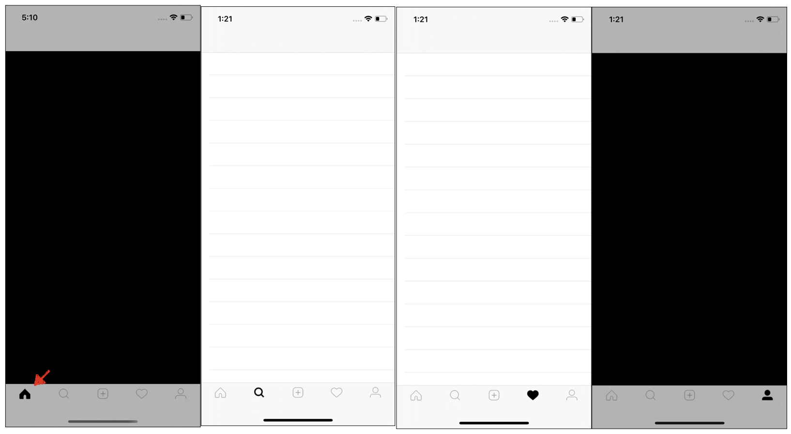
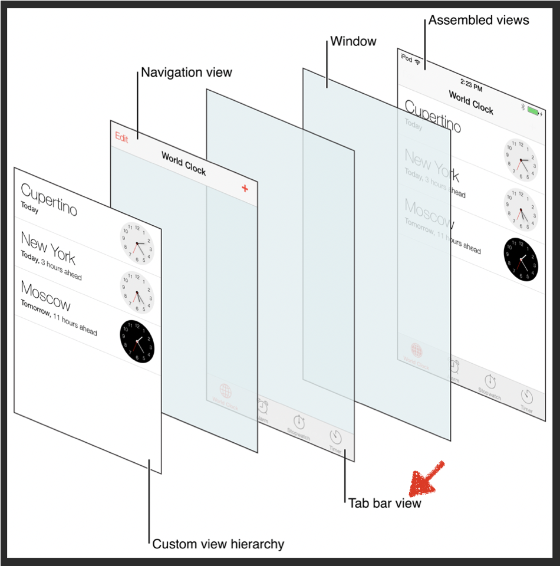
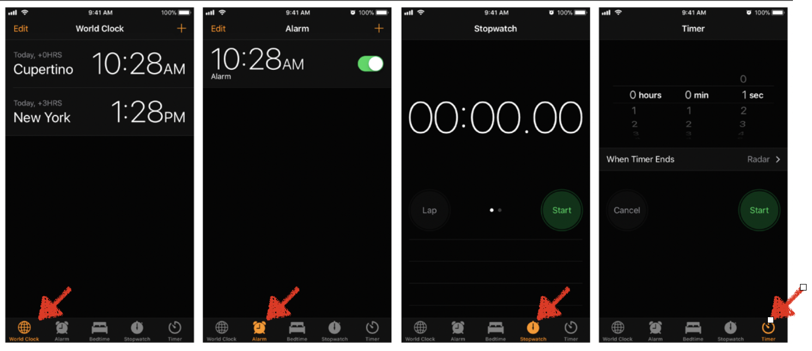

# Login with Firebase and Construct main page


## 구현 화면

- 하단 TabView를 기반으로한 메인 페이지 작성
- 하단 버튼 별로 신규 view생성, FeedVC, searchVC, profileVC ETC...





## 소스 코드

- SignUpVC.swift

```swift
@objc func formValidation() {
        
  //ID와 패스워드 입력 여부 확인
  guard
  emailTexField.hasText,
  passwordTexField.hasText
  else {
    // ID와 패스워드가 재대로 입력되지 않은 경우
    loginButton.isHidden = false
    loginButton.backgroundColor = UIColor(red: 149/255, green: 204/255, blue: 244/255, alpha: 1)
    return
  }
   // ID와 패스워드가 맞는경우 Login버튼 활성화
  loginButton.isEnabled = true
  loginButton.backgroundColor = UIColor(red: 17/255, green: 154/255, blue: 235/255, alpha: 1)
}

@objc func handleSignIn() {

  //사용자가 로그인시 정보를 입력했는지 확인
  guard
  	let email = emailTexField.text,
  	let password = passwordTexField.text else { return }
  
  // 사용자가 입력한 정보를 Firebase 내에 사용자 정보 비교, 사용자 인증
  Auth.auth().signIn(withEmail: email, password: password) { (user, error) in
    // 오류 발생시 처리 구문
 	  if let error = error {
	  	print("Unable to SignIn", error.localizedDescription)
	 		return
	 	}          
 	  // 정상 처리 완료
	  print("Sucessful Signup user Login")
	            
  	// 로그인 성공시 MainTabVC 표시
 		let mainTabVC = MainTabVC()                   
	  self.present(mainTabVC, animated: true)                   
  }
}
```

- MainTabVC.swift
  - 앱의 메인 페이지로 각각의 버튼별로 특정 기능을 사용하도록 설정
  - bar controller

```swift
import UIKit
import Firebase

class MainTabVC: UITabBarController, UITabBarControllerDelegate{

    override func viewDidLoad() {
        super.viewDidLoad()

        self.delegate = self
        
        // 뷰 컨트롤러 기본설정 함수
        configureViewController()
        
        // 사용자 로그인 상태에 대한 체크
        checkIfUserIsLoggedIn()
    }
    
    // bar controller 내 들어갈 뷰 컨트롤러들 생성 후 tabBar에 저장
    func configureViewController() {
    
        // home feed controller
        let feedVC = constructNavController(unselectedImage: #imageLiteral(resourceName: "home_unselected"), selectedImage: #imageLiteral(resourceName: "home_selected"), rootViewController: FeedVC(collectionViewLayout: UICollectionViewFlowLayout()))
        // search feed controller
        let searchVC = constructNavController(unselectedImage: #imageLiteral(resourceName: "search_unselected"), selectedImage: #imageLiteral(resourceName: "search_selected"), rootViewController: SearchVC())
    
        // post controller
        let uploadPostVC = constructNavController(unselectedImage: #imageLiteral(resourceName: "plus_unselected"), selectedImage: #imageLiteral(resourceName: "plus_unselected"), rootViewController: UploadPostVC())
        
        // notification Contoller
        let notificationVC = constructNavController(unselectedImage: #imageLiteral(resourceName: "like_unselected"), selectedImage: #imageLiteral(resourceName: "like_selected"), rootViewController: NotificationVC())
        
        // profile controller
        let userProfileVC = constructNavController(unselectedImage: #imageLiteral(resourceName: "profile_unselected"), selectedImage: #imageLiteral(resourceName: "profile_selected"), rootViewController: UserProfileVC(collectionViewLayout: UICollectionViewLayout()))
        
        // 생성된 뷰 컨트롤러들 모두 tabview 적용
        viewControllers = [feedVC, searchVC, uploadPostVC, notificationVC, userProfileVC]
        
        //tab bar tint color
        tabBar.tintColor = .black
    }
    
    //  코드 중복 최소화를 위한 새로운 컨트롤러 생성 함수
    func constructNavController(unselectedImage:UIImage, selectedImage:UIImage, rootViewController: UIViewController = UIViewController()) -> UINavigationController {
        
        // 네비게이션 컨트롤러 생성
        let navController = UINavigationController(rootViewController: rootViewController)
        navController.tabBarItem.image = unselectedImage
        navController.tabBarItem.selectedImage = selectedImage
        navController.navigationBar.tintColor = .black
        
        // return new Controller
        return navController
    }
}

```


## Important Thing

### UITabBarController

- 어떤 자식뷰를 보여줄것인지를 선택할 수 있는  radio-style 선택 인터페이스룰 제공하는 컨테이너 뷰 컨틀롤러

```swift
class UITabBarController : UIViewController
```





- [그림] 하단에 사용자가 선택한 메뉴에 따라서 각각 다른 화면을 보여주는 방식
