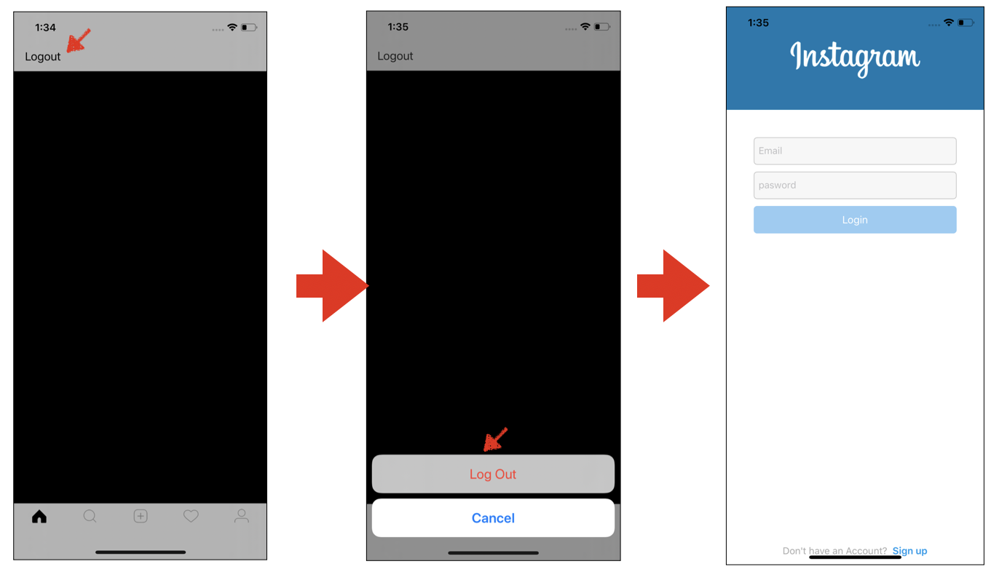
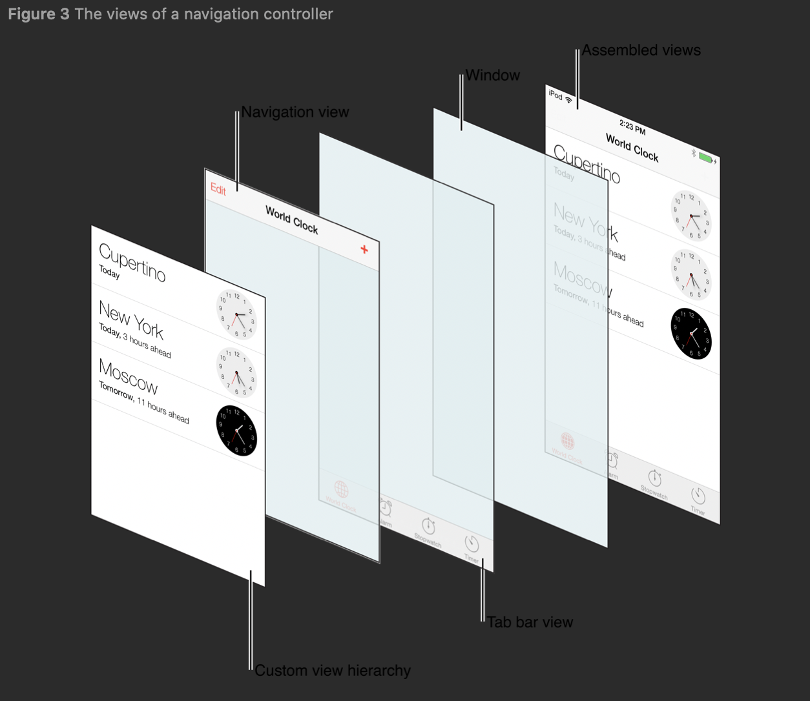

# Logout Button and validation User

## 구현 화면

-   UI 기본 사항
  - 사용자 로그인이 FeedVC를 루트뷰 컨트롤러로 설정
  - 만약 사용자가 로그아웃상태라면 로그인 페이지 표시
- 기능 구현 사항
  - 로그아웃 버튼 : NavigationbarItem 왼쪽 버튼 설정
  - 선택 메뉴 :  alretViewController
  - 로그인 메뉴 : 사용자 로그인상태 확인 후 로그아웃시 로그인화면 즉시 띄움




## 소스코드

- FeedVC.swift
  - 사용자가 로그아웃 할수 있도록 버튼 추가 
  - 로그아웃 선택시 로그인 페이지 이동

```swift
import UIKit
import Firebase

private let reuseIdentifier = "Cell"

class FeedVC: UICollectionViewController {
    //MARK: - Properties
    override func viewDidLoad() {
        super.viewDidLoad()

      self.collectionView!.register(UICollectionViewCell.self, forCellWithReuseIdentifier: reuseIdentifier)

        // 로그아웃 버튼 설정 생성
        configLogoutButton()
    }
    // MARK: UICollectionViewDataSource

    override func numberOfSections(in collectionView: UICollectionView) -> Int {
        return 0
    }

    override func collectionView(_ collectionView: UICollectionView, numberOfItemsInSection section: Int) -> Int {
        return 0
}

    override func collectionView(_ collectionView: UICollectionView, cellForItemAt indexPath: IndexPath) -> UICollectionViewCell {
        let cell = collectionView.dequeueReusableCell(withReuseIdentifier: reuseIdentifier, for: indexPath)
    
        // Configure the cell
    
        return cell
    }

    // MARK: Handlers
    // 로그아웃 버튼 추가
    func configLogoutButton() {
        // 네비게이션바(상단)의 왼쪽버튼을 추가, handleLogout 액션 연결
        self.navigationItem.leftBarButtonItem = UIBarButtonItem(title: "Logout", style: .plain, target: self, action: #selector(handleLogout))
        
    }
    // 사용자가 로그아웃 버튼을 눌렀을때 발생하는 액션
    @objc func handleLogout() {
        //alert controller 생성
        let alertController = UIAlertController(title: nil, message: nil, preferredStyle: .actionSheet)
        
        //alert controller 내에 logout action 추가
        alertController.addAction(UIAlertAction(title: "Log Out", style: .destructive  ,handler: { (_) in
            
            do {
                // Firebase에서 제공한 Auth를 활용하여 로그아웃 시도
                try Auth.auth().signOut()
                
                // 로그아웃 성공시 로그인 페이지 로드
                let loginVC = LoginVC()
                let navController = UINavigationController(rootViewController: loginVC)
                navController.modalPresentationStyle = .fullScreen
                self.present(navController, animated: true, completion: nil)
                print("SucessFull Log out User")
            } catch {
                // 오류발생시 처리
                print("Failed to sign out")
            }
        }))
        // Alert 컨트롤러에 cancel 버튼 추가 
        alertController.addAction(UIAlertAction(title: "Cancel", style: .cancel, handler: nil))
       // Alert controller 화면 띄우기
        present(alertController, animated: true, completion: nil)
    }
}

```

- MainTabVC.swift

```swift
// 사용자 로그인 상태 확인
func checkIfUserIsLoggedIn(){
  DispatchQueue.main.async {
    // 로그인한 사용자 확인
    if Auth.auth().currentUser == nil {
      // 로그인한 사용자 정보 없을시 로그인페이지 로드
      let loginVC = LoginVC()
      let navController = UINavigationController(rootViewController: loginVC)
      navController.modalPresentationStyle = .fullScreen
      self.present(navController, animated: true, completion: nil)
    } else {
      print("User Logined")
    }
    return
  }


```


## Important thing

### navigationItem

- navigation item은 부모 navigation bar에 뷰 컨트롤러를 표현하기 위해 사용된다.
- 뷰 컨트롤러가 네비게이션 컨트롤러에 의해서 push될 때 생성되고 나타난다
  - 따라서 네비게이션 컨트롤러를 사용하지 않는 경우에는 이 프로퍼티에 접근하면 안된다.
- Navigation View는 앞에서 두번째 존재




### viewControllers : Instance Property

- 네이게이션 stack에 있는 현재 뷰 컨트롤러
- root viewcontroller는 Array에 인덱스 0번에 있다, 
  - back view controller는 인덱스 n-2에 있다.
  - top controller는 인덱스  n-1에 있다.
- 이 속성에 새로운 뷰 컨트롤러 배열을 할당하는 것은`animated` 매개 변수가`false`로 설정된`setViewControllers (_ : animated :)`메소드를 호출하는 것과 같습니다.

### setViewController(_:animated:)

- navigation 컨트롤러에서 현재 관리하는 view 컨트롤러를 지정된 항목으로 바꿉니다.


참조 : [2. SingUp Page with navigationController, NSAttributedString](https://github.com/tootoomaa/MyStudyRoom/blob/master/instagramCopy/note/2_Addlogo%26bottomButton.md)


### Firebase 사용자 인증 상태 지속성

- Firebase JS SDK를 사용하면 인증 상태를 유지하는 방식을 지정할 수 있습니다. 로그인한 사용자가 명시적으로 로그아웃할 때까지 무기한 유지할지, 창을 닫으면 상태를 삭제할지, 아니면 페이지 새로고침 시 삭제할지 지정할 수 있습니다.
- 처음에 SDK가 인증된 사용자가 있는지 확인하고, setPersistence가 호출되지 않는 한 이 사용자의 현재의 지속 유형이 이후 로그인 시도에 적용됩니다.
- 즉, 최초 로그인한 사용자의 정보를 지속적으로 유지, 사용하여 자동 로그인됨

| 열거형                                       | 값        | 설명                                                         |
| :------------------------------------------- | :-------- | :----------------------------------------------------------- |
| firebase.auth.<br />Auth.Persistence.LOCA    | 'local'   | 브라우저 창이 닫히거나 React Native에서 활동이 폐기된 경우에도 상태가 유지됨을 나타냅니다. 이 상태를 삭제하려면 명시적으로 로그아웃해야 합니다. Firebase 인증 웹 세션은 단일 호스트 출처이며 단일 도메인의 경우에만 유지된다는 점에 유의하세요. |
| firebase.auth.<br />Auth.Persistence.SESSION | 'session' | 현재의 세션이나 탭에서만 상태가 유지되며 사용자가 인증된 탭이나 창이 닫히면 삭제됨을 나타냅니다. 웹 앱에만 적용됩니다. |
| firebase.auth.<br />Auth.Persistence.NONE    | 'none'    | 상태가 메모리에만 저장되며 창이나 활동이 새로고침되면 삭제됨을 나타냅니다. |

```swift
// none 으로 생성된 상태
firebase.auth().setPersistence(firebase.auth.Auth.Persistence.NONE)
.then(function() {
  var provider = new firebase.auth.GoogleAuthProvider();
  // In memory persistence will be applied to the signed in Google user
  // even though the persistence was set to 'none' and a page redirect
  // occurred.
  return firebase.auth().signInWithRedirect(provider);
})
.catch(function(error) {
  // Handle Errors here.
  var errorCode = error.code;
  var errorMessage = error.message;
});	
```


### DispatchQueue

- task의 실행을 관리하는 오브젝트로써 앱의 main 쓰레드나, 백그라운에서 병렬적으로 실행되도록 한다
- 해당 앱에서는 사용자의 정보를 확인하고 로그인 정보가 없을 경우 강제로 로그인 페이지를 로딩시는 화면 구성.


## References

- Firebase
  - [인증 상태 지속성](https://firebase.google.com/docs/auth/web/auth-state-persistence?hl=ko)
- Apple Doc
  - [UINavigationItem](https://developer.apple.com/documentation/uikit/uinavigationitem)
  - [DispatchQuere](https://developer.apple.com/documentation/dispatch/dispatchqueue)
  - [setViewController](https://developer.apple.com/documentation/uikit/uitabbarcontroller/1621177-setviewcontrollers)

